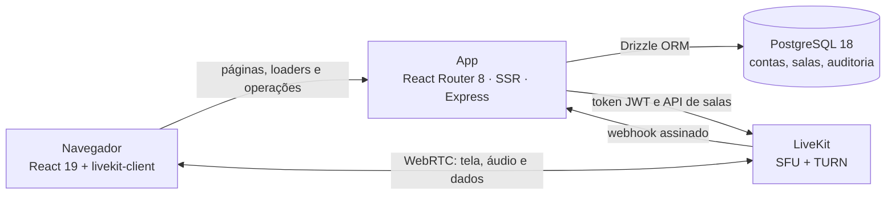

<div align="center">


# Nelcota

**Compartilhe sua tela em segundos.**

Compartilhamento de tela para times pequenos, com áudio, chat e um mascote que reage a você.
Self-hosted, com LiveKit e React Router.


[Início rápido](#-início-rápido) · [Funcionalidades](#-funcionalidades) · [Arquitetura](#-arquitetura) · [Documentação](#-documentação)

<br />

<picture>
  <source media="(prefers-color-scheme: dark)" srcset="docs/assets/home-dark.png" />
  
</picture>

</div>

## ✨ Funcionalidades

| Recurso                    | O que faz                                                                                               |
| -------------------------- | ------------------------------------------------------------------------------------------------------- |
| 🖥️ **Tela com áudio**      | Compartilha a tela com o som da aba ou do sistema, quando o navegador permite                           |
| 🎙️ **Microfone**           | Teste antes de entrar, troca de dispositivo e indicador de quem está falando                            |
| 💬 **Na sala**             | Chat, reações, levantar a mão e apontar na tela de outra pessoa (todos veem o ponto)                    |
| 🔗 **Entrar é simples**    | Crie uma sala com `Enter` ou cole o link recebido; senha opcional e limite de 2 a 8 pessoas             |
| 👤 **Contas**              | Cadastro, 2FA, foto de perfil, dispositivos conectados, exportação e exclusão dos dados (LGPD)          |
| 🛡️ **Painel admin**        | Salas, participantes, compartilhamentos e auditoria imutável, com convite, 2FA obrigatório e permissões |
| 🌗 **Tema claro e escuro** | Animações com GSAP que respeitam `prefers-reduced-motion`                                               |
| 🌱 **O Nelcota**           | Mascote que acompanha o formulário, comemora, se preocupa com erros e cochila quando você some          |

### Atalhos na sala

| Tecla | Ação                                                  |
| ----- | ----------------------------------------------------- |
| `M`   | Liga e desliga o microfone                            |
| `S`   | Abre o menu de compartilhar (ou para de compartilhar) |
| `F`   | Tela cheia no palco                                   |
| `P`   | Apontar na tela de outra pessoa                       |
| `H`   | Levantar ou baixar a mão                              |
| `C`   | Abre e fecha o chat                                   |
| `E`   | Sair da sala (pede confirmação)                       |

Os atalhos não disparam enquanto você digita no chat ou em outro campo.

## 🚀 Início rápido

Você precisa de **Node 26.9+**, **pnpm 12.9.1** (`npm install -g pnpm@12.9.1`) e **Docker**.

```bash
# 1. LiveKit em modo dev
docker run -d --name lk-dev \
  -p 7880:7880 -p 7881:7881 -p 7882:7882/udp \
  livekit/livekit-server:v1.13.7 \
  --dev --bind 0.0.0.0 --node-ip 127.0.0.1 \
  --keys "devkey: devsecret-0123456789abcdef0123456789abcdef"

# 2. Postgres local, com os mesmos papéis da produção
pnpm db:bootstrap:dev

# 3. Variáveis (os valores de dev estão no guia de desenvolvimento)
cp .env.example .env.local

# 4. App
pnpm install
pnpm db:migrate
pnpm db:seed        # opcional: contas (senha senha-dev-1234), salas e auditoria de exemplo
pnpm dev            # http://localhost:3000
```

Abra duas abas (ou uma janela anônima), entre na mesma sala e compartilhe a tela.

> [!TIP]
> Os valores de dev do `.env.local`, todos os scripts e a solução de problemas comuns estão em [docs/development.md](docs/development.md).

## 🧱 Arquitetura



- **O servidor do app nunca toca na mídia.** Ele confere a conta, a senha da sala e o limite de pessoas e devolve um token JWT de vida curta; a tela e o áudio vão direto do navegador para o LiveKit.
- **O webhook do LiveKit** alimenta o painel com salas, participações e compartilhamentos. Os eventos são idempotentes e aceitam chegar fora de ordem.
- **Duas instâncias do Better Auth**, separadas: contas de participantes (`/api/auth`) e admins do painel (`/api/admin/auth`).

O código é organizado por funcionalidade, com o mesmo padrão em todas:

```
app/          rotas (routes.ts), loaders e actions finos
features/     room · mascot · auth · security · account · admin · home · privacy · runtime
  <nome>/       domain/ (TypeScript puro) · server/ · client/ · hooks/ · ui/ · actions.ts
components/   UI genérica: ui/ (shadcn), shell/ (cabeçalho, navbar, tema), data-table/
lib/          utilitários isomórficos
server/       só infraestrutura: env, banco, logs, e-mail, segurança, rotas e operações
```

As fronteiras entre essas pastas são verificadas pelo lint: a UI não importa o servidor, o `domain/` não importa React nem banco, e o `server/` não conhece as features. Detalhes no [guia da arquitetura](docs/README.md).

## 🛠️ Stack

| Área            | Ferramentas                                                                           |
| --------------- | ------------------------------------------------------------------------------------- |
| Framework       | React Router 8.4 (Framework Mode, a evolução do Remix), Vite 8.3, SSR, React Compiler |
| UI              | React 19.3, Tailwind CSS 4.3, shadcn/ui, lucide-react, fonte Manrope                  |
| Tempo real      | LiveKit 1.13 (`livekit-client`, `@livekit/components-react`, `livekit-server-sdk`)    |
| Dados           | PostgreSQL 18, Drizzle ORM, Zod 4                                                     |
| Autenticação    | Better Auth (argon2id, 2FA TOTP)                                                      |
| Animação        | GSAP 3.15 (Flip, CustomEase)                                                          |
| Qualidade       | TypeScript 7 (compilador nativo), Oxlint com tipos, Oxfmt, Knip, jscpd                |
| Testes          | Vitest (unitários e integração com Postgres real), Playwright (E2E)                   |
| Observabilidade | Pino, Sentry                                                                          |
| Produção        | Node 26.9 em Docker, imagem no GHCR, deploy no Coolify via GitHub Actions             |

## ✅ Qualidade

```bash
pnpm format:check   # formatação (Oxfmt)
pnpm typecheck      # tipos das rotas + TypeScript 7
pnpm lint           # Oxlint com tipos e fronteiras da arquitetura
pnpm test           # unitários + integração (Postgres real)
pnpm test:e2e       # Playwright com Postgres e LiveKit de dev
pnpm knip           # código e dependências sem uso
pnpm build
```

O CI roda tudo isso em cada PR, mais `pnpm audit`. Na `main`, o deploy constrói a imagem, roda as migrações num job separado e só então publica.

## 📚 Documentação

| Guia                                                 | Conteúdo                                                                |
| ---------------------------------------------------- | ----------------------------------------------------------------------- |
| [Desenvolvimento](docs/development.md)               | Ambiente local, variáveis, scripts, testes, lint e problemas comuns     |
| [Arquitetura](docs/README.md)                        | Organização das pastas, loaders, actions e operações                    |
| [Contas, painel e banco](docs/accounts-and-admin.md) | Contas de participantes, painel `/admin`, auditoria, papéis do Postgres |
| [Deploy e operação](docs/deployment.md)              | Coolify, LiveKit, proxy, TURN, webhook e como testar em produção        |
| [Decisões (ADRs)](docs/adr/)                         | Por que as coisas são como são                                          |
