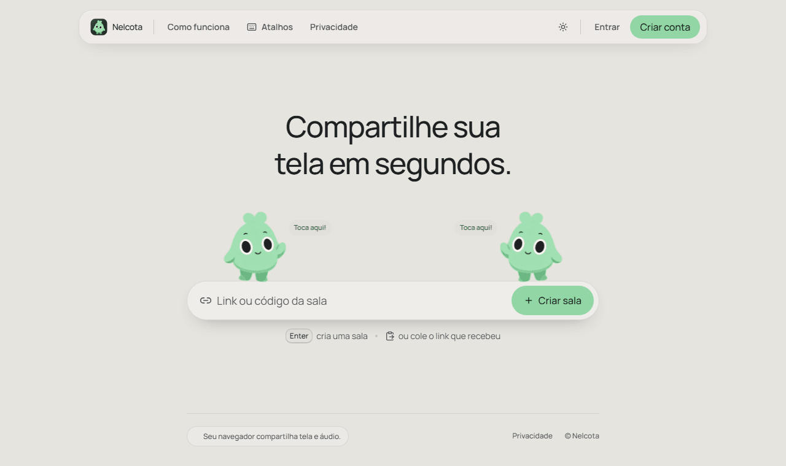
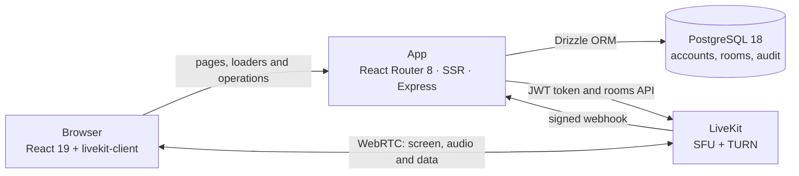

<div align="center">


# Nelcota

**Compartilhe sua tela em segundos.** ("Share your screen in seconds.")

Screen sharing for small teams, with audio, chat and a mascot that reacts to you.
Self-hosted, with LiveKit and React Router.


[Quick start](#quick-start) · [Features](#features) · [Architecture](#architecture) · [Documentation](#documentation)

<br />

<picture>
  <source media="(prefers-color-scheme: dark)" srcset="docs/assets/home-dark.png" />
  
</picture>

</div>

## Features

| Feature              | What it does                                                                                              |
| -------------------- | --------------------------------------------------------------------------------------------------------- |
| Screen with audio    | Shares the screen with tab or system audio, when the browser allows it                                    |
| Microphone           | Test before joining, device switching and an indicator of who is speaking                                 |
| In the room          | Chat, reactions, raise your hand and point at someone else's screen (everyone sees the pointer)           |
| Joining is simple    | Create a room with `Enter` or paste the link you received; optional password and a limit of 2 to 8 people |
| Accounts             | Sign-up, 2FA, profile picture, connected devices, data export and deletion (LGPD)                         |
| Admin panel          | Rooms, participants, shares and an immutable audit log, with invitations, mandatory 2FA and permissions   |
| Light and dark theme | GSAP animations that respect `prefers-reduced-motion`                                                     |
| Nelcota              | A mascot that follows the form, celebrates, worries about errors and dozes off when you go away           |

### Room shortcuts

| Key | Action                                     |
| --- | ------------------------------------------ |
| `M` | Toggles the microphone                     |
| `S` | Opens the share menu (or stops sharing)    |
| `F` | Full screen on the stage                   |
| `J` | Someone else's screen in a floating window |
| `P` | Point at someone else's screen             |
| `H` | Raise or lower your hand                   |
| `C` | Opens and closes the chat                  |
| `E` | Leave the room (asks for confirmation)     |

Shortcuts don't fire while you are typing in the chat or another field.

## Quick start

You need Node 26.9+, pnpm 12.9.1 and Docker. With the dev LiveKit container running and `.env.local` filled in:

```bash
pnpm install
pnpm db:bootstrap:dev && pnpm db:migrate
pnpm dev            # http://localhost:3000
```

The LiveKit command, the dev values for `.env.local`, every script and fixes for common problems are in [docs/development.md](docs/development.md#running-locally).

## Architecture



- **The app server never touches media.** It checks the account, the room password and the people limit and returns a short-lived JWT; screen and audio go straight from the browser to LiveKit.
- **The LiveKit webhook** feeds the panel with rooms, participations and shares. Events are idempotent and may arrive out of order.
- **Two separate Better Auth instances**: participant accounts (`/api/auth`) and panel admins (`/api/admin/auth`).

The code is organized by feature, with the same pattern in all of them:

```
app/          routes (routes.ts), thin loaders and actions
features/     room · mascot · auth · security · account · admin · home · privacy · runtime
  <name>/       domain/ (pure TypeScript) · server/ · client/ · hooks/ · ui/ · actions.ts
components/   generic UI: ui/ (shadcn), shell/ (header, navbar, theme), data-table/
lib/          isomorphic utilities
server/       infrastructure only: env, database, logs, e-mail, security, routes and operations
```

The linter checks the boundaries between these folders ([ADR 0003](docs/adr/0003-oxlint-boundaries.md)); the layout is detailed in the [architecture guide](docs/README.md).

## Stack

| Area          | Tools                                                                                    |
| ------------- | ---------------------------------------------------------------------------------------- |
| Framework     | React Router 8.4 (Framework Mode, the evolution of Remix), Vite 8.3, SSR, React Compiler |
| UI            | React 19.3, Tailwind CSS 4.3, shadcn/ui, lucide-react, Manrope font                      |
| Real time     | LiveKit 1.13 (`livekit-client`, `@livekit/components-react`, `livekit-server-sdk`)       |
| Data          | PostgreSQL 18, Drizzle ORM, Zod 4                                                        |
| Auth          | Better Auth (argon2id, TOTP 2FA)                                                         |
| Animation     | GSAP 3.15 (Flip, CustomEase)                                                             |
| Quality       | TypeScript 7 (native compiler), type-aware Oxlint, Oxfmt, Knip, jscpd                    |
| Tests         | Vitest (unit, and integration against a real Postgres), Playwright (E2E)                 |
| Observability | Pino, Sentry                                                                             |
| Production    | Node 26.9 on Docker, image on GHCR, deployed to Coolify via GitHub Actions               |

## Quality

```bash
pnpm format:check   # formatting (Oxfmt)
pnpm typecheck      # route types + TypeScript 7
pnpm lint           # type-aware Oxlint and architecture boundaries
pnpm test           # unit + integration (real Postgres)
pnpm test:e2e       # Playwright with dev Postgres and LiveKit
pnpm knip           # unused code and dependencies
pnpm build
```

CI runs all of this on every PR, plus `pnpm audit`. The Deploy workflow (image, migrations in a separate job, then publish) is disabled until the production secrets exist.

## Documentation

| Guide                                                      | Contents                                                             |
| ---------------------------------------------------------- | -------------------------------------------------------------------- |
| [Development](docs/development.md)                         | Local environment, variables, scripts, tests, lint and common issues |
| [Architecture](docs/README.md)                             | Folder layout, loaders, actions and operations                       |
| [Accounts, panel and database](docs/accounts-and-admin.md) | Participant accounts, `/admin` panel, audit log, Postgres roles      |
| [Deployment and operations](docs/deployment.md)            | Coolify, LiveKit, proxy, TURN, webhook and how to test in production |
| [Decisions (ADRs)](docs/adr/)                              | Why things are the way they are                                      |
