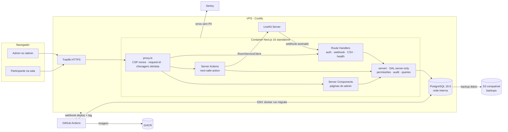
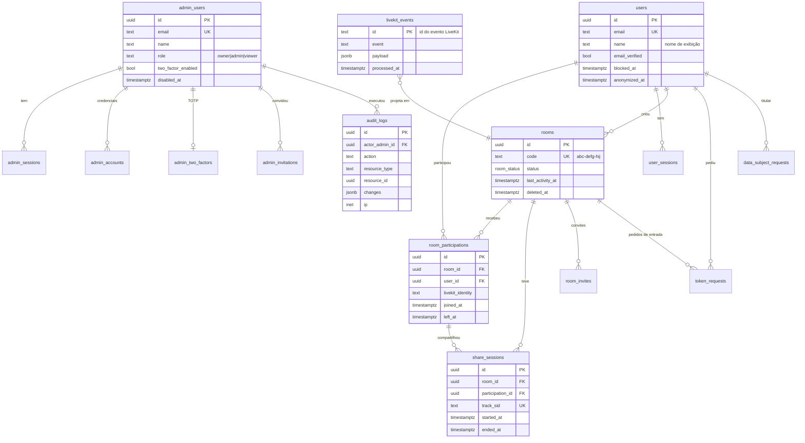
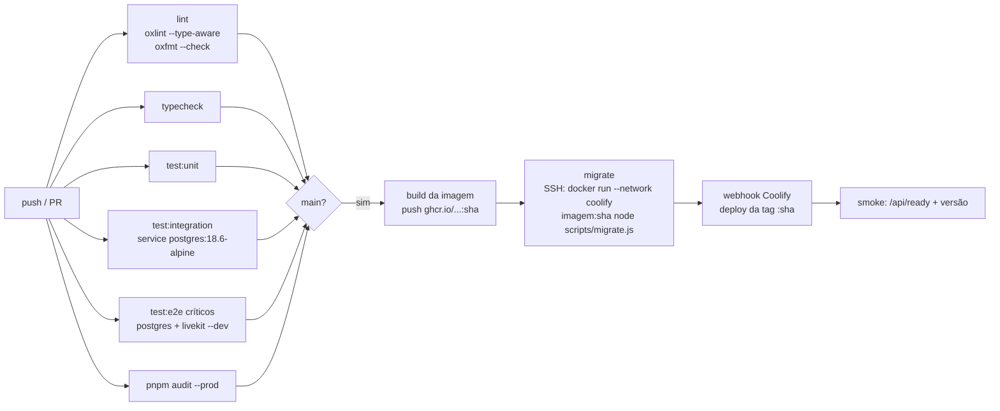

# Plano técnico: painel admin do Nelcota

> Status: **aprovado em 06/10/2026**, com uma mudança: **participantes têm conta com e-mail e senha** (§5.4). As demais premissas da §11 seguem a recomendação.
> Versões e documentação verificadas em **06/10/2026** (npm registry, docs oficiais, GitHub, Docker Hub).

---

## 1. Resumo executivo

1. O painel vive **no mesmo app Next.js** (rota `/admin`), na mesma imagem Docker, com código organizado por _feature_ para ser reaproveitável.
2. Dados em **PostgreSQL 18.6** com **Drizzle ORM 0.45** + driver **`pg`**; chaves **UUID v7** geradas pelo próprio Postgres (`uuidv7()`).
3. Autenticação com **Better Auth 1.7** em **duas instâncias separadas**: admins (`/api/admin/auth`, 2FA obrigatório, só por convite) e participantes (`/api/auth`, cadastro com e-mail verificado, 2FA opcional). Senhas em **argon2id**, sessões no banco. **RBAC** de admins definido em código (`owner` / `admin` / `viewer`).
4. Mutações só por **Server Actions via `next-safe-action`**, com permissão + validação Zod + **audit log** aplicados em um único _middleware_.
5. Listagens **server-side** com TanStack Table v9 (headless), estado na URL com **nuqs**, paginação **keyset** e exportação CSV em _stream_.
6. Os dados de negócio (salas, participações, compartilhamentos) vêm dos **webhooks do LiveKit**, gravados de forma idempotente.
7. Migrações em **job separado** no deploy (CI → imagem no GHCR → `migrate` com usuário próprio → deploy no Coolify), padrão **expand/contract**.
8. Observabilidade: Pino (JSON no stdout), Sentry SDK 11 (SaaS, sem PII), `pg_stat_statements`, health checks.
9. Backup diário do Coolify para S3 com restauração **testada mensalmente**. RPO 24 h / RTO 2 h no MVP.
10. Roadmap em 11 fases, **~47 dias úteis** até o painel completo, com MVP utilizável ao fim da Fase 3 (~23 dias).

---

## 2. Decisões da stack

### 2.1 Versões verificadas (06/10/2026)

| Pacote / serviço                            | Versão estável                    | Último release           | Compatibilidade verificada                                                                                        |
| ------------------------------------------- | --------------------------------- | ------------------------ | ----------------------------------------------------------------------------------------------------------------- |
| next                                        | 16.3.8                            | 05/10/2026               | peer `react ^19`                                                                                                  |
| react / react-dom                           | 19.3.0                            | 02/10/2026               | atende "19.2+"                                                                                                    |
| typescript                                  | 7.0.2                             | 06/10/2026               | —                                                                                                                 |
| zod                                         | 4.6.5                             | 02/10/2026               | Standard Schema                                                                                                   |
| drizzle-orm / drizzle-kit                   | 0.45.3 / 0.31.11                  | 21/09/2026               | peer `pg >=8`; 1.0 ainda em **RC (1.0.0-rc.4)**                                                                   |
| pg                                          | 8.23.1                            | 30/09/2026               | Node ≥16                                                                                                          |
| better-auth                                 | 1.7.7                             | 30/09/2026               | peers `next ^16`, `react ^19`, `drizzle-orm ^0.45.2`                                                              |
| @node-rs/argon2                             | **2.2.1** (10/09/2026)            | 2.2.2 saiu em 06/10/2026 | fixada na 2.2.1: a 2.2.2 ainda não passou do `minimumReleaseAge` do pnpm; binários linux-musl x64/arm64 e Windows |
| next-safe-action                            | 8.7.3                             | 07/09/2026               | peers `next >=14`, `react >=18.2`; aceita Zod 4                                                                   |
| @next-safe-action/adapter-react-hook-form   | 2.1.0                             | 18/07/2026               | peer `next-safe-action >=8.1.10`                                                                                  |
| @tanstack/react-table                       | 9.2.6                             | 04/10/2026               | **compatível com React Compiler** (v9)                                                                            |
| @tanstack/react-query                       | 5.104.1                           | 02/10/2026               | peer `react ^19`                                                                                                  |
| nuqs                                        | 2.10.1                            | 28/08/2026               | peer `next >=14.2`                                                                                                |
| react-hook-form / @hookform/resolvers       | 7.89.0 / 5.9.1                    | 26/09 e 17/08/2026       | resolvers aceita `zod ^4`                                                                                         |
| recharts (via shadcn chart)                 | 3.10.1                            | 03/10/2026               | peer `react ^19`                                                                                                  |
| cmdk (via shadcn command)                   | 1.1.1                             | **27/08/2025**           | peer `react ^19`; manutenção lenta (ver riscos)                                                                   |
| sonner                                      | 2.0.8                             | 09/08/2026               | já no projeto                                                                                                     |
| pino                                        | 10.4.0                            | 02/10/2026               | já está na lista de `serverExternalPackages` padrão do Next 16.3.8                                                |
| @sentry/nextjs                              | 11.4.0                            | 02/10/2026               | peer `next ^16`; Node 24 ok                                                                                       |
| vitest                                      | 5.0.3                             | 30/09/2026               | Node `^24`                                                                                                        |
| @playwright/test                            | 1.63.0                            | 06/10/2026               | Node ≥20                                                                                                          |
| @axe-core/playwright                        | 4.13.0                            | 06/10/2026               | —                                                                                                                 |
| testcontainers / @testcontainers/postgresql | 12.2.0                            | 28/09/2026               | Node ≥22.22                                                                                                       |
| @faker-js/faker                             | 10.6.0                            | 06/09/2026               | Node ≥24 ok                                                                                                       |
| date-fns / @date-fns/tz                     | 4.4.0 / 1.5.0                     | 29/05 e 21/05/2026       | —                                                                                                                 |
| livekit-server-sdk                          | 2.19.1                            | 20/09/2026               | já no projeto                                                                                                     |
| PostgreSQL                                  | **18.6** (`postgres:18.6-alpine`) | 13/08/2026               | EOL 14/11/2030; `uuidv7()` nativo                                                                                 |
| Coolify                                     | 4.3.23                            | 18/09/2026               | oferece Postgres 18 (`postgres:18-alpine` é o padrão)                                                             |
| Node.js                                     | 24.21.0 LTS                       | 07/09/2026               | —                                                                                                                 |

### 2.2 ORM / acesso a dados

|                    | Decisão                                                                                                                                                                                                                                                                                                                                                                                                                                   |
| ------------------ | ----------------------------------------------------------------------------------------------------------------------------------------------------------------------------------------------------------------------------------------------------------------------------------------------------------------------------------------------------------------------------------------------------------------------------------------- |
| **Escolha**        | **Drizzle ORM 0.45.x** (versão exata fixada) + drizzle-kit 0.31.x                                                                                                                                                                                                                                                                                                                                                                         |
| Alternativas       | Prisma 7; Kysely 0.29                                                                                                                                                                                                                                                                                                                                                                                                                     |
| Motivo             | Schema em TypeScript, sem etapa de geração de código. Consultas próximas do SQL, o que torna o keyset e os agregados previsíveis. Suporta tudo que o plano usa: `jsonb` tipado, `pgEnum`, `check()`, índices parciais (`.where`), GIN com `gin_trgm_ops`, `CREATE INDEX CONCURRENTLY`, identity e `default(sql\`uuidv7()\`)`. Gera SQL versionado. O Better Auth tem adaptador oficial para ele. Já está no projeto.                      |
| Por que não Prisma | Em 06/10/2026 a tag `latest` do CLI `prisma` instala o **8.0.0-rc**, que não tem `generate` nem `migrate dev`. O Prisma 7 estável (7.10) exige fixar `^7`, usa _driver adapter_ e tem ciclo de manutenção de 18 meses após o v8. É risco de retrabalho logo no início.                                                                                                                                                                    |
| Por que não Kysely | Excelente _query builder_, mas as migrações são escritas à mão (sem diff a partir do schema) e os tipos dependem de codegen. Mais trabalho para o mesmo resultado.                                                                                                                                                                                                                                                                        |
| Riscos             | (1) O Drizzle 1.0 ainda não tem data de GA e muda o formato da pasta de migrações (`drizzle-kit up` converte). Mitigação: usar a API de relações v2 (`defineRelations`) desde já e planejar a conversão como tarefa isolada. (2) Colunas geradas só no modo `STORED` (o PG18 usa `VIRTUAL` por padrão), então declarar sempre `STORED`. (3) Desempenho de tipos com TS 7 não verificado. Medir com `tsc --extendedDiagnostics` na Fase 0. |

### 2.3 Driver e pool

|              | Decisão                                                                                                                                                                                                                                                                                                                            |
| ------------ | ---------------------------------------------------------------------------------------------------------------------------------------------------------------------------------------------------------------------------------------------------------------------------------------------------------------------------------- |
| **Escolha**  | **`pg` 8.23** (`drizzle-orm/node-postgres`), um `Pool` por processo, `max: 10`, `idleTimeoutMillis: 30s`, `connectionTimeoutMillis: 5s`, `statement_timeout` de 15 s por conexão (30 s para exportações)                                                                                                                           |
| Alternativas | postgres.js 3.4.9; `pg-native`                                                                                                                                                                                                                                                                                                     |
| Motivo       | `pg` está ativo (release em 30/09/2026) e é o driver mais usado com Drizzle e Better Auth. O postgres.js não publica desde 04/2026 e tem _issues_ graves abertas sem resposta (conexão de transação entregue a outra transação, pool que não se recupera). `pg-native` exige toolchain nativo na imagem Alpine para ~10% de ganho. |
| PgBouncer    | **Não usar.** É um único processo Node de longa duração (não serverless): 10 conexões do app + 2 do job de migração + folga ficam muito abaixo de `max_connections = 50/100`. Reavaliar só com várias réplicas.                                                                                                                    |
| Riscos       | Pool por processo: ao escalar para N réplicas, recalcular `max × N`.                                                                                                                                                                                                                                                               |

### 2.4 Autenticação e autorização

|                             | Decisão                                                                                                                                                                                                                                                                                                                                                                                              |
| --------------------------- | ---------------------------------------------------------------------------------------------------------------------------------------------------------------------------------------------------------------------------------------------------------------------------------------------------------------------------------------------------------------------------------------------------- |
| **Escolha**                 | **Better Auth 1.7.7+** com plugins `twoFactor`, `admin` + `createAccessControl`, `nextCookies` (último plugin), adaptador Drizzle, rate limit com `storage: "database"`, hash próprio **argon2id** via `@node-rs/argon2` (m=19456 KiB, t=2, p=1, mínimo OWASP)                                                                                                                                       |
| Alternativas                | Auth.js (next-auth); solução própria (padrão Lucia)                                                                                                                                                                                                                                                                                                                                                  |
| Motivo                      | Cobre e-mail + senha, recuperação, 2FA TOTP com _backup codes_, listagem e revogação de sessões, rate limit por rota, RBAC granular (recurso → ações), cadastro desligado (`disableSignUp`) e geração de schema Drizzle. Integra com Next 16 (`toNextJsHandler`, `auth.api.getSession({ headers })`). Os mantenedores do Auth.js recomendam Better Auth para projetos novos (anúncio de 22/09/2025). |
| Por que não Auth.js         | v5 continua em **beta** (5.0.0-beta.32) e o projeto agora é mantido pela equipe do Better Auth só com correções.                                                                                                                                                                                                                                                                                     |
| Por que não solução própria | Exigiria escrever e auditar sessões, rotação, TOTP, _backup codes_, reset, rate limit e RBAC. O histórico de falhas sutis em bibliotecas maduras mostra o custo.                                                                                                                                                                                                                                     |
| Lacunas a cobrir            | (1) **Bloqueio de conta por senhas erradas não é nativo** (só o 2FA tem bloqueio). Implementar tabela própria + _hook_ (ver §5.3). (2) O `sameSite` padrão do cookie não foi verificado: definir `SameSite=Strict` explicitamente e testar. (3) `cookieCache` **desligado** (sessão revogada deixaria de valer só no fim do cache).                                                                  |
| Riscos                      | Biblioteca com releases frequentes e _advisories_ públicos. Fixar versão exata, Renovate com revisão, ler o changelog de segurança a cada update. Não usar plugins OAuth/OIDC/organization (onde se concentraram os _advisories_ de 2026).                                                                                                                                                           |

### 2.5 Mutações e validação

|                        | Decisão                                                                                                                                                                                                                                            |
| ---------------------- | -------------------------------------------------------------------------------------------------------------------------------------------------------------------------------------------------------------------------------------------------- |
| **Escolha**            | **Server Actions com `next-safe-action` 8.7** para toda mutação. Schemas **Zod 4** em `features/*/schemas.ts`, importados pelo formulário (cliente) e pela action (servidor).                                                                      |
| Alternativas           | Route Handlers REST; Server Actions puras                                                                                                                                                                                                          |
| Motivo                 | Um _client_ base aplica, nessa ordem: sessão → 2FA → permissão → rate limit → validação → execução → audit log → log. Fica impossível esquecer a autorização em uma action nova. Tipagem ponta a ponta e integração com RHF (`useHookFormAction`). |
| Route Handlers só para | `/api/auth/[...all]` (Better Auth), `/api/livekit/webhook` (assinatura), `/api/health` e `/api/ready`, exportação CSV (`GET` em _stream_, com a mesma checagem de permissão).                                                                      |
| Riscos                 | Toda action é um endpoint POST público: o _middleware_ é obrigatório e há um teste que percorre **todas** as actions registradas e garante que nenhuma roda sem sessão e permissão (§8).                                                           |

### 2.6 Tabelas de dados

|                  | Decisão                                                                                                                                                                                                                                                                                  |
| ---------------- | ---------------------------------------------------------------------------------------------------------------------------------------------------------------------------------------------------------------------------------------------------------------------------------------- |
| **Escolha**      | **TanStack Table v9** (headless, `manualPagination/Sorting/Filtering`) + componentes do shadcn Data Table (já em v9) + **nuqs 2.10** (`createLoader` no servidor, `shallow: false` + `useTransition` no cliente)                                                                         |
| Alternativas     | AG Grid Community; tabela própria sem biblioteca                                                                                                                                                                                                                                         |
| Motivo           | v9 é a primeira versão compatível com o React Compiler. Headless, então segue o design do app. O estado (filtros, ordenação, cursor, colunas) fica na URL: dá para compartilhar o link e voltar no histórico.                                                                            |
| Paginação        | **Keyset** (`WHERE (col, id) < ($1, $2) ORDER BY col DESC, id DESC LIMIT n+1`) em todas as listas. Botões "Anterior / Próxima" e total **aproximado** (`count` limitado a 10.001 linhas: "mais de 10.000"). Ordenação só por colunas de uma _whitelist_, sempre com `id` como desempate. |
| Seleção em massa | Por IDs (até 500) ou "todos os resultados do filtro" (o servidor reaplica o filtro, limite de 10.000, com confirmação).                                                                                                                                                                  |
| Exportação CSV   | Route Handler em _stream_ (lotes keyset de 1.000 linhas), UTF-8 com BOM, separador `;` (Excel pt-BR), proteção contra **CSV injection** (prefixar `'` em células que começam com `= + - @ \t \r`), registrada no audit log.                                                              |
| Riscos           | API do v9 é nova (não desestruturar métodos de `row`). Validar o componente do shadcn na Fase 2.                                                                                                                                                                                         |

### 2.7 Formulários

|              | Decisão                                                                                                                                                                                                                            |
| ------------ | ---------------------------------------------------------------------------------------------------------------------------------------------------------------------------------------------------------------------------------- |
| **Escolha**  | **React Hook Form 7.89 + `zodResolver` + `useHookFormAction`** (adapter do next-safe-action) + componentes `Field` do shadcn                                                                                                       |
| Alternativas | TanStack Form 1.33; Conform                                                                                                                                                                                                        |
| Motivo       | Integração direta com next-safe-action (erros do servidor caem no campo certo), maior base de exemplos e o guia atual do shadcn usa `Field` + RHF.                                                                                 |
| Padrão único | Entidade com até ~6 campos (convite de admin, configurações, renomear sala) → **Dialog**. Entidade maior ou com histórico → **página** `/[id]/editar`. Os dois usam o mesmo componente `<EntityForm schema action defaultValues>`. |
| Riscos       | `watch()` é incompatível com o React Compiler: usar `useWatch`, com regra de lint `no-restricted-syntax` impedindo `watch(`.                                                                                                       |

### 2.8 Busca de dados no cliente

|              | Decisão                                                                                                                                                                                                                                                                              |
| ------------ | ------------------------------------------------------------------------------------------------------------------------------------------------------------------------------------------------------------------------------------------------------------------------------------ |
| **Escolha**  | **Server Components + DAL por padrão.** Depois de uma action: `refresh()` (atualiza o roteador) ou `revalidatePath`. **TanStack Query 5 só** em: (1) salas ativas do LiveKit (_polling_ a cada 5 s), (2) busca do command palette, (3) contadores do topo que se atualizam sozinhos. |
| Alternativas | TanStack Query em tudo; só RSC (sem polling)                                                                                                                                                                                                                                         |
| Regra        | "Precisa atualizar sem ação do usuário ou a cada tecla?" → Query. Senão → RSC.                                                                                                                                                                                                       |
| Cache        | Painel 100% dinâmico (exigência do CSP com nonce). Sem `cacheComponents` nesta etapa: ligar mudaria o modelo de renderização do app público. Reavaliar depois do MVP.                                                                                                                |
| Riscos       | Duas fontes de verdade se a regra não for seguida. Revisão de código checa.                                                                                                                                                                                                          |

### 2.9 Gráficos e dashboard

|              | Decisão                                                                                                                                                                                                                                     |
| ------------ | ------------------------------------------------------------------------------------------------------------------------------------------------------------------------------------------------------------------------------------------- |
| **Escolha**  | **Charts do shadcn (Recharts 3.10)**, só em componentes cliente, com dados já agregados no servidor                                                                                                                                         |
| Alternativas | ECharts 6.1; visx 4                                                                                                                                                                                                                         |
| Motivo       | Mesmo sistema visual do shadcn, tema por tokens CSS (claro/escuro), suficiente para séries diárias e barras. ECharts é mais pesado (~1 MB) e destoa do design.                                                                              |
| Consultas    | Agregados por dia em `America/Sao_Paulo` (`date_trunc('day', started_at AT TIME ZONE 'America/Sao_Paulo')`), apoiados pelos índices por data. Acima de ~1 milhão de linhas: tabela de _rollup_ `metrics_daily` atualizada por job (Fase 9). |
| Riscos       | Recharts renderiza em SVG: limitar a ~366 pontos por série (1 ano por dia).                                                                                                                                                                 |

### 2.10 Logs, auditoria e observabilidade

|              | Decisão                                                                                                                                                                                                                                                                                                            |
| ------------ | ------------------------------------------------------------------------------------------------------------------------------------------------------------------------------------------------------------------------------------------------------------------------------------------------------------------ |
| Logger       | **Pino 10** em JSON no stdout (sem _transports_ em produção, sem _worker threads_). `pino-pretty` só em dev. `redact` para `password`, `token`, `cookie`, `authorization`, `*.secret`, `totp*`. Cada requisição recebe `x-request-id` gerado no `proxy.ts`.                                                        |
| Audit log    | Tabela `audit_logs` só de inserção: quem, ação, recurso, IP, user agent, `before`/`after` (só campos alterados, com dados sensíveis mascarados) e `request_id`. Gravado pelo _middleware_ do next-safe-action **na mesma transação** da mudança. O usuário do banco do app não tem `UPDATE`/`DELETE` nessa tabela. |
| Erros        | **Sentry SDK 11 → Sentry SaaS**, com `sendDefaultPii: false`, _scrubbing_ de IP e e-mail, `onRequestError` no `instrumentation.ts`. Alternativa: **GlitchTip 6** auto-hospedado (mesmo SDK, com `traceLifecycle: "static"`), se os dados precisarem ficar na VPS. Custa ~1 GB de RAM a mais.                       |
| Saúde        | `/api/health` (liveness, sem banco, usado pelo `HEALTHCHECK`) e `/api/ready` (`select 1` + versão da última migração, usado no _smoke test_ do deploy).                                                                                                                                                            |
| Banco        | `pg_stat_statements` + `log_min_duration_statement = 500ms` + `auto_explain` para consultas acima de 2 s. Tela "Consultas lentas" no admin (Fase 9, só `owner`).                                                                                                                                                   |
| Alternativas | Winston (mais lento); OpenTelemetry completo (pesado para uma VPS)                                                                                                                                                                                                                                                 |
| Riscos       | Sentry SaaS envia dados de erro para fora do Brasil (LGPD: transferência internacional). Mitigado por não enviar PII. Ver a pergunta 5 da §11.                                                                                                                                                                     |

### 2.11 Testes

|                       | Decisão                                                                                                                                                                                                                                                                                                       |
| --------------------- | ------------------------------------------------------------------------------------------------------------------------------------------------------------------------------------------------------------------------------------------------------------------------------------------------------------- |
| Unitário + integração | **Vitest 5** (substitui o `node --test` atual, cujos testes serão migrados). Integração contra **Postgres 18.6 real**: no CI, _service container_; localmente, `docker compose`. Cada _worker_ do Vitest usa um banco clonado de um _template_ já migrado (`CREATE DATABASE ... TEMPLATE`), isolado e rápido. |
| E2E                   | **Playwright 1.63** contra o build standalone, com Postgres e `livekit-server --dev` como serviços. Acessibilidade com `@axe-core/playwright`.                                                                                                                                                                |
| Alternativa           | Testcontainers 12 (descartado como padrão: exige Docker dentro do runner de testes e é mais lento; continua disponível para quem preferir localmente).                                                                                                                                                        |
| Riscos                | E2E lentos: rodar só os fluxos críticos no PR e a suíte completa diariamente.                                                                                                                                                                                                                                 |

### 2.12 CI/CD

|              | Decisão                                                                                                                                                                                                                                             |
| ------------ | --------------------------------------------------------------------------------------------------------------------------------------------------------------------------------------------------------------------------------------------------- |
| **Escolha**  | GitHub Actions: `lint` (`oxlint --type-aware`), `typecheck`, `test:unit`, `test:integration`, `test:e2e`, `build` → imagem no **GHCR** → **job de migração** → webhook de deploy do Coolify (com tag da imagem) → _smoke test_ em `/api/ready`      |
| Alternativas | Coolify buildando a partir do Git (o padrão de hoje)                                                                                                                                                                                                |
| Motivo       | (1) O _pre-deployment command_ do Coolify roda no container **antigo**, então não aplica migrações novas. (2) Buildar Next.js na VPS pequena compete com o app em produção por CPU e RAM. Buildar no CI e entregar a imagem resolve as duas coisas. |
| Dependências | **Renovate** (o suporte do Dependabot a pnpm 12 ainda não está confirmado e há problemas conhecidos com `minimumReleaseAge`). `pnpm audit --prod` no CI, falhando em _high/critical_.                                                               |
| Riscos       | O job de migração precisa de acesso SSH à VPS (chave dedicada, usuário sem shell interativo, restrito a `docker run`).                                                                                                                              |

---

## 3. Arquitetura e estrutura de pastas

### 3.1 Visão geral



### 3.2 Árvore de pastas proposta

```
app/
  (publico)/                      # app atual (home, sala) — sem mudança de comportamento
  admin/
    (auth)/                       # sem shell; acessível sem sessão
      entrar/  verificar-2fa/  recuperar-senha/  redefinir-senha/  convite/[token]/
    (painel)/                     # shell com sidebar; exige sessão + 2FA
      layout.tsx                  # carrega sessão via DAL, monta sidebar conforme permissões
      page.tsx                    # dashboard
      usuarios/  salas/  compartilhamentos/  ao-vivo/
      auditoria/  admins/  configuracoes/  conta/
  api/
    auth/[...all]/route.ts        # Better Auth
    livekit/webhook/route.ts
    admin/exportar/[recurso]/route.ts
    health/route.ts  ready/route.ts
server/                           # TUDO aqui começa com import "server-only"
  db/
    client.ts                     # Pool + drizzle()
    schema/                       # um arquivo por domínio: auth.ts, rooms.ts, audit.ts…
    relations.ts                  # defineRelations (API v2)
  auth/
    better-auth.ts                # instância e plugins
    permissions.ts                # statements, papéis e matriz (fonte única)
    session.ts                    # getAdminSession(), requirePermission()
    lockout.ts
  actions/
    client.ts                     # actionClient, adminAction(perm) com middlewares
  audit/record.ts
  livekit/
    room-service.ts               # RoomServiceClient
    webhook-projector.ts          # evento → tabelas
  logger.ts
  env.ts                          # Zod (substitui lib/env.ts)
features/                         # um diretório por domínio do painel
  salas/
    schemas.ts                    # Zod compartilhado (cliente + servidor)
    queries.ts                    # server-only: listagem keyset, detalhes, agregados
    actions.ts                    # "use server": next-safe-action
    columns.tsx                   # colunas da tabela (cliente)
    components/                   # telas e diálogos da feature
  usuarios/  compartilhamentos/  ao-vivo/  auditoria/  admins/  dashboard/  configuracoes/
components/
  ui/                             # shadcn
  admin/                          # shell, sidebar, breadcrumbs, command palette, data-table/*
lib/                              # isomórfico, sem segredo: formatação pt-BR, utils
drizzle/                          # migrações SQL versionadas
scripts/
  migrate.ts  seed.ts  create-owner.ts  restore-check.sh
tests/
  unit/  integration/  e2e/
```

### 3.3 Regras de dependência (verificadas por lint)

| De → Para                                                                                                      | Permitido?                                                      |
| -------------------------------------------------------------------------------------------------------------- | --------------------------------------------------------------- |
| `components/**`, `features/*/components/**`, `features/*/columns.tsx` → `server/**` ou `features/*/queries.ts` | **Não.** Componentes recebem dados por props ou chamam actions. |
| Componente cliente → `features/*/actions.ts` e `schemas.ts`                                                    | Sim                                                             |
| `features/*/queries.ts` e `actions.ts` → `server/**`                                                           | Sim                                                             |
| `features/a/**` → `features/b/queries.ts`                                                                      | **Não.** O que for compartilhado sobe para `server/`.           |
| Qualquer código → `pg` ou `drizzle-orm` fora de `server/db` e `features/*/queries.ts`                          | **Não**                                                         |
| `app/**` páginas → `features/*/queries.ts`                                                                     | Sim (só Server Components)                                      |

Implementação: `import "server-only"` em todo `server/**` e `queries.ts` (erro de build se for parar no cliente) + `no-restricted-imports` do oxlint com `overrides` por pasta.

O código atual que muda: `lib/env.ts`, `lib/db/*`, `lib/settings.ts`, `lib/admin-auth.ts` e `app/admin/*` (feitos antes deste plano) vão para `server/` e `features/`, e o login por `ADMIN_PASSWORD` é **substituído** pelo Better Auth. A migração no boot (`instrumentation.ts`) é **removida** (§9.4).

---

## 4. Modelagem do banco

### 4.1 Convenções

| Tema               | Decisão e motivo                                                                                                                                                                                                                                                                                                                                                                                                                                                                       |
| ------------------ | -------------------------------------------------------------------------------------------------------------------------------------------------------------------------------------------------------------------------------------------------------------------------------------------------------------------------------------------------------------------------------------------------------------------------------------------------------------------------------------- |
| Chave primária     | **`uuid` com `DEFAULT uuidv7()`** (nativo no PG18) em todas as tabelas. É ordenado por tempo, então a inserção fica no fim do índice (sem a fragmentação do UUID v4) e o keyset por `id` acompanha a ordem de criação. Não é enumerável em URLs (`/admin/salas/<id>`) e é gerado no banco (o Better Auth usa `advanced.database.generateId: false` com `DEFAULT`). Custo: 16 bytes contra 8 do `bigint`, irrelevante nesta escala. O UUID v7 revela a data de criação, aceitável aqui. |
| Tempo              | `timestamptz` sempre (armazenado em UTC). Conversão para `America/Sao_Paulo` só na apresentação e nos agregados por dia.                                                                                                                                                                                                                                                                                                                                                               |
| Auditoria de linha | `created_at`/`updated_at` `NOT NULL DEFAULT now()` + trigger genérico `set_updated_at()` (vale até para SQL manual, diferente do `$onUpdate` do ORM).                                                                                                                                                                                                                                                                                                                                  |
| Soft delete        | `deleted_at timestamptz` em `rooms`, `users` e `room_invites`. Admins são **desativados** (`disabled_at`), nunca apagados (o audit log aponta para eles). Audit log e eventos brutos não têm exclusão. Pedidos de exclusão da LGPD fazem **anonimização definitiva**, não soft delete.                                                                                                                                                                                                 |
| Enums vs tabelas   | `pgEnum` para conjuntos pequenos e estáveis, ligados a código (`room_status`, `participant_leave_reason`, `invite_status`, `dsr_type`, `dsr_status`). Papéis de admin: `text` com `CHECK` gerado da lista em código (ver §5.2). Tabelas de domínio só quando o usuário puder editar a lista.                                                                                                                                                                                           |
| Nomes              | `snake_case`, tabelas no plural, FKs `<entidade>_id`, índices `<tabela>_<colunas>_idx`, únicos `<tabela>_<colunas>_key`. Drizzle com `casing: "snake_case"`.                                                                                                                                                                                                                                                                                                                           |
| Integridade        | `NOT NULL` por padrão. FKs com `ON DELETE` explícito (`restrict` por padrão; `set null` só onde a anonimização exige). `CHECK` para faixas e formatos (código de sala, durações ≥ 0). `UNIQUE` parcial respeitando o soft delete.                                                                                                                                                                                                                                                      |
| Texto e busca      | Extensões `pg_trgm` e `unaccent`, com função `IMMUTABLE` `f_unaccent()` para usar em índice. Busca por nome/código com `ILIKE` + trigram (melhor que _full-text_ para nomes e códigos curtos em pt-BR). _Full-text_ (`tsvector` `portuguese`) fica reservado para texto longo (notas), se aparecer.                                                                                                                                                                                    |

### 4.2 Diagrama



> **Decisão (aprovação de 06/10/2026):** participantes têm **conta própria** (e-mail + senha), separada dos admins: tabelas `users`, `user_sessions`, `user_accounts`, `user_verifications`, `user_two_factors`, `user_rate_limits`, geradas pela segunda instância do Better Auth. Entrar numa sala e criar uma sala exigem login com e-mail verificado.

### 4.3 Schema proposto (SQL de referência)

O schema real será escrito em Drizzle (`server/db/schema/*.ts`), e o SQL abaixo é o que ele deve gerar. As tabelas do Better Auth são geradas pelo CLI (`npx auth@latest generate --adapter drizzle`) e ajustadas para estes nomes com `modelName`/`fields`.

```sql
-- Extensões e utilitários (migração 0001, aplicada pelo usuário de migração)
CREATE EXTENSION IF NOT EXISTS pg_trgm;
CREATE EXTENSION IF NOT EXISTS unaccent;
CREATE EXTENSION IF NOT EXISTS pg_stat_statements;

CREATE FUNCTION f_unaccent(text) RETURNS text
  LANGUAGE sql IMMUTABLE PARALLEL SAFE STRICT
  AS $$ SELECT public.unaccent('public.unaccent'::regdictionary, $1) $$;

CREATE FUNCTION set_updated_at() RETURNS trigger LANGUAGE plpgsql AS $$
BEGIN NEW.updated_at := now(); RETURN NEW; END $$;

-- ===== Admins (Better Auth, nomes mapeados) =====
CREATE TABLE admin_users (
  id uuid PRIMARY KEY DEFAULT uuidv7(),
  email text NOT NULL,
  email_verified boolean NOT NULL DEFAULT false,
  name text NOT NULL CHECK (length(name) BETWEEN 1 AND 80),
  image text,
  role text NOT NULL DEFAULT 'viewer' CHECK (role IN ('owner','admin','viewer')),
  two_factor_enabled boolean NOT NULL DEFAULT false,
  banned boolean NOT NULL DEFAULT false,          -- plugin admin
  ban_reason text,
  ban_expires timestamptz,
  disabled_at timestamptz,
  created_at timestamptz NOT NULL DEFAULT now(),
  updated_at timestamptz NOT NULL DEFAULT now()
);
CREATE UNIQUE INDEX admin_users_email_key ON admin_users (lower(email));
-- Sempre existe pelo menos um owner ativo: garantido na action + teste (não dá para expressar em CHECK).

CREATE TABLE admin_sessions (
  id uuid PRIMARY KEY DEFAULT uuidv7(),
  user_id uuid NOT NULL REFERENCES admin_users(id) ON DELETE CASCADE,
  token text NOT NULL UNIQUE,
  expires_at timestamptz NOT NULL,
  ip_address inet,
  user_agent text,
  impersonated_by uuid REFERENCES admin_users(id), -- plugin admin; impersonação fica DESLIGADA
  created_at timestamptz NOT NULL DEFAULT now(),
  updated_at timestamptz NOT NULL DEFAULT now()
);
CREATE INDEX admin_sessions_user_id_idx ON admin_sessions (user_id, expires_at DESC);

CREATE TABLE admin_accounts (            -- credencial (hash argon2id) do Better Auth
  id uuid PRIMARY KEY DEFAULT uuidv7(),
  user_id uuid NOT NULL REFERENCES admin_users(id) ON DELETE CASCADE,
  account_id text NOT NULL,
  provider_id text NOT NULL,              -- 'credential'
  password text,                          -- $argon2id$...
  created_at timestamptz NOT NULL DEFAULT now(),
  updated_at timestamptz NOT NULL DEFAULT now(),
  UNIQUE (provider_id, account_id)
);
CREATE TABLE admin_verifications (       -- tokens de reset / convite (Better Auth)
  id uuid PRIMARY KEY DEFAULT uuidv7(),
  identifier text NOT NULL,
  value text NOT NULL,
  expires_at timestamptz NOT NULL,
  created_at timestamptz NOT NULL DEFAULT now(),
  updated_at timestamptz NOT NULL DEFAULT now()
);
CREATE INDEX admin_verifications_identifier_idx ON admin_verifications (identifier);
CREATE TABLE admin_two_factors (
  id uuid PRIMARY KEY DEFAULT uuidv7(),
  user_id uuid NOT NULL UNIQUE REFERENCES admin_users(id) ON DELETE CASCADE,
  secret text NOT NULL,                   -- cifrado pelo Better Auth
  backup_codes text NOT NULL
);
CREATE TABLE admin_rate_limits (         -- storage "database" do rate limit do Better Auth
  id text PRIMARY KEY, key text NOT NULL UNIQUE, count integer NOT NULL, last_request bigint NOT NULL
);

-- Bloqueio por tentativas (não é nativo do Better Auth)
CREATE TYPE auth_scope AS ENUM ('admin','user');
CREATE TABLE login_failures (             -- admins e participantes, separados por scope
  id uuid PRIMARY KEY DEFAULT uuidv7(),
  scope auth_scope NOT NULL,
  email_hash bytea NOT NULL,              -- HMAC do e-mail normalizado: não guarda e-mail de quem nem é admin
  ip inet NOT NULL,
  created_at timestamptz NOT NULL DEFAULT now()
);
CREATE INDEX login_failures_email_idx ON login_failures (scope, email_hash, created_at DESC);
CREATE INDEX login_failures_ip_idx ON login_failures (scope, ip, created_at DESC);

CREATE TYPE invite_status AS ENUM ('pending','accepted','revoked','expired');
CREATE TABLE admin_invitations (
  id uuid PRIMARY KEY DEFAULT uuidv7(),
  email text NOT NULL,
  role text NOT NULL CHECK (role IN ('admin','viewer')),   -- owner só por transferência
  token_hash bytea NOT NULL UNIQUE,       -- SHA-256 do token; o token só aparece uma vez
  status invite_status NOT NULL DEFAULT 'pending',
  invited_by uuid NOT NULL REFERENCES admin_users(id),
  expires_at timestamptz NOT NULL,
  accepted_at timestamptz,
  created_at timestamptz NOT NULL DEFAULT now(),
  updated_at timestamptz NOT NULL DEFAULT now(),
  CHECK (expires_at > created_at)
);
CREATE UNIQUE INDEX admin_invitations_pending_email_key
  ON admin_invitations (lower(email)) WHERE status = 'pending';

-- ===== Negócio =====
CREATE TYPE room_status AS ENUM ('active','finished');
CREATE TABLE rooms (
  id uuid PRIMARY KEY DEFAULT uuidv7(),
  code text NOT NULL CHECK (code ~ '^[a-z0-9]+(-[a-z0-9]+)*$' AND length(code) <= 32),
  status room_status NOT NULL DEFAULT 'active',
  livekit_sid text,
  started_at timestamptz NOT NULL DEFAULT now(),
  finished_at timestamptz,
  last_activity_at timestamptz NOT NULL DEFAULT now(),
  peak_participants smallint NOT NULL DEFAULT 0 CHECK (peak_participants >= 0),
  created_by_user_id uuid REFERENCES users(id) ON DELETE SET NULL,
  closed_by_admin_id uuid REFERENCES admin_users(id),
  note text CHECK (length(note) <= 500),
  deleted_at timestamptz,
  created_at timestamptz NOT NULL DEFAULT now(),
  updated_at timestamptz NOT NULL DEFAULT now(),
  CHECK (finished_at IS NULL OR finished_at >= started_at)
);
-- O mesmo código pode ser reaberto no futuro: só uma sala "viva" (não excluída) por código.
CREATE UNIQUE INDEX rooms_code_live_key ON rooms (code) WHERE deleted_at IS NULL;
-- (Implementado) o CHECK do código segue lib/livekit.ts: '^[a-z0-9][a-z0-9-]{1,30}[a-z0-9]$'.
-- Reabrir um código reaproveita a linha: status volta a 'active', started_at guarda a 1ª abertura.

-- Participantes (2ª instância do Better Auth; nomes mapeados com modelName/fields)
CREATE TABLE users (
  id uuid PRIMARY KEY DEFAULT uuidv7(),
  email text NOT NULL,
  email_verified boolean NOT NULL DEFAULT false,
  name text NOT NULL CHECK (length(name) BETWEEN 1 AND 32),   -- nome mostrado na sala
  image text,
  two_factor_enabled boolean NOT NULL DEFAULT false,
  last_seen_at timestamptz,
  blocked_at timestamptz,                 -- bloqueado por admin: login e /api/token recusam
  block_reason text CHECK (length(block_reason) <= 300),
  anonymized_at timestamptz,              -- LGPD: e-mail/nome trocados por valores sem PII
  deleted_at timestamptz,
  created_at timestamptz NOT NULL DEFAULT now(),
  updated_at timestamptz NOT NULL DEFAULT now()
);
CREATE UNIQUE INDEX users_email_key ON users (lower(email));
-- (Implementado) users.participations_count, mantido por trigger em room_participations,
-- para ordenar a lista de participantes por participações sem COUNT por página.
-- user_sessions, user_accounts, user_verifications, user_two_factors, user_rate_limits:
-- mesma estrutura das tabelas admin_* acima, com FK para users(id) ON DELETE CASCADE.

CREATE TYPE participant_leave_reason AS ENUM ('left','disconnected','removed_by_admin','room_closed','unknown');
CREATE TABLE room_participations (
  id uuid PRIMARY KEY DEFAULT uuidv7(),
  room_id uuid NOT NULL REFERENCES rooms(id) ON DELETE RESTRICT,
  user_id uuid REFERENCES users(id) ON DELETE SET NULL,
  livekit_identity text NOT NULL,       -- = users.id no token
  livekit_sid text NOT NULL UNIQUE,       -- sid da conexão (PA_…): vem em todos os eventos, inclusive de faixa
  display_name text CHECK (length(display_name) <= 32),   -- anonimizável
  ip inet,                                -- registro de acesso (Marco Civil, 6 meses), depois NULL
  joined_at timestamptz NOT NULL,
  left_at timestamptz,
  leave_reason participant_leave_reason,
  created_at timestamptz NOT NULL DEFAULT now(),
  updated_at timestamptz NOT NULL DEFAULT now(),
  CHECK (left_at IS NULL OR left_at >= joined_at)
);

CREATE TABLE share_sessions (
  id uuid PRIMARY KEY DEFAULT uuidv7(),
  room_id uuid NOT NULL REFERENCES rooms(id) ON DELETE RESTRICT,
  participation_id uuid NOT NULL REFERENCES room_participations(id) ON DELETE RESTRICT,
  track_sid text NOT NULL UNIQUE,
  with_audio boolean NOT NULL DEFAULT false,
  started_at timestamptz NOT NULL,
  ended_at timestamptz,
  duration_seconds integer GENERATED ALWAYS AS
    (CASE WHEN ended_at IS NULL THEN NULL
          ELSE floor(extract(epoch FROM ended_at - started_at))::int END) STORED,
  created_at timestamptz NOT NULL DEFAULT now(),
  updated_at timestamptz NOT NULL DEFAULT now(),
  CHECK (ended_at IS NULL OR ended_at >= started_at)
);

CREATE TABLE room_invites (               -- convite com validade/limite (substitui o "link aberto" quando usado)
  id uuid PRIMARY KEY DEFAULT uuidv7(),
  room_id uuid NOT NULL REFERENCES rooms(id) ON DELETE CASCADE,
  token_hash bytea NOT NULL UNIQUE,
  label text CHECK (length(label) <= 80),
  max_uses integer CHECK (max_uses > 0),
  uses integer NOT NULL DEFAULT 0 CHECK (uses >= 0),
  expires_at timestamptz,
  revoked_at timestamptz,
  created_by uuid NOT NULL REFERENCES admin_users(id),
  deleted_at timestamptz,
  created_at timestamptz NOT NULL DEFAULT now(),
  updated_at timestamptz NOT NULL DEFAULT now(),
  CHECK (max_uses IS NULL OR uses <= max_uses)
);

-- (Implementado) quem usou cada convite: o limite conta PESSOAS, não entradas.
CREATE TABLE room_invite_uses (
  invite_id uuid NOT NULL REFERENCES room_invites(id) ON DELETE CASCADE,
  user_id uuid NOT NULL REFERENCES users(id) ON DELETE CASCADE,
  created_at timestamptz NOT NULL DEFAULT now(),
  PRIMARY KEY (invite_id, user_id)
);
-- Convite válido (?convite= no link da sala) substitui a senha de acesso no /api/token.

CREATE TYPE token_result AS ENUM ('granted','wrong_password','room_full','rate_limited','blocked','unverified','unauthenticated','invalid','invite_invalid','error');
CREATE TABLE token_requests (             -- cada pedido ao /api/token (append-only)
  id uuid PRIMARY KEY DEFAULT uuidv7(),
  room_code text NOT NULL,
  room_id uuid REFERENCES rooms(id) ON DELETE SET NULL,
  user_id uuid REFERENCES users(id) ON DELETE SET NULL,
  result token_result NOT NULL,
  ip inet,
  created_at timestamptz NOT NULL DEFAULT now()
);

CREATE TABLE livekit_events (             -- webhook bruto: idempotência + reprocessamento
  id text PRIMARY KEY,                    -- WebhookEvent.id do LiveKit
  event text NOT NULL,
  room_name text,
  payload jsonb NOT NULL,
  occurred_at timestamptz NOT NULL,       -- horário do evento no LiveKit (ordena o reprocessamento)
  received_at timestamptz NOT NULL DEFAULT now(),
  processed_at timestamptz,
  error text
);

-- ===== Auditoria, configurações e LGPD =====
CREATE TABLE audit_logs (
  id uuid PRIMARY KEY DEFAULT uuidv7(),
  actor_admin_id uuid REFERENCES admin_users(id) ON DELETE RESTRICT,   -- NULL = sistema
  action text NOT NULL CHECK (action ~ '^[a-z_]+\.[a-z_]+$'),         -- ex.: room.close
  resource_type text NOT NULL,
  resource_id text,
  changes jsonb,                           -- {"campo":{"antes":x,"depois":y}} com segredos mascarados
  metadata jsonb NOT NULL DEFAULT '{}',
  ip inet,
  user_agent text,
  request_id text,
  created_at timestamptz NOT NULL DEFAULT now()
);
-- Imutável: trigger recusa UPDATE/DELETE + o papel do app só tem INSERT/SELECT.

CREATE TABLE app_settings (               -- já existe; ganha updated_by
  key text PRIMARY KEY,
  value jsonb NOT NULL,
  updated_by uuid REFERENCES admin_users(id),
  updated_at timestamptz NOT NULL DEFAULT now()
);

CREATE TYPE dsr_type AS ENUM ('export','anonymize');
CREATE TYPE dsr_status AS ENUM ('open','done','rejected');
CREATE TABLE data_subject_requests (
  id uuid PRIMARY KEY DEFAULT uuidv7(),
  user_id uuid REFERENCES users(id) ON DELETE SET NULL,
  type dsr_type NOT NULL,
  status dsr_status NOT NULL DEFAULT 'open',
  requester_contact text NOT NULL,         -- como respondemos ao titular
  notes text,
  handled_by uuid REFERENCES admin_users(id),
  due_at timestamptz NOT NULL,             -- prazo legal (15 dias, LGPD art. 19)
  completed_at timestamptz,
  created_at timestamptz NOT NULL DEFAULT now(),
  updated_at timestamptz NOT NULL DEFAULT now()
);
```

### 4.4 Índices (por consulta real)

| Consulta (tela)                                 | Índice                                                                                                                 |
| ----------------------------------------------- | ---------------------------------------------------------------------------------------------------------------------- |
| Salas: filtro status + ordem por atividade      | `rooms (status, last_activity_at DESC, id DESC) WHERE deleted_at IS NULL`                                              |
| Salas: busca por código                         | `rooms USING gin (code gin_trgm_ops) WHERE deleted_at IS NULL`                                                         |
| Usuários: busca por nome ou e-mail (sem acento) | `users USING gin (f_unaccent(lower(name                                                                                |     | ' ' |     | email)) gin_trgm_ops) WHERE deleted_at IS NULL` |
| Usuários: ordem por cadastro / último acesso    | `users (created_at DESC, id DESC)` e `users (last_seen_at DESC NULLS LAST, id DESC)`, ambos `WHERE deleted_at IS NULL` |
| Detalhe da sala: participações                  | `room_participations (room_id, joined_at DESC)`                                                                        |
| Histórico do usuário                            | `room_participations (user_id, joined_at DESC)`                                                                        |
| "Online agora"                                  | `room_participations (room_id) WHERE left_at IS NULL`                                                                  |
| Compartilhamentos: lista e período              | `share_sessions (started_at DESC, id DESC)` e `share_sessions (room_id, started_at DESC)`                              |
| Compartilhamentos ativos                        | `share_sessions (room_id) WHERE ended_at IS NULL`                                                                      |
| Audit: lista geral                              | `audit_logs (created_at DESC, id DESC)`                                                                                |
| Audit: por autor, por recurso, por ação         | `(actor_admin_id, created_at DESC)`, `(resource_type, resource_id, created_at DESC)`, `(action, created_at DESC)`      |
| Pedidos de token: segurança e retenção          | `token_requests USING brin (created_at)` + `(ip, created_at DESC)`                                                     |
| Eventos LiveKit pendentes                       | `livekit_events (received_at) WHERE processed_at IS NULL`                                                              |
| Retenção (jobs de limpeza)                      | BRIN em `created_at` nas tabelas append-only (baratíssimo e eficaz para faixas de data)                                |

**Evitar N+1:** listagens fazem **uma** consulta com `JOIN`/`LEFT JOIN LATERAL` (ex.: sala + contagem de participantes via subquery agregada), nunca consulta por linha. Detalhes usam a API relacional v2 do Drizzle (gera um único SQL com `json_agg`). Em dev, o logger do Drizzle conta queries por requisição e avisa acima de 10.

**Particionamento:** não agora. Reavaliar `audit_logs`/`token_requests` por mês acima de ~20 milhões de linhas (os índices BRIN e keyset seguram bem até lá).

### 4.5 Migrações

- **Geração:** `drizzle-kit generate` → SQL revisado à mão no PR (é ali que entram `CONCURRENTLY`, triggers e grants) → commit em `drizzle/`.
- **Aplicação:** **job separado** com o usuário `nelcota_migrator` (§9.4). O app **nunca** migra no boot.
- **Expand/contract** (o container antigo continua servindo durante a migração):
  1. _Expand_: adicionar coluna/tabela nullable ou com default; índices com `CREATE INDEX CONCURRENTLY` (migração sem transação, em arquivo próprio).
  2. Deploy do código que escreve nos dois formatos e lê o novo.
  3. _Backfill_ em lotes por job (`UPDATE ... WHERE id IN (SELECT ... LIMIT 5000)`), nunca numa transação gigante.
  4. _Contract_ em release posterior: remover coluna antiga / adicionar `NOT NULL` (`ADD CONSTRAINT ... NOT VALID` + `VALIDATE CONSTRAINT`).
- **Regras de revisão** (checklist no PR): nada de `ALTER TYPE ... RENAME VALUE` ou remoção de coluna no mesmo release que para de usá-la, `lock_timeout = '5s'` no início de cada migração, nenhuma migração reescreve tabela grande sem plano.
- **Rollback:** migrações não têm _down_. A reversão é sempre por nova migração _forward_, e por isso o _expand/contract_ é obrigatório.

### 4.6 Seed

- `pnpm db:seed` → `scripts/seed.ts` com **@faker-js/faker** (`faker.seed(42)`, locale `pt_BR`) e **IDs determinísticos** (UUID derivado do índice), `INSERT ... ON CONFLICT DO NOTHING`: rodar duas vezes não duplica nada.
- Perfis: `--perfil=dev` (1 owner, 2 admins, 50 salas, 300 usuários, 2 mil participações) e `--perfil=carga --linhas=300000` (gerado com `generate_series` em SQL, ~1 minuto) para testar índices e paginação.
- Recusa rodar se `NODE_ENV=production` ou se a URL não for local/teste.
- Owner inicial em produção: `scripts/create-owner.ts` (pede e-mail, imprime um link de convite de uso único, válido por 30 min). Nunca existe senha padrão.

### 4.7 Segurança do banco

| Papel do Postgres                 | Privilégios                                                                                                                                                                                | Usado por                                        |
| --------------------------------- | ------------------------------------------------------------------------------------------------------------------------------------------------------------------------------------------ | ------------------------------------------------ |
| `postgres` (superuser do Coolify) | tudo                                                                                                                                                                                       | **só** bootstrap manual (criar os papéis abaixo) |
| `nelcota_migrator`                | dono do schema `public`; DDL                                                                                                                                                               | job de migração                                  |
| `nelcota_app`                     | `SELECT/INSERT/UPDATE/DELETE` nas tabelas; em `audit_logs`, `livekit_events` e `token_requests` só `SELECT/INSERT` (+ `UPDATE` de `processed_at`/`error` em `livekit_events`); nada de DDL | o app                                            |
| `nelcota_readonly`                | `SELECT` (sem tabelas de auth)                                                                                                                                                             | diagnóstico e teste de restore                   |

- `ALTER DEFAULT PRIVILEGES FOR ROLE nelcota_migrator` concede os acessos do app a tabelas futuras automaticamente.
- Senhas `scram-sha-256` (md5 está obsoleto no PG18), longas e aleatórias, e cada uma só existe no ambiente onde é usada (a do migrator fica **só** nos segredos do GitHub Actions).
- Rede: banco **sem porta pública**, só na rede interna do Coolify. SSL interno é opcional (tráfego não sai do host); ligar `sslmode=verify-full` com a CA do Coolify se o banco for para outra máquina.
- `statement_timeout = 15s` e `idle_in_transaction_session_timeout = 30s` no papel `nelcota_app`.
- **Row Level Security: não adotar agora.** É um sistema de um único "cliente" com autorização centralizada no DAL e um só papel de app. RLS exigiria `SET` por transação com o pool, políticas difíceis de depurar e não protegeria contra o app comprometido (que ainda seria o mesmo papel). A imutabilidade do audit é garantida por _grants_ + trigger, que é mais simples. **Reavaliar** se o produto virar multi-tenant (vários clientes isolados no mesmo banco).

### 4.8 Backup e recuperação

- **Backup lógico diário** do Coolify (`pg_dump` formato custom) às 03:00 para S3 compatível (Cloudflare R2 ou Backblaze B2), com **criptografia no bucket** e _object lock_/versionamento contra exclusão.
- **Retenção:** 7 diários na VPS; no S3, 30 diários + 12 mensais (regra de _lifecycle_ do bucket).
- **Metas:** **RPO 24 h / RTO 2 h** no MVP. Evolução (Fase 9, se o negócio pedir): WAL archiving contínuo com `wal-g` para **RPO de 5 min** e restauração para um ponto no tempo.
- **Teste de restauração mensal (documentado em `docs/RESTORE.md`):**
  1. Baixar o dump mais recente do S3.
  2. Subir um `postgres:18.6-alpine` descartável.
  3. `pg_restore --no-owner --role=nelcota_migrator`.
  4. Rodar `scripts/restore-check.sh`, que confere contagens por tabela, a migração mais recente e uma amostra de consultas do painel.
  5. Registrar data, duração e resultado numa tabela no próprio doc.

  Se falhar, abre-se um incidente.

- O Coolify não registra backups que falharam se o banco estiver parado: alerta por e-mail/Discord do Coolify ligado + checagem semanal manual da data do último objeto no bucket (Fase 9: verificação automática).

### 4.9 Tuning e monitoramento (Postgres dividindo a VPS com o app)

| Parâmetro                       | VPS 4 GB (~2 GB p/ PG)                                                                                                                                                                                                                                   | VPS 8 GB (~4 GB p/ PG) |
| ------------------------------- | -------------------------------------------------------------------------------------------------------------------------------------------------------------------------------------------------------------------------------------------------------- | ---------------------- |
| `shared_buffers`                | 512MB                                                                                                                                                                                                                                                    | 1GB                    |
| `effective_cache_size`          | 1536MB                                                                                                                                                                                                                                                   | 3GB                    |
| `work_mem`                      | 8MB                                                                                                                                                                                                                                                      | 12MB                   |
| `maintenance_work_mem`          | 128MB                                                                                                                                                                                                                                                    | 256MB                  |
| `max_connections`               | 50                                                                                                                                                                                                                                                       | 100                    |
| `wal_buffers`                   | 16MB                                                                                                                                                                                                                                                     | 16MB                   |
| `min_wal_size` / `max_wal_size` | 512MB / 2GB                                                                                                                                                                                                                                              | 1GB / 4GB              |
| Comuns                          | `random_page_cost=1.1`, `effective_io_concurrency=200`, `checkpoint_completion_target=0.9`, `shared_preload_libraries='pg_stat_statements,auto_explain'`, `log_min_duration_statement=500ms`, `auto_explain.log_min_duration=2s`, `listen_addresses='*'` |                        |

- A configuração customizada do Coolify **substitui** o `postgresql.conf` inteiro, então o arquivo completo fica versionado em `deploy/postgres/postgresql.conf`.
- Limite de memória no container do banco. `/dev/shm` de 256 MB se o Coolify aceitar `--shm-size` (não verificado; testar na Fase 0).
- Painel "Saúde do banco" (Fase 9): top 10 de `pg_stat_statements` por tempo total, tamanho das tabelas, _bloat_ estimado, conexões abertas.

---

## 5. Autenticação, RBAC e matriz de permissões

### 5.1 Fluxos

| Fluxo                | Como funciona                                                                                                                                                                                                                                                                                                                                                                   |
| -------------------- | ------------------------------------------------------------------------------------------------------------------------------------------------------------------------------------------------------------------------------------------------------------------------------------------------------------------------------------------------------------------------------- |
| **Primeiro owner**   | `scripts/create-owner.ts` no servidor → link de convite de uso único (30 min) → define senha → configura 2FA obrigatoriamente → entra.                                                                                                                                                                                                                                          |
| **Convite de admin** | Owner convida e-mail + papel → token aleatório de 32 bytes (guardado só o SHA-256), válido por 48 h → e-mail com link **ou** link copiado na tela, se não houver SMTP (§11) → a pessoa define nome e senha → setup do 2FA → aceito. Cadastro público **desligado** (`disableSignUp: true`).                                                                                     |
| **Login**            | E-mail + senha → se tem 2FA, tela de código TOTP (ou _backup code_) → sessão criada. Resposta e tempo de resposta **iguais** para "e-mail não existe" e "senha errada".                                                                                                                                                                                                         |
| **2FA**              | TOTP (RFC 6238, 30 s, 6 dígitos), QR code + chave manual, 10 _backup codes_ de uso único (mostrados uma vez, com opção de baixar). **Obrigatório para `owner` e `admin`**: sem 2FA, a sessão só acessa a tela de configurar 2FA. `trustDevice` **desligado**. Desativar 2FA exige senha + código atual e fica no audit log.                                                     |
| **Recuperar senha**  | Mensagem sempre "Se o e-mail existir, enviamos um link". Token de 30 min, uso único. Trocar a senha **revoga todas as sessões** (`revokeSessionsOnPasswordReset`). O 2FA continua exigido depois do reset.                                                                                                                                                                      |
| **Sessões**          | No banco. Expira em **12 h** de inatividade (`expiresIn` 12 h, `updateAge` 1 h), máximo absoluto de 7 dias. **Sessão "fresca" (10 min)** para ações críticas: trocar senha, mudar papel, desativar 2FA, excluir, exportar dados pessoais. Fora dessa janela, pede a senha de novo. Tela "Sessões ativas": dispositivo, IP, último uso, "encerrar" e "encerrar todas as outras". |
| **Cookie**           | Prefixo `__Secure-`, `HttpOnly`, `Secure`, **`SameSite=Strict`**, `Path=/`, sem `Domain`. `cookieCache` desligado.                                                                                                                                                                                                                                                              |
| **Impersonação**     | **Desligada** (o plugin admin oferece; não faz sentido aqui e é um vetor de abuso).                                                                                                                                                                                                                                                                                             |

### 5.2 Papéis e permissões (fonte única em `server/auth/permissions.ts`)

Os papéis ficam **em código** (`createAccessControl`) e não numa tabela editável: ficam versionados e revisados no Git, são tipados (`requirePermission("room", "close")` não compila com ação inexistente) e não há escalada de privilégio pela UI. A coluna `admin_users.role` tem `CHECK` gerado da mesma lista. Papéis customizáveis pela tela ficam como evolução futura (§10, fase extra), se aparecer necessidade real.

| Recurso → ação                                                                   |  owner  |  admin  | viewer |
| -------------------------------------------------------------------------------- | :-----: | :-----: | :----: |
| `dashboard.read`                                                                 |   ✅    |   ✅    |   ✅   |
| `user.read`                                                                      |   ✅    |   ✅    |   ✅   |
| `user.update` (bloquear/desbloquear, encerrar sessões, reenviar verificação)     |   ✅    |   ✅    |   —    |
| `user.delete` (soft delete / restaurar)                                          |   ✅    |   ✅    |   —    |
| `user.export` (CSV)                                                              |   ✅    |   ✅    |   —    |
| `user.anonymize` (LGPD, irreversível)                                            |   ✅    |    —    |   —    |
| `room.read`                                                                      |   ✅    |   ✅    |   ✅   |
| `room.update` (nota) / `room.delete` (soft delete)                               |   ✅    |   ✅    |   —    |
| `room.export`                                                                    |   ✅    |   ✅    |   —    |
| `share_session.read` / `share_session.export`                                    | ✅ / ✅ | ✅ / ✅ | ✅ / — |
| `live.read` (salas ativas no LiveKit)                                            |   ✅    |   ✅    |   ✅   |
| `live.kick` (remover participante) / `live.close` (encerrar sala)                |   ✅    |   ✅    |   —    |
| `invite.create` / `invite.revoke` (convites de sala)                             |   ✅    |   ✅    |   —    |
| `audit.read`                                                                     |   ✅    |   ✅    |   —    |
| `audit.export`                                                                   |   ✅    |    —    |   —    |
| `admin.read`                                                                     |   ✅    |   ✅    |   —    |
| `admin.invite` / `admin.update_role` / `admin.disable` / `admin.revoke_sessions` |   ✅    |    —    |   —    |
| `settings.read` / `settings.update`                                              | ✅ / ✅ | ✅ / —  |   —    |
| `lgpd.read` / `lgpd.handle`                                                      | ✅ / ✅ | ✅ / —  |   —    |
| `system.db_health`                                                               |   ✅    |    —    |   —    |

Regras extras (com teste): não é possível rebaixar ou desativar o **último owner** ativo. Ninguém altera o próprio papel. Transferir owner exige sessão fresca + 2FA e fica no audit log.

### 5.3 Onde a autorização acontece

1. **`proxy.ts`**: só checagem **otimista** (cookie de sessão presente → senão redireciona para `/admin/entrar`). Nunca é a defesa real.
2. **Layout `(painel)`**: `getAdminSession()` (DAL) valida a sessão no banco e o 2FA, e monta o menu conforme as permissões.
3. **Cada página**: `await requirePermission("room", "read")` → `forbidden()` se não tiver.
4. **Cada Server Action**: `adminAction("room", "close")` (_middleware_ do next-safe-action) valida sessão, 2FA e permissão, e verifica a sessão fresca quando a ação é crítica.
5. **Cada Route Handler** (CSV etc.): o mesmo `requirePermission` no topo.
6. **Bloqueio por tentativas** (`server/auth/lockout.ts`, _hook_ `before` em `/sign-in/email`): 5 falhas por e-mail em 15 min → conta bloqueada por 15 min (dobra a cada bloqueio, até 24 h). 20 falhas por IP em 15 min → IP bloqueado por 15 min. Somado ao rate limit do Better Auth (`/sign-in/email`: 5 a cada 60 s por IP, storage no banco). A mensagem continua genérica para não confirmar que o e-mail existe. O owner pode desbloquear pela tela de admins.

---

### 5.4 Contas de participantes (2ª instância do Better Auth)

| Tema                   | Decisão                                                                                                                                                                                                                                                                                                       |
| ---------------------- | ------------------------------------------------------------------------------------------------------------------------------------------------------------------------------------------------------------------------------------------------------------------------------------------------------------- |
| Isolamento             | Instância própria em `/api/auth`, cookie `__Secure-nelcota.*` (`SameSite=Lax`, para links de e-mail e convites funcionarem), tabelas `users*`. Uma sessão de participante **nunca** autoriza nada no `/admin` e vice-versa. O mesmo e-mail pode ter conta de participante e de admin, sem relação entre elas. |
| Cadastro               | E-mail + nome de exibição + senha (10 a 128 caracteres, argon2id). **Verificação de e-mail obrigatória** antes de entrar em salas. Resposta de cadastro igual para e-mail novo ou já cadastrado (`customSyntheticUser`: quem já tem conta recebe um e-mail avisando, e ninguém descobre pela tela).           |
| Login e recuperação    | Iguais aos dos admins (mensagens genéricas, bloqueio por tentativas com `scope = 'user'`, reset de 30 min que encerra as sessões). 2FA TOTP **opcional**. Sessão de 30 dias com renovação diária e sessão fresca de 10 min para trocar e-mail, senha ou excluir a conta.                                      |
| Entrada na sala        | `/api/token` passa a exigir sessão de participante com e-mail verificado e conta não bloqueada. `identity` = `users.id`, `name` = nome de exibição. A senha de acesso à sala (`ACCESS_PASSWORD`) continua opcional. A sala guarda quem a criou.                                                               |
| E-mail                 | `nodemailer` com SMTP via variáveis (`SMTP_URL`, `MAIL_FROM`). Em desenvolvimento, sem SMTP, o link é escrito no log do servidor. **Em produção, o app recusa subir sem SMTP** (cadastro sem verificação não é permitido).                                                                                    |
| Autoatendimento (LGPD) | `/conta`: editar nome, trocar e-mail (com verificação) e senha, 2FA, sessões ativas, **baixar meus dados** (JSON) e **excluir minha conta** (anonimização imediata, mantendo só os registros de acesso exigidos por lei pelo prazo legal).                                                                    |

## 6. Telas e fluxos

Comum a todas as telas: sidebar recolhível (estado salvo em cookie), breadcrumbs, command palette (`Ctrl/⌘ K`: navegação + busca de sala/usuário por código ou nome), toasts (sonner), _skeletons_ do tamanho real, estado vazio com ação ("Nenhuma sala ainda"), estado de erro com "Tentar de novo" e `request_id` copiável. Datas em pt-BR, fuso `America/Sao_Paulo` (`Intl.DateTimeFormat`), relativas ("há 5 min") com `Intl.RelativeTimeFormat`, números com `Intl.NumberFormat("pt-BR")`. Tabelas: no celular, rolagem horizontal com a primeira coluna fixa; nas listas principais, **cards** abaixo de 640 px.

### 6.1 Acesso (`/admin/entrar`, `/verificar-2fa`, `/recuperar-senha`, `/redefinir-senha`, `/convite/[token]`, `/conta`)

Critérios de aceite:

- [ ] Login errado mostra "E-mail ou senha incorretos" para e-mail existente ou não, com tempo de resposta equivalente (diferença < 50 ms no teste).
- [ ] 6ª tentativa errada no mesmo e-mail em 15 min é recusada com "Muitas tentativas. Tente em X min." e gera audit `auth.lockout`.
- [ ] Admin sem 2FA, ao entrar, só acessa `/admin/conta/2fa` até concluir.
- [ ] _Backup code_ funciona uma única vez.
- [ ] Reset de senha encerra todas as sessões do admin.
- [ ] `/admin/conta/sessoes` lista as sessões e encerra qualquer uma, exceto a atual, que tem botão "Sair".

### 6.2 Dashboard (`/admin`)

- **Cards:** salas ativas agora, pessoas online agora, compartilhamentos ativos, salas no período, minutos de compartilhamento no período, pedidos de entrada negados no período.
- **Gráficos:** salas e participantes por dia (área), minutos compartilhados por dia (barras), entradas negadas por motivo (barras empilhadas).
- **Período:** hoje, 7 dias, 30 dias, 90 dias ou personalizado (na URL via nuqs), sempre com comparação com o período anterior (▲/▼ %).
- **Atividade recente:** últimas 10 ações do audit log (se tiver `audit.read`) e últimas salas encerradas.
- **Aceite:** carrega em < 1 s com 300 mil participações (seed de carga). Cada card é uma consulta agregada com índice (verificado com `EXPLAIN`, sem _seq scan_ em tabela grande).

### 6.0 Conta do participante (app público: `/entrar`, `/cadastro`, `/verificar-email`, `/recuperar-senha`, `/redefinir-senha`, `/conta`)

- Navbar: "Entrar" / "Criar conta" para visitante; menu com nome, "Minha conta" e "Sair" para quem está logado.
- Criar sala e entrar numa sala levam para `/entrar?voltar=/sala/<código>` quando não há sessão. Depois do login, a pessoa volta para onde estava.
- A pré-entrada da sala deixa de pedir nome: usa o nome da conta (editável em `/conta`).
- **Aceite:**
  - [ ] Cadastro com e-mail já existente mostra a mesma tela de "verifique seu e-mail".
  - [ ] Sem verificar o e-mail, a pessoa vê "Confirme seu e-mail para entrar em salas" com botão de reenviar (limitado a 1 por minuto).
  - [ ] Conta bloqueada por admin não entra em sala nem faz login (mensagem genérica).
  - [ ] "Excluir minha conta" pede a senha e encerra todas as sessões.

### 6.3 Usuários (`/admin/usuarios`, `/admin/usuarios/[id]`)

- **Lista:** nome, e-mail, e-mail verificado, cadastro, último acesso, nº de participações, status (ativo / não verificado / bloqueado / anonimizado).
- **Filtros:** status, verificado, período de cadastro ou último acesso, busca por nome ou e-mail (sem acento).
- **Ordenação:** última visita, participações.
- **Ações em massa:** bloquear, desbloquear, excluir (soft), exportar CSV.
- **Detalhe:** dados da conta, sessões ativas, linha do tempo de participações (sala, entrada, saída, duração, compartilhamentos) e ações "Bloquear" (motivo obrigatório; encerra as sessões, e login e `/api/token` passam a recusar), "Encerrar sessões", "Reenviar verificação" e "Anonimizar (LGPD)", irreversível, que pede digitar `ANONIMIZAR` e só aparece para o owner. Admin **nunca** vê nem define a senha de um participante.
- **Aceite:**
  - [ ] Excluir mostra toast "Usuário excluído · Desfazer" por 10 s, e "Desfazer" restaura.
  - [ ] Busca "joao" encontra "João".
  - [ ] A lista pagina corretamente com 300 mil linhas (teste de integração do keyset sem repetir ou pular linhas).

### 6.4 Salas (`/admin/salas`, `/admin/salas/[id]`)

- **Lista:** código, status, início, fim, duração, pico de participantes, nº de compartilhamentos.
- **Filtros:** status, período, busca por código.
- **Ações em massa:** excluir (soft) e exportar.
- **Detalhe:** participantes (com entrada e saída), compartilhamentos, convites da sala (criar com validade ou limite de usos, revogar), nota interna.
- **Aceite:**
  - [ ] Sala ativa mostra o selo "Ao vivo" e um link para `/admin/ao-vivo/[code]`.
  - [ ] Excluir uma sala ativa não é permitido ("Encerre a sala antes").

### 6.5 Compartilhamentos (`/admin/compartilhamentos`)

- **Lista:** sala, pessoa, início, duração, com áudio.
- **Filtros:** período, sala, com/sem áudio, duração mínima.
- **Ação:** exportar.
- **Aceite:**
  - [ ] Compartilhamento em andamento aparece com duração "em andamento" e some do filtro "finalizados".

### 6.6 Ao vivo (`/admin/ao-vivo`, `/admin/ao-vivo/[code]`)

- **Dados:** `RoomServiceClient.listRooms()` e `listParticipants()` (só no servidor), com polling a cada 5 s via TanStack Query → Route Handler.
- **Ações:** remover participante (`removeParticipant`) e encerrar sala (`deleteRoom`), ambas com confirmação: encerrar pede digitar o código da sala. **Não têm "desfazer"**, e o diálogo diz isso.
- **Aceite:**
  - [ ] Ao encerrar, todos os participantes recebem a mensagem "A sala foi encerrada" (já tratada no app).
  - [ ] O audit log registra `live.close` com o código e o número de participantes.
  - [ ] `viewer` vê a lista sem os botões, e a action recusa se chamada diretamente.

### 6.7 Admins e papéis (`/admin/admins`)

- **Lista:** nome, e-mail, papel, 2FA (sim/não), último acesso, status.
- **Ações:** convidar, mudar papel, desativar/reativar, encerrar sessões, desbloquear login, reenviar ou revogar convite.
- **Aba "Papéis":** a matriz da §5.2 renderizada da própria definição em código (somente leitura, com explicação de cada permissão).
- **Aceite:**
  - [ ] Owner não consegue rebaixar o último owner.
  - [ ] Mudar papel exige sessão fresca.
  - [ ] Convite expirado não pode ser aceito.

### 6.8 Auditoria (`/admin/auditoria`)

- **Lista:** quando, quem, ação (rótulo em pt-BR), recurso (link), IP.
- **Filtros:** período, autor, ação, tipo de recurso, ID do recurso, busca por `request_id`.
- **Detalhe em painel lateral:** diff "antes → depois" campo a campo e metadados.
- **Exportar** (owner).
- **Aceite:**
  - [ ] Toda action marcada como sensível gera exatamente 1 linha de audit (teste automático percorrendo o registro de actions).
  - [ ] Nenhuma tela permite editar ou excluir audit.

### 6.9 Configurações (`/admin/configuracoes`, `/admin/conta`)

- **App:** saturação do mascote (o que já existe), máximo de participantes, senha de acesso às salas (ligar/desligar, trocar), mensagem de manutenção, retenção de dados (somente leitura com os prazos vigentes).
- **Conta:** nome, troca de senha, 2FA (ativar, regenerar _backup codes_, desativar), sessões ativas.
- **Pedidos LGPD (`/admin/configuracoes/lgpd`):** registrar pedido, gerar export JSON do titular, anonimizar, controle de prazo de 15 dias.
- **Aceite:**
  - [ ] Mudar uma configuração aplica no app público em até 60 s.
  - [ ] Cada mudança gera audit com antes e depois.

---

## 7. Segurança, LGPD e observabilidade

### 7.1 Checklist de segurança

| Item                            | Como é tratado                                                                                                                                                                                                                                                                                                                                                                                                                                                             |
| ------------------------------- | -------------------------------------------------------------------------------------------------------------------------------------------------------------------------------------------------------------------------------------------------------------------------------------------------------------------------------------------------------------------------------------------------------------------------------------------------------------------------- |
| **A01 Controle de acesso**      | Permissão verificada em toda página, action e Route Handler (§5.3). Teste que percorre todas as actions. Nada de IDs sequenciais. Admin desativado perde as sessões na hora.                                                                                                                                                                                                                                                                                               |
| **A02 Configuração**            | Headers já existentes + CSP com nonce no `/admin`. `poweredByHeader: false`. Banco sem porta pública. Coolify com API restrita. Erros sem stack para o usuário.                                                                                                                                                                                                                                                                                                            |
| **A03 Cadeia de suprimentos**   | Lockfile congelado, `pnpm audit --prod` no CI, Renovate com `minimumReleaseAge` de 3 dias, `allowBuilds` do pnpm restrito, imagem base fixada por versão.                                                                                                                                                                                                                                                                                                                  |
| **A04 Criptografia**            | argon2id (OWASP), tokens com `crypto.randomBytes(32)` guardados como hash SHA-256, segredos TOTP cifrados pelo Better Auth, HTTPS obrigatório (Traefik + HSTS).                                                                                                                                                                                                                                                                                                            |
| **A05 Injeção / SQL injection** | Só Drizzle (parametrizado). `sql\`\``com interpolação parametrizada e **proibido**`sql.raw` com entrada do usuário (lint + revisão). Ordenação só por _whitelist_.                                                                                                                                                                                                                                                                                                         |
| **XSS**                         | React escapa por padrão. `dangerouslySetInnerHTML` só no script de tema (conteúdo fixo, com nonce). **CSP no `/admin`**: `script-src 'self' 'nonce-…' 'strict-dynamic'`, `style-src 'self' 'unsafe-inline'` (necessário para atributos `style` do React e Radix; nonce não cobre atributo), `connect-src 'self' <livekit>`, `frame-ancestors 'none'`, `form-action 'self'`, `base-uri 'self'`, `object-src 'none'`. O app público migra para nonce também (já é dinâmico). |
| **CSRF**                        | Server Actions comparam `Origin` com `Host` (nativo do Next). Better Auth valida `trustedOrigins`. Cookie `SameSite=Strict`. Nenhuma mutação via `GET`.                                                                                                                                                                                                                                                                                                                    |
| **Rate limiting**               | Login e reset (Better Auth + bloqueio próprio). Actions sensíveis (exportar, anonimizar, encerrar sala) com limite por admin no _middleware_. `/api/token` (já existe). Storage no banco (vale entre reinícios).                                                                                                                                                                                                                                                           |
| **Enumeração**                  | Login, reset e convite com mensagens e tempos iguais. Convites e tokens não revelam se o e-mail já é admin.                                                                                                                                                                                                                                                                                                                                                                |
| **Validação**                   | Zod em **toda** entrada no servidor (actions, Route Handlers, webhooks, query string via nuqs `createLoader` estrito). Tamanhos máximos em todos os textos.                                                                                                                                                                                                                                                                                                                |
| **A07 Autenticação**            | 2FA obrigatório para quem altera dados, sessões revogáveis, sessão fresca para ações críticas, sem senha padrão.                                                                                                                                                                                                                                                                                                                                                           |
| **A08 Integridade**             | Webhook do LiveKit com assinatura verificada e idempotência por `id`. Imagem produzida só pelo CI.                                                                                                                                                                                                                                                                                                                                                                         |
| **A09 Logs e alertas**          | Audit log imutável. Alertas: rajada de bloqueios de login, backup sem objeto novo em 26 h, erro 5xx > 1% em 5 min (Sentry).                                                                                                                                                                                                                                                                                                                                                |
| **A10 Condições excepcionais**  | `error.tsx` por segmento, actions retornam erro tipado, falha do banco não vaza mensagem interna, timeouts em todas as chamadas externas (LiveKit 5 s).                                                                                                                                                                                                                                                                                                                    |
| **Segredos**                    | Só em variáveis do Coolify e segredos do GitHub, validados por Zod no boot. Separados por ambiente. `.env*` fora do Git (já está).                                                                                                                                                                                                                                                                                                                                         |
| **Rotação**                     | `BETTER_AUTH_SECRET`: rotacionar derruba as sessões (aceitável; procedimento documentado). LiveKit: `LIVEKIT_KEYS` aceita duas chaves durante a troca. Senhas do Postgres: `ALTER ROLE` → atualizar o Coolify → redeploy. Revisão semestral.                                                                                                                                                                                                                               |
| **Dependências**                | Renovate (agrupado por ecossistema, _automerge_ só em patch de devDependencies com CI verde).                                                                                                                                                                                                                                                                                                                                                                              |

### 7.2 LGPD

| Tema                          | Decisão                                                                                                                                                                                                                                                                                              |
| ----------------------------- | ---------------------------------------------------------------------------------------------------------------------------------------------------------------------------------------------------------------------------------------------------------------------------------------------------- |
| Inventário de dados pessoais  | Participante: e-mail, nome de exibição, hash da senha, segredo de 2FA (cifrado), IP e user agent das sessões, IP e horários de participação. Admin: nome, e-mail, IP, user agent.                                                                                                                    |
| Minimização                   | Conta de participante só com e-mail, nome e senha (sem telefone, CPF ou foto obrigatória). IP só nas tabelas de registro de acesso e sessões. Sentry sem PII.                                                                                                                                        |
| Base legal                    | Execução do serviço (participação), cumprimento de obrigação legal (registros de acesso, **Marco Civil art. 15: guarda de 6 meses**), legítimo interesse (segurança e audit).                                                                                                                        |
| Retenção (job diário, Fase 8) | `token_requests`: 6 meses → excluir. `room_participations.ip`: 6 meses → `NULL`. `display_name` de participações: 12 meses → anonimizar. `livekit_events`: 30 dias → excluir. `audit_logs`: 5 anos. `admin_login_failures`: 30 dias. Sessões expiradas: 7 dias.                                      |
| Direitos do titular           | **Autoatendimento** em `/conta`: baixar os dados (JSON) e excluir a conta (anonimização: e-mail vira `removido+<id>@invalid`, nome "Pessoa removida", sessões e credenciais apagadas). Pedidos por outros canais entram em `data_subject_requests` (prazo de 15 dias) e o owner executa pelo painel. |
| Transparência                 | Atualizar o aviso de privacidade do app (texto jurídico fora do escopo técnico; ver §11).                                                                                                                                                                                                            |

### 7.3 Observabilidade

- **Logs:** cada linha tem `level`, `time`, `request_id`, `admin_id` (quando houver), `route`, `duration_ms`. Logs de acesso do Next não são duplicados.
- **Métricas de negócio:** vêm do banco (dashboard). Sem Prometheus nesta etapa.
- **Erros:** Sentry com _release_ = SHA do commit, _source maps_ enviados no CI e nunca servidos ao navegador.
- **Uptime:** monitor externo gratuito (ex.: Uptime Kuma no próprio Coolify ou serviço externo) batendo em `/api/ready` a cada 1 min.

---

## 8. Testes e CI/CD

### 8.1 O que é obrigatório testar

| Nível                                        | Obrigatório                                                                                                                                                                                                                                                                                                                                                                                                                                |
| -------------------------------------------- | ------------------------------------------------------------------------------------------------------------------------------------------------------------------------------------------------------------------------------------------------------------------------------------------------------------------------------------------------------------------------------------------------------------------------------------------ |
| **Unitário** (Vitest)                        | Matriz de permissões (cada papel × cada ação, contra uma tabela esperada). Schemas Zod. Formatação pt-BR (datas no fuso de SP, inclusive na virada de dia). Escape de CSV injection. Codificação/decodificação de cursor keyset. Cálculo do bloqueio por tentativas.                                                                                                                                                                       |
| **Integração** (Vitest + Postgres 18.6 real) | Migrações do zero até a última. Toda action: sem sessão → recusa; sem permissão → recusa; com permissão → efeito + **1 linha de audit** (teste gerado a partir do registro de actions). Keyset sem repetir ou pular linhas com empates na ordenação. Projeção dos webhooks do LiveKit (eventos fora de ordem, duplicados). Retenção e anonimização. `nelcota_app` não consegue alterar `audit_logs` nem fazer DDL. Último owner protegido. |
| **E2E** (Playwright, fluxos críticos)        | Login + 2FA + logout. Bloqueio após tentativas. Convite de admin até o primeiro login. Listar, filtrar e ordenar salas pela URL, com voltar do navegador. Exportar CSV. Encerrar sala ao vivo (com LiveKit dev). Audit log mostrando a ação. `viewer` sem botões de alteração. Axe sem violações sérias nas telas principais.                                                                                                              |
| **Manual por release**                       | Teste de restauração mensal (§4.8). Revisão do checklist de migração.                                                                                                                                                                                                                                                                                                                                                                      |

Cobertura mínima: 80% de linhas em `server/` e `features/*/queries.ts|actions.ts`. Em componentes não há meta (cobertos pelo E2E).

### 8.2 Pipeline (GitHub Actions)



- `pnpm/action-setup@v6` (versão do `packageManager`) → `actions/setup-node@v7` (`node-version: 24`, `cache: pnpm`) → `pnpm install --frozen-lockfile`.
- E2E completos e `oxlint` com todas as regras também rodam **diariamente** em `main`.
- Deploy só a partir de `main`, com _environment_ protegido no GitHub (aprovação manual opcional).

---

## 9. Deploy e operação no Coolify

### 9.1 Recursos

| Recurso           | Configuração                                                                                                                                                                                                                                                                                          |
| ----------------- | ----------------------------------------------------------------------------------------------------------------------------------------------------------------------------------------------------------------------------------------------------------------------------------------------------- |
| **PostgreSQL**    | Imagem `postgres:18.6-alpine` (fixada). Volume persistente (o Coolify monta `/var/lib/postgresql` no 18+). Sem acesso público. `postgresql.conf` customizado (§4.9). Limite de memória. Backups agendados para S3.                                                                                    |
| **App (Next.js)** | Tipo **imagem Docker** (`ghcr.io/<org>/nelcota:<sha>`, puxada com token de leitura do GHCR), não build no servidor. Domínio com HTTPS automático (Let's Encrypt via Traefik). Healthcheck do Dockerfile (`/api/health`). Rolling update ligado (sem mapear porta do host nem nome fixo de container). |
| **LiveKit**       | Como hoje (compose próprio). Webhook apontando para `https://<app>/api/livekit/webhook`.                                                                                                                                                                                                              |
| **Rede**          | App e Postgres na mesma rede do Coolify. `DATABASE_URL` usa o host interno (`<uuid-do-container>:5432`).                                                                                                                                                                                              |

### 9.2 Variáveis de ambiente (app)

`DATABASE_URL` (papel `nelcota_app`), `ADMIN_AUTH_SECRET` e `AUTH_SECRET` (um segredo por instância do Better Auth, 32+ bytes), `APP_URL`, `LIVEKIT_API_KEY`, `LIVEKIT_API_SECRET`, `NEXT_PUBLIC_LIVEKIT_URL`, `SMTP_*` (se houver), `SENTRY_DSN`, `LOG_LEVEL`, `TRUSTED_PROXY_HOPS`, `ACCESS_PASSWORD`, `MAX_PARTICIPANTS`. Todas validadas por Zod no boot. `ADMIN_PASSWORD`/`ADMIN_SESSION_SECRET` são **removidas** com a chegada do Better Auth.

**Não** ficam no app: `DATABASE_MIGRATOR_URL` (só nos segredos do GitHub) e a senha do superuser.

### 9.3 Healthchecks

- **Dockerfile:** `HEALTHCHECK --interval=10s --timeout=3s --start-period=30s --retries=5 CMD wget -qO- http://127.0.0.1:3000/api/health || exit 1`.
- O Coolify só troca o container quando o novo fica saudável. Se não ficar, mantém o antigo.

### 9.4 Job de migração

O _pre-deployment command_ do Coolify roda no container antigo, e o _post-deployment_ roda depois que o tráfego já mudou e não aborta o deploy. Nenhum dos dois serve. Por isso:

1. O CI publica a imagem `:sha`, que contém `scripts/migrate.js` (migrator programático do Drizzle) e a pasta `drizzle/`.
2. O job `migrate` entra via SSH na VPS (usuário `deploy`, chave dedicada, `command=` restrito no `authorized_keys`) e roda a imagem nova com o migrador empacotado (`migrate.mjs`). A URL do migrator vai **pelo stdin** e é lida dentro do container (não aparece em `ps` nem nos argumentos do docker):
   `printf '%s
' "$MIGRATOR_URL" | ssh deploy@vps "docker run --rm -i --network coolify ghcr.io/<org>/nelcota:<sha> sh -c 'read -r DATABASE_URL && export DATABASE_URL && exec node migrate.mjs'"`
   - O script usa `lock_timeout`/advisory lock, aplica as pendentes e sai com código ≠ 0 em erro.
3. Só se o passo 2 passar, o CI chama o webhook do Coolify. O app no Coolify aponta para a tag `:main` (o parâmetro `tag` do webhook filtra tags de recurso do Coolify, não a tag da imagem), que o CI move junto com a `:<sha>` imutável. O smoke test confere que o `/api/ready` responde com o SHA novo.
4. Se a migração falhar, nada é deployado. Como as migrações são _expand-only_ por padrão, o container em produção continua compatível.

**Alternativa registrada** (se não for aceitável abrir SSH para o CI): um passo separado no início do container (`node scripts/migrate.js && node server.js`), com a credencial de migração só nesse processo. Funciona com o rolling update (falhou → container novo não fica saudável → o antigo continua), mas mistura o ciclo de vida do app com o da migração. Por isso fica como plano B.

### 9.5 Rollback

- **Código:** Coolify → _Rollback_ para a imagem anterior (manter pelo menos 5 imagens no servidor; o _cleanup_ do Docker configurado para não apagá-las), ou redeploy da tag anterior pelo webhook.
- **Banco:** **não** se desfaz migração. Como o _expand/contract_ garante que a versão anterior do código funciona com o schema novo, basta voltar o código. Se o dado estiver corrompido, restaurar o backup (§4.8) num banco novo, comparar e corrigir com migração _forward_ (último recurso: trocar a `DATABASE_URL` para o banco restaurado, aceitando perder até 24 h).
- **Procedimento escrito** em `docs/RUNBOOK.md` (Fase 9): deploy, rollback, restore, rotação de segredos, desbloqueio de admin, perda do 2FA do owner (reset via `scripts/create-owner.ts --recover`, só com acesso ao servidor).

---

## 10. Roadmap

Estimativas em dias úteis para 1 pessoa em tempo integral, já incluindo testes.

| Fase                                | Entregas                                                                                                                                                                                                                                                                                                                                                                           |   Dias   | Depende de | Riscos                                                                              |
| ----------------------------------- | ---------------------------------------------------------------------------------------------------------------------------------------------------------------------------------------------------------------------------------------------------------------------------------------------------------------------------------------------------------------------------------- | :------: | ---------- | ----------------------------------------------------------------------------------- |
| **0. Fundação**                     | Estrutura `server/` + `features/`. Mover o código existente (env, db, settings). Remover a migração no boot. Papéis do Postgres (bootstrap SQL). Vitest (migrar os testes `node --test`). Postgres de teste por _template_. Pino + request-id. CSP com nonce. Sentry. CI completo (lint, typecheck, testes, build da imagem, GHCR). Job de migração via SSH. Medir TS 7 + Drizzle. |    4     | —          | SSH/GHCR no Coolify. Desempenho de tipos.                                           |
| **1. Autenticação**                 | Better Auth (tabelas `admin_*`, argon2id). Login, logout, 2FA obrigatório, _backup codes_. Recuperação de senha. Bloqueio por tentativas. Convite e `create-owner`. Sessões ativas. Cookie e CSRF verificados.                                                                                                                                                                     |    6     | 0          | Lacunas do Better Auth (lockout próprio, `sameSite`). E-mail (§11).                 |
| **1b. Contas de participantes**     | 2ª instância do Better Auth (`users*`). Cadastro, verificação de e-mail (nodemailer + log em dev), login, recuperação, 2FA opcional, `/conta` (perfil, senha, sessões, exportar, excluir). Navbar com sessão. `/api/token` exige conta verificada.                                                                                                                                 |    5     | 1          | Mudança de fluxo para quem já usa o app (agora precisa de conta). SMTP em produção. |
| **2. RBAC + audit + shell**         | `permissions.ts` + `adminAction` (next-safe-action). Audit log na mesma transação. Teste que percorre as actions. Layout com sidebar, breadcrumbs, `cmdk`, toasts, estados vazios e erro. Tela de Auditoria.                                                                                                                                                                       |    4     | 1          | Desenho do _middleware_ (base de tudo).                                             |
| **3. Kit de tabela**                | TanStack Table v9 + nuqs + keyset + total aproximado + seleção em massa + CSV em stream + cards no mobile. Seed `dev` e `carga` (300 mil).                                                                                                                                                                                                                                         |    4     | 2          | API nova do v9.                                                                     |
| **MVP ✅**                          | Participantes com conta. Admin entra com 2FA, vê e audita. Base pronta para os CRUDs.                                                                                                                                                                                                                                                                                              |  **23**  |            |                                                                                     |
| **4. Ingestão de dados**            | Tabelas de negócio. Webhook LiveKit → `livekit_events` → projeção idempotente, ligando participações a `users`. `token_requests` registrado no `/api/token`.                                                                                                                                                                                                                       |    4     | 1b         | Eventos fora de ordem. Sem dados antes do deploy (histórico começa do zero).        |
| **5. CRUDs**                        | Usuários (contas), salas, compartilhamentos (listas, filtros, detalhes, ações em massa, desfazer, exportação). Convites de sala.                                                                                                                                                                                                                                                   |    6     | 3, 4       | Volume de telas.                                                                    |
| **6. Ao vivo**                      | Salas ativas e participantes (polling), remover e encerrar com confirmação e audit.                                                                                                                                                                                                                                                                                                |    2     | 2, 4       | Limites da API do LiveKit.                                                          |
| **7. Dashboard**                    | Cards, gráficos, período na URL, comparação, atividade recente, `EXPLAIN` revisado.                                                                                                                                                                                                                                                                                                |    3     | 4          | Consultas lentas com volume: _rollup_ fica para a Fase 9 se preciso.                |
| **8. Admins, configurações e LGPD** | Gestão de admins e matriz de papéis. Configurações do app e da conta. Pedidos LGPD (export e anonimização). Jobs de retenção.                                                                                                                                                                                                                                                      |    4     | 2, 4       | Texto jurídico (fora do escopo técnico).                                            |
| **9. Operação e endurecimento**     | Backups no S3 + primeiro teste de restore documentado. Tuning do `postgresql.conf`. `pg_stat_statements` + tela de saúde. Alertas. RUNBOOK. Revisão de segurança (checklist §7.1). Teste de carga com 300 mil linhas.                                                                                                                                                              |    5     | todas      | Limites da VPS.                                                                     |
| **Total**                           |                                                                                                                                                                                                                                                                                                                                                                                    | **~47**  |            |                                                                                     |
| _Extra (opcional)_                  | Papéis customizáveis pela UI. WAL archiving (RPO 5 min). _Rollup_ `metrics_daily`. Migrar para Drizzle 1.0 quando sair do RC.                                                                                                                                                                                                                                                      | 3–6 cada |            |                                                                                     |

---

## 11. Perguntas em aberto e premissas

Não encontrei nada que bloqueie a Fase 0. Assumi as premissas abaixo; confirme ou corrija ao aprovar.

**Respostas da aprovação (06/10/2026):**

1. Participantes **têm conta** com e-mail e senha (§5.4).
2. E-mail: SMTP genérico via variáveis; link no log em desenvolvimento; obrigatório em produção.
3. Cores: o admin usa os mesmos tokens do app; mudar o fundo vale para os dois numa mudança à parte.
4. Domínio: `/admin` no mesmo domínio.
5. Erros: Sentry SaaS sem PII (desligado enquanto `SENTRY_DSN` não estiver definido).

**Premissas assumidas:**

- VPS com 4–8 GB de RAM e uma única instância do app (rate limit e caches pensados para isso; o pool e o PgBouncer foram reavaliados para N réplicas).
- Repositório no GitHub, imagens no GHCR, acesso SSH à VPS para o job de migração.
- S3 compatível disponível (Cloudflare R2 ou Backblaze B2).
- Histórico de salas e participações começa a ser registrado a partir da Fase 4. Não há dados anteriores para importar.
- Painel só em pt-BR, sem i18n.
- Sem moeda no domínio atual. Utilitário `formatBRL` previsto para quando houver.
- O trabalho já feito (Drizzle, `app_settings`, saturação do mascote, `/admin` com senha única) é reaproveitado e migrado na Fase 0/1, não descartado.
- Quem usa o app hoje (sem conta) precisará criar uma conta a partir da Fase 1b. Não há dados antigos de participantes para migrar.
- Drizzle fica em 0.45 até o 1.0 sair do RC. A conversão será uma tarefa separada.
- `cmdk` (sem release desde 08/2025) é aceitável por ser estável e usado pelo shadcn. Se virar problema, o command palette é trocado sem afetar o resto.
