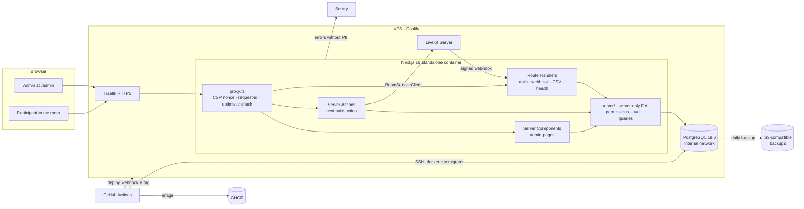
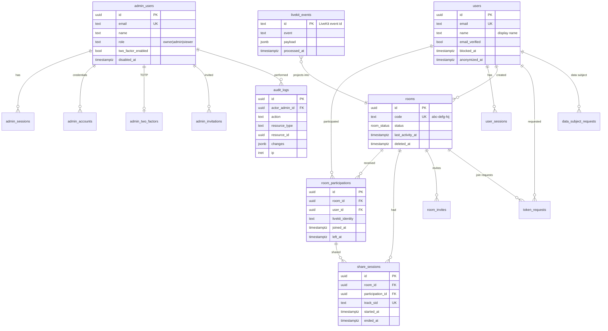
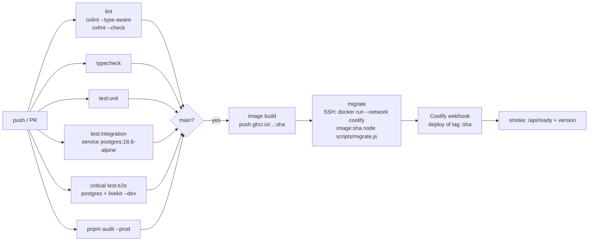

# Technical plan: Nelcota admin panel

> Status: **approved on 06/10/2026**, with one change: **participants have an account with e-mail and password** (§5.4). The other assumptions in §11 follow the recommendation.
> Versions and documentation verified on **06/10/2026** (npm registry, official docs, GitHub, Docker Hub).

---

## 1. Executive summary

1. The panel lives **in the same Next.js app** (route `/admin`), in the same Docker image, with code organized by _feature_ so it can be reused.
2. Data in **PostgreSQL 18.6** with **Drizzle ORM 0.45** + the **`pg`** driver; **UUID v7** keys generated by Postgres itself (`uuidv7()`).
3. Authentication with **Better Auth 1.7** in **two separate instances**: admins (`/api/admin/auth`, mandatory 2FA, invite only) and participants (`/api/auth`, sign-up with verified e-mail, optional 2FA). Passwords in **argon2id**, sessions in the database. Admin **RBAC** defined in code (`owner` / `admin` / `viewer`).
4. Mutations only through **Server Actions via `next-safe-action`**, with permission + Zod validation + **audit log** applied in a single _middleware_.
5. **Server-side** listings with TanStack Table v9 (headless), state in the URL with **nuqs**, **keyset** pagination and _streamed_ CSV export.
6. Business data (rooms, participations, shares) comes from **LiveKit webhooks**, written idempotently.
7. Migrations in a **separate job** at deploy time (CI → image on GHCR → `migrate` with its own user → deploy on Coolify), **expand/contract** pattern.
8. Observability: Pino (JSON on stdout), Sentry SDK 11 (SaaS, no PII), `pg_stat_statements`, health checks.
9. Daily Coolify backup to S3 with restore **tested monthly**. RPO 24 h / RTO 2 h for the MVP.
10. Roadmap in 11 phases, **~47 working days** to the complete panel, with a usable MVP at the end of Phase 3 (~23 days).

---

## 2. Stack decisions

### 2.1 Verified versions (06/10/2026)

| Package / service                           | Stable version                    | Latest release               | Verified compatibility                                                                                           |
| ------------------------------------------- | --------------------------------- | ---------------------------- | ---------------------------------------------------------------------------------------------------------------- |
| next                                        | 16.3.8                            | 05/10/2026                   | peer `react ^19`                                                                                                 |
| react / react-dom                           | 19.3.0                            | 02/10/2026                   | meets "19.2+"                                                                                                    |
| typescript                                  | 7.0.2                             | 06/10/2026                   | —                                                                                                                |
| zod                                         | 4.6.5                             | 02/10/2026                   | Standard Schema                                                                                                  |
| drizzle-orm / drizzle-kit                   | 0.45.3 / 0.31.11                  | 21/09/2026                   | peer `pg >=8`; 1.0 still in **RC (1.0.0-rc.4)**                                                                  |
| pg                                          | 8.23.1                            | 30/09/2026                   | Node ≥16                                                                                                         |
| better-auth                                 | 1.7.7                             | 30/09/2026                   | peers `next ^16`, `react ^19`, `drizzle-orm ^0.45.2`                                                             |
| @node-rs/argon2                             | **2.2.1** (10/09/2026)            | 2.2.2 released on 06/10/2026 | pinned to 2.2.1: 2.2.2 has not yet cleared pnpm's `minimumReleaseAge`; linux-musl x64/arm64 and Windows binaries |
| next-safe-action                            | 8.7.3                             | 07/09/2026                   | peers `next >=14`, `react >=18.2`; accepts Zod 4                                                                 |
| @next-safe-action/adapter-react-hook-form   | 2.1.0                             | 18/07/2026                   | peer `next-safe-action >=8.1.10`                                                                                 |
| @tanstack/react-table                       | 9.2.6                             | 04/10/2026                   | **compatible with React Compiler** (v9)                                                                          |
| @tanstack/react-query                       | 5.104.1                           | 02/10/2026                   | peer `react ^19`                                                                                                 |
| nuqs                                        | 2.10.1                            | 28/08/2026                   | peer `next >=14.2`                                                                                               |
| react-hook-form / @hookform/resolvers       | 7.89.0 / 5.9.1                    | 26/09 and 17/08/2026         | resolvers accepts `zod ^4`                                                                                       |
| recharts (via shadcn chart)                 | 3.10.1                            | 03/10/2026                   | peer `react ^19`                                                                                                 |
| cmdk (via shadcn command)                   | 1.1.1                             | **27/08/2025**               | peer `react ^19`; slow maintenance (see risks)                                                                   |
| sonner                                      | 2.0.8                             | 09/08/2026                   | already in the project                                                                                           |
| pino                                        | 10.4.0                            | 02/10/2026                   | already in Next 16.3.8's default `serverExternalPackages` list                                                   |
| @sentry/nextjs                              | 11.4.0                            | 02/10/2026                   | peer `next ^16`; Node 24 ok                                                                                      |
| vitest                                      | 5.0.3                             | 30/09/2026                   | Node `^24`                                                                                                       |
| @playwright/test                            | 1.63.0                            | 06/10/2026                   | Node ≥20                                                                                                         |
| @axe-core/playwright                        | 4.13.0                            | 06/10/2026                   | —                                                                                                                |
| testcontainers / @testcontainers/postgresql | 12.2.0                            | 28/09/2026                   | Node ≥22.22                                                                                                      |
| @faker-js/faker                             | 10.6.0                            | 06/09/2026                   | Node ≥24 ok                                                                                                      |
| date-fns / @date-fns/tz                     | 4.4.0 / 1.5.0                     | 29/05 and 21/05/2026         | —                                                                                                                |
| livekit-server-sdk                          | 2.19.1                            | 20/09/2026                   | already in the project                                                                                           |
| PostgreSQL                                  | **18.6** (`postgres:18.6-alpine`) | 13/08/2026                   | EOL 14/11/2030; native `uuidv7()`                                                                                |
| Coolify                                     | 4.3.23                            | 18/09/2026                   | offers Postgres 18 (`postgres:18-alpine` is the default)                                                         |
| Node.js                                     | 24.21.0 LTS                       | 07/09/2026                   | —                                                                                                                |

### 2.2 ORM / data access

|                | Decision                                                                                                                                                                                                                                                                                                                                                                                                                                    |
| -------------- | ------------------------------------------------------------------------------------------------------------------------------------------------------------------------------------------------------------------------------------------------------------------------------------------------------------------------------------------------------------------------------------------------------------------------------------------- |
| **Choice**     | **Drizzle ORM 0.45.x** (exact version pinned) + drizzle-kit 0.31.x                                                                                                                                                                                                                                                                                                                                                                          |
| Alternatives   | Prisma 7; Kysely 0.29                                                                                                                                                                                                                                                                                                                                                                                                                       |
| Reason         | Schema in TypeScript, no code generation step. Queries close to SQL, which makes keyset and aggregates predictable. Supports everything the plan uses: typed `jsonb`, `pgEnum`, `check()`, partial indexes (`.where`), GIN with `gin_trgm_ops`, `CREATE INDEX CONCURRENTLY`, identity and `default(sql\`uuidv7()\`)`. Generates versioned SQL. Better Auth has an official adapter for it. Already in the project.                          |
| Why not Prisma | On 06/10/2026 the `latest` tag of the `prisma` CLI installs **8.0.0-rc**, which has neither `generate` nor `migrate dev`. Stable Prisma 7 (7.10) requires pinning `^7`, uses a _driver adapter_ and has an 18-month maintenance cycle after v8. That is a rework risk right at the start.                                                                                                                                                   |
| Why not Kysely | Excellent _query builder_, but migrations are handwritten (no diff from the schema) and the types depend on codegen. More work for the same result.                                                                                                                                                                                                                                                                                         |
| Risks          | (1) Drizzle 1.0 still has no GA date and changes the migrations folder format (`drizzle-kit up` converts it). Mitigation: use the v2 relations API (`defineRelations`) from now on and plan the conversion as an isolated task. (2) Generated columns only in `STORED` mode (PG18 uses `VIRTUAL` by default), so always declare `STORED`. (3) Type performance with TS 7 not verified. Measure with `tsc --extendedDiagnostics` in Phase 0. |

### 2.3 Driver and pool

|              | Decision                                                                                                                                                                                                                                                                                                                                                     |
| ------------ | ------------------------------------------------------------------------------------------------------------------------------------------------------------------------------------------------------------------------------------------------------------------------------------------------------------------------------------------------------------ |
| **Choice**   | **`pg` 8.23** (`drizzle-orm/node-postgres`), one `Pool` per process, `max: 10`, `idleTimeoutMillis: 30s`, `connectionTimeoutMillis: 5s`, `statement_timeout` of 15 s per connection (30 s for exports)                                                                                                                                                       |
| Alternatives | postgres.js 3.4.9; `pg-native`                                                                                                                                                                                                                                                                                                                               |
| Reason       | `pg` is active (release on 30/09/2026) and is the most used driver with Drizzle and Better Auth. postgres.js has not published since 04/2026 and has serious open _issues_ with no response (transaction connection handed to another transaction, pool that does not recover). `pg-native` requires a native toolchain in the Alpine image for a ~10% gain. |
| PgBouncer    | **Do not use.** It is a single long-running Node process (not serverless): 10 app connections + 2 from the migration job + headroom stay well below `max_connections = 50/100`. Reevaluate only with multiple replicas.                                                                                                                                      |
| Risks        | Pool per process: when scaling to N replicas, recompute `max × N`.                                                                                                                                                                                                                                                                                           |

### 2.4 Authentication and authorization

|                  | Decision                                                                                                                                                                                                                                                                                                                                                                                                    |
| ---------------- | ----------------------------------------------------------------------------------------------------------------------------------------------------------------------------------------------------------------------------------------------------------------------------------------------------------------------------------------------------------------------------------------------------------- |
| **Choice**       | **Better Auth 1.7.7+** with the `twoFactor`, `admin` + `createAccessControl`, `nextCookies` (last plugin) plugins, Drizzle adapter, rate limit with `storage: "database"`, custom **argon2id** hash via `@node-rs/argon2` (m=19456 KiB, t=2, p=1, OWASP minimum)                                                                                                                                            |
| Alternatives     | Auth.js (next-auth); in-house solution (Lucia pattern)                                                                                                                                                                                                                                                                                                                                                      |
| Reason           | Covers e-mail + password, recovery, TOTP 2FA with _backup codes_, session listing and revocation, per-route rate limit, granular RBAC (resource → actions), disabled sign-up (`disableSignUp`) and Drizzle schema generation. Integrates with Next 16 (`toNextJsHandler`, `auth.api.getSession({ headers })`). The Auth.js maintainers recommend Better Auth for new projects (announcement of 22/09/2025). |
| Why not Auth.js  | v5 is still in **beta** (5.0.0-beta.32) and the project is now maintained by the Better Auth team with fixes only.                                                                                                                                                                                                                                                                                          |
| Why not in-house | It would require writing and auditing sessions, rotation, TOTP, _backup codes_, reset, rate limit and RBAC. The history of subtle flaws in mature libraries shows the cost.                                                                                                                                                                                                                                 |
| Gaps to cover    | (1) **Account lockout after wrong passwords is not native** (only 2FA has lockout). Implement our own table + _hook_ (see §5.3). (2) The cookie's default `sameSite` was not verified: set `SameSite=Strict` explicitly and test. (3) `cookieCache` **off** (a revoked session would only stop working at the end of the cache).                                                                            |
| Risks            | Library with frequent releases and public _advisories_. Pin the exact version, Renovate with review, read the security changelog on every update. Do not use the OAuth/OIDC/organization plugins (where the 2026 _advisories_ concentrated).                                                                                                                                                                |

### 2.5 Mutations and validation

|                         | Decision                                                                                                                                                                                                                                                     |
| ----------------------- | ------------------------------------------------------------------------------------------------------------------------------------------------------------------------------------------------------------------------------------------------------------ |
| **Choice**              | **Server Actions with `next-safe-action` 8.7** for every mutation. **Zod 4** schemas in `features/*/schemas.ts`, imported by the form (client) and by the action (server).                                                                                   |
| Alternatives            | REST Route Handlers; plain Server Actions                                                                                                                                                                                                                    |
| Reason                  | A base _client_ applies, in this order: session → 2FA → permission → rate limit → validation → execution → audit log → log. It becomes impossible to forget authorization in a new action. End-to-end typing and integration with RHF (`useHookFormAction`). |
| Route Handlers only for | `/api/auth/[...all]` (Better Auth), `/api/livekit/webhook` (signature), `/api/health` and `/api/ready`, CSV export (_streamed_ `GET`, with the same permission check).                                                                                       |
| Risks                   | Every action is a public POST endpoint: the _middleware_ is mandatory and a test walks through **all** registered actions and guarantees none runs without session and permission (§8).                                                                      |

### 2.6 Data tables

|                | Decision                                                                                                                                                                                                                                                                                                                    |
| -------------- | --------------------------------------------------------------------------------------------------------------------------------------------------------------------------------------------------------------------------------------------------------------------------------------------------------------------------- |
| **Choice**     | **TanStack Table v9** (headless, `manualPagination/Sorting/Filtering`) + shadcn Data Table components (already on v9) + **nuqs 2.10** (`createLoader` on the server, `shallow: false` + `useTransition` on the client)                                                                                                      |
| Alternatives   | AG Grid Community; custom table with no library                                                                                                                                                                                                                                                                             |
| Reason         | v9 is the first version compatible with the React Compiler. Headless, so it follows the app's design. State (filters, sorting, cursor, columns) lives in the URL: the link can be shared and browser history works.                                                                                                         |
| Pagination     | **Keyset** (`WHERE (col, id) < ($1, $2) ORDER BY col DESC, id DESC LIMIT n+1`) in every list. "Anterior / Próxima" ("Previous / Next") buttons and an **approximate** total (`count` capped at 10,001 rows: "mais de 10.000" ("more than 10,000")). Sorting only by _whitelisted_ columns, always with `id` as tie-breaker. |
| Bulk selection | By IDs (up to 500) or "all results of the filter" (the server reapplies the filter, limit of 10,000, with confirmation).                                                                                                                                                                                                    |
| CSV export     | _Streamed_ Route Handler (keyset batches of 1,000 rows), UTF-8 with BOM, `;` separator (pt-BR Excel), protection against **CSV injection** (prefix `'` on cells starting with `= + - @ \t \r`), recorded in the audit log.                                                                                                  |
| Risks          | The v9 API is new (do not destructure `row` methods). Validate the shadcn component in Phase 2.                                                                                                                                                                                                                             |

### 2.7 Forms

|                | Decision                                                                                                                                                                                                             |
| -------------- | -------------------------------------------------------------------------------------------------------------------------------------------------------------------------------------------------------------------- |
| **Choice**     | **React Hook Form 7.89 + `zodResolver` + `useHookFormAction`** (next-safe-action adapter) + shadcn `Field` components                                                                                                |
| Alternatives   | TanStack Form 1.33; Conform                                                                                                                                                                                          |
| Reason         | Direct integration with next-safe-action (server errors land on the right field), largest base of examples, and the current shadcn guide uses `Field` + RHF.                                                         |
| Single pattern | Entity with up to ~6 fields (admin invite, settings, rename room) → **Dialog**. Larger entity or one with history → **page** `/[id]/editar`. Both use the same `<EntityForm schema action defaultValues>` component. |
| Risks          | `watch()` is incompatible with the React Compiler: use `useWatch`, with a `no-restricted-syntax` lint rule blocking `watch(`.                                                                                        |

### 2.8 Client-side data fetching

|              | Decision                                                                                                                                                                                                                                                  |
| ------------ | --------------------------------------------------------------------------------------------------------------------------------------------------------------------------------------------------------------------------------------------------------- |
| **Choice**   | **Server Components + DAL by default.** After an action: `refresh()` (refreshes the router) or `revalidatePath`. **TanStack Query only** for: (1) active LiveKit rooms (_polling_ every 5 s), (2) command palette search, (3) self-updating top counters. |
| Alternatives | TanStack Query everywhere; RSC only (no polling)                                                                                                                                                                                                          |
| Rule         | "Does it need to update without user action or on every keystroke?" → Query. Otherwise → RSC.                                                                                                                                                             |
| Cache        | 100% dynamic panel (required by the nonce CSP). No `cacheComponents` at this stage: turning it on would change the public app's rendering model. Reevaluate after the MVP.                                                                                |
| Risks        | Two sources of truth if the rule is not followed. Code review checks it.                                                                                                                                                                                  |

### 2.9 Charts and dashboard

|              | Decision                                                                                                                                                                                                                |
| ------------ | ----------------------------------------------------------------------------------------------------------------------------------------------------------------------------------------------------------------------- |
| **Choice**   | **shadcn Charts (Recharts 3.10)**, only in client components, with data already aggregated on the server                                                                                                                |
| Alternatives | ECharts 6.1; visx 4                                                                                                                                                                                                     |
| Reason       | Same visual system as shadcn, theming via CSS tokens (light/dark), enough for daily series and bars. ECharts is heavier (~1 MB) and clashes with the design.                                                            |
| Queries      | Daily aggregates in `America/Sao_Paulo` (`date_trunc('day', started_at AT TIME ZONE 'America/Sao_Paulo')`), backed by date indexes. Above ~1 million rows: a `metrics_daily` _rollup_ table updated by a job (Phase 9). |
| Risks        | Recharts renders SVG: limit to ~366 points per series (1 year by day).                                                                                                                                                  |

### 2.10 Logs, auditing and observability

|              | Decision                                                                                                                                                                                                                                                                                                            |
| ------------ | ------------------------------------------------------------------------------------------------------------------------------------------------------------------------------------------------------------------------------------------------------------------------------------------------------------------- |
| Logger       | **Pino 10** as JSON on stdout (no _transports_ in production, no _worker threads_). `pino-pretty` only in dev. `redact` for `password`, `token`, `cookie`, `authorization`, `*.secret`, `totp*`. Every request gets an `x-request-id` generated in `proxy.ts`.                                                      |
| Audit log    | Insert-only `audit_logs` table: who, action, resource, IP, user agent, `before`/`after` (only changed fields, with sensitive data masked) and `request_id`. Written by the next-safe-action _middleware_ **in the same transaction** as the change. The app's database user has no `UPDATE`/`DELETE` on this table. |
| Errors       | **Sentry SDK 11 → Sentry SaaS**, with `sendDefaultPii: false`, IP and e-mail _scrubbing_, `onRequestError` in `instrumentation.ts`. Alternative: self-hosted **GlitchTip 6** (same SDK, with `traceLifecycle: "static"`), if the data must stay on the VPS. Costs ~1 GB of extra RAM.                               |
| Health       | `/api/health` (liveness, no database, used by `HEALTHCHECK`) and `/api/ready` (`select 1` + latest migration version, used in the deploy _smoke test_).                                                                                                                                                             |
| Database     | `pg_stat_statements` + `log_min_duration_statement = 500ms` + `auto_explain` for queries above 2 s. "Consultas lentas" ("Slow queries") screen in the admin (Phase 9, `owner` only).                                                                                                                                |
| Alternatives | Winston (slower); full OpenTelemetry (heavy for a VPS)                                                                                                                                                                                                                                                              |
| Risks        | Sentry SaaS sends error data outside Brazil (LGPD: international transfer). Mitigated by not sending PII. See question 5 in §11.                                                                                                                                                                                    |

### 2.11 Tests

|                    | Decision                                                                                                                                                                                                                                                                                                                     |
| ------------------ | ---------------------------------------------------------------------------------------------------------------------------------------------------------------------------------------------------------------------------------------------------------------------------------------------------------------------------- |
| Unit + integration | **Vitest 5** (replaces the current `node --test`, whose tests will be migrated). Integration against a **real Postgres 18.6**: in CI, a _service container_; locally, `docker compose`. Each Vitest _worker_ uses a database cloned from an already-migrated _template_ (`CREATE DATABASE ... TEMPLATE`), isolated and fast. |
| E2E                | **Playwright 1.63** against the standalone build, with Postgres and `livekit-server --dev` as services. Accessibility with `@axe-core/playwright`.                                                                                                                                                                           |
| Alternative        | Testcontainers 12 (rejected as the default: requires Docker inside the test runner and is slower; still available for anyone who prefers it locally).                                                                                                                                                                        |
| Risks              | Slow E2E: run only the critical flows on PRs and the full suite daily.                                                                                                                                                                                                                                                       |

### 2.12 CI/CD

|              | Decision                                                                                                                                                                                                                                              |
| ------------ | ----------------------------------------------------------------------------------------------------------------------------------------------------------------------------------------------------------------------------------------------------- |
| **Choice**   | GitHub Actions: `lint` (`oxlint --type-aware`), `typecheck`, `test:unit`, `test:integration`, `test:e2e`, `build` → image on **GHCR** → **migration job** → Coolify deploy webhook (with the image tag) → _smoke test_ on `/api/ready`                |
| Alternatives | Coolify building from Git (today's default)                                                                                                                                                                                                           |
| Reason       | (1) Coolify's _pre-deployment command_ runs in the **old** container, so it does not apply new migrations. (2) Building Next.js on the small VPS competes with the production app for CPU and RAM. Building in CI and shipping the image solves both. |
| Dependencies | **Renovate** (Dependabot's support for pnpm 12 is not confirmed yet and there are known issues with `minimumReleaseAge`). `pnpm audit --prod` in CI, failing on _high/critical_.                                                                      |
| Risks        | The migration job needs SSH access to the VPS (dedicated key, user with no interactive shell, restricted to `docker run`).                                                                                                                            |

---

## 3. Architecture and folder structure

### 3.1 Overview



### 3.2 Proposed folder tree

```
app/
  (publico)/                      # current app (home, room) — no behavior change
  admin/
    (auth)/                       # no shell; accessible without a session
      entrar/  verificar-2fa/  recuperar-senha/  redefinir-senha/  convite/[token]/
    (painel)/                     # shell with sidebar; requires session + 2FA
      layout.tsx                  # loads the session via the DAL, builds the sidebar from permissions
      page.tsx                    # dashboard
      usuarios/  salas/  compartilhamentos/  ao-vivo/
      auditoria/  admins/  configuracoes/  conta/
  api/
    auth/[...all]/route.ts        # Better Auth
    livekit/webhook/route.ts
    admin/exportar/[recurso]/route.ts
    health/route.ts  ready/route.ts
server/                           # EVERYTHING here starts with import "server-only"
  db/
    client.ts                     # Pool + drizzle()
    schema/                       # one file per domain: auth.ts, rooms.ts, audit.ts…
    relations.ts                  # defineRelations (v2 API)
  auth/
    better-auth.ts                # instance and plugins
    permissions.ts                # statements, roles and matrix (single source)
    session.ts                    # getAdminSession(), requirePermission()
    lockout.ts
  actions/
    client.ts                     # actionClient, adminAction(perm) with middlewares
  audit/record.ts
  livekit/
    room-service.ts               # RoomServiceClient
    webhook-projector.ts          # event → tables
  logger.ts
  env.ts                          # Zod (replaces lib/env.ts)
features/                         # one directory per panel domain
  salas/
    schemas.ts                    # shared Zod (client + server)
    queries.ts                    # server-only: keyset listing, details, aggregates
    actions.ts                    # "use server": next-safe-action
    columns.tsx                   # table columns (client)
    components/                   # the feature's screens and dialogs
  usuarios/  compartilhamentos/  ao-vivo/  auditoria/  admins/  dashboard/  configuracoes/
components/
  ui/                             # shadcn
  admin/                          # shell, sidebar, breadcrumbs, command palette, data-table/*
lib/                              # isomorphic, no secrets: pt-BR formatting, utils
drizzle/                          # versioned SQL migrations
scripts/
  migrate.ts  seed.ts  create-owner.ts  restore-check.sh
tests/
  unit/  integration/  e2e/
```

### 3.3 Dependency rules (checked by lint)

| From → To                                                                                                      | Allowed?                                                       |
| -------------------------------------------------------------------------------------------------------------- | -------------------------------------------------------------- |
| `components/**`, `features/*/components/**`, `features/*/columns.tsx` → `server/**` or `features/*/queries.ts` | **No.** Components receive data through props or call actions. |
| Client component → `features/*/actions.ts` and `schemas.ts`                                                    | Yes                                                            |
| `features/*/queries.ts` and `actions.ts` → `server/**`                                                         | Yes                                                            |
| `features/a/**` → `features/b/queries.ts`                                                                      | **No.** Whatever is shared moves up to `server/`.              |
| Any code → `pg` or `drizzle-orm` outside `server/db` and `features/*/queries.ts`                               | **No**                                                         |
| `app/**` pages → `features/*/queries.ts`                                                                       | Yes (Server Components only)                                   |

Implementation: `import "server-only"` in all of `server/**` and `queries.ts` (build error if it ends up on the client) + oxlint's `no-restricted-imports` with per-folder `overrides`.

Current code that changes: `lib/env.ts`, `lib/db/*`, `lib/settings.ts`, `lib/admin-auth.ts` and `app/admin/*` (built before this plan) move to `server/` and `features/`, and the `ADMIN_PASSWORD` login is **replaced** by Better Auth. The migration at boot (`instrumentation.ts`) is **removed** (§9.4).

---

## 4. Database modeling

### 4.1 Conventions

| Topic           | Decision and reason                                                                                                                                                                                                                                                                                                                                                                                                                                                                                |
| --------------- | -------------------------------------------------------------------------------------------------------------------------------------------------------------------------------------------------------------------------------------------------------------------------------------------------------------------------------------------------------------------------------------------------------------------------------------------------------------------------------------------------- |
| Primary key     | **`uuid` with `DEFAULT uuidv7()`** (native in PG18) in every table. It is time-ordered, so inserts go to the end of the index (without UUID v4 fragmentation) and keyset by `id` follows creation order. It is not enumerable in URLs (`/admin/salas/<id>`) and is generated in the database (Better Auth uses `advanced.database.generateId: false` with `DEFAULT`). Cost: 16 bytes versus 8 for `bigint`, irrelevant at this scale. UUID v7 reveals the creation date, which is acceptable here. |
| Time            | Always `timestamptz` (stored in UTC). Conversion to `America/Sao_Paulo` only for display and daily aggregates.                                                                                                                                                                                                                                                                                                                                                                                     |
| Row auditing    | `created_at`/`updated_at` `NOT NULL DEFAULT now()` + a generic `set_updated_at()` trigger (works even for manual SQL, unlike the ORM's `$onUpdate`).                                                                                                                                                                                                                                                                                                                                               |
| Soft delete     | `deleted_at timestamptz` on `rooms`, `users` and `room_invites`. Admins are **disabled** (`disabled_at`), never deleted (the audit log points to them). Audit log and raw events have no deletion. LGPD deletion requests perform **permanent anonymization**, not soft delete.                                                                                                                                                                                                                    |
| Enums vs tables | `pgEnum` for small, stable sets tied to code (`room_status`, `participant_leave_reason`, `invite_status`, `dsr_type`, `dsr_status`). Admin roles: `text` with a `CHECK` generated from the list in code (see §5.2). Domain tables only when the user can edit the list.                                                                                                                                                                                                                            |
| Names           | `snake_case`, plural tables, FKs `<entity>_id`, indexes `<table>_<columns>_idx`, uniques `<table>_<columns>_key`. Drizzle with `casing: "snake_case"`.                                                                                                                                                                                                                                                                                                                                             |
| Integrity       | `NOT NULL` by default. FKs with explicit `ON DELETE` (`restrict` by default; `set null` only where anonymization requires it). `CHECK` for ranges and formats (room code, durations ≥ 0). Partial `UNIQUE` respecting soft delete.                                                                                                                                                                                                                                                                 |
| Text and search | `pg_trgm` and `unaccent` extensions, with an `IMMUTABLE` `f_unaccent()` function usable in indexes. Name/code search with `ILIKE` + trigram (better than _full-text_ for short pt-BR names and codes). _Full-text_ (`tsvector` `portuguese`) is reserved for long text (notes), if it ever appears.                                                                                                                                                                                                |

### 4.2 Diagram



> **Decision (approval of 06/10/2026):** participants have **their own account** (e-mail + password), separate from admins: tables `users`, `user_sessions`, `user_accounts`, `user_verifications`, `user_two_factors`, `user_rate_limits`, generated by the second Better Auth instance. Joining a room and creating a room require login with a verified e-mail.

### 4.3 Proposed schema (reference SQL)

The real schema will be written in Drizzle (`server/db/schema/*.ts`), and the SQL below is what it must generate. The Better Auth tables are generated by the CLI (`npx auth@latest generate --adapter drizzle`) and adjusted to these names with `modelName`/`fields`.

```sql
-- Extensions and utilities (migration 0001, applied by the migration user)
CREATE EXTENSION IF NOT EXISTS pg_trgm;
CREATE EXTENSION IF NOT EXISTS unaccent;
CREATE EXTENSION IF NOT EXISTS pg_stat_statements;

CREATE FUNCTION f_unaccent(text) RETURNS text
  LANGUAGE sql IMMUTABLE PARALLEL SAFE STRICT
  AS $$ SELECT public.unaccent('public.unaccent'::regdictionary, $1) $$;

CREATE FUNCTION set_updated_at() RETURNS trigger LANGUAGE plpgsql AS $$
BEGIN NEW.updated_at := now(); RETURN NEW; END $$;

-- ===== Admins (Better Auth, mapped names) =====
CREATE TABLE admin_users (
  id uuid PRIMARY KEY DEFAULT uuidv7(),
  email text NOT NULL,
  email_verified boolean NOT NULL DEFAULT false,
  name text NOT NULL CHECK (length(name) BETWEEN 1 AND 80),
  image text,
  role text NOT NULL DEFAULT 'viewer' CHECK (role IN ('owner','admin','viewer')),
  two_factor_enabled boolean NOT NULL DEFAULT false,
  banned boolean NOT NULL DEFAULT false,          -- admin plugin
  ban_reason text,
  ban_expires timestamptz,
  disabled_at timestamptz,
  created_at timestamptz NOT NULL DEFAULT now(),
  updated_at timestamptz NOT NULL DEFAULT now()
);
CREATE UNIQUE INDEX admin_users_email_key ON admin_users (lower(email));
-- There is always at least one active owner: guaranteed in the action + test (cannot be expressed as a CHECK).

CREATE TABLE admin_sessions (
  id uuid PRIMARY KEY DEFAULT uuidv7(),
  user_id uuid NOT NULL REFERENCES admin_users(id) ON DELETE CASCADE,
  token text NOT NULL UNIQUE,
  expires_at timestamptz NOT NULL,
  ip_address inet,
  user_agent text,
  impersonated_by uuid REFERENCES admin_users(id), -- admin plugin; impersonation stays OFF
  created_at timestamptz NOT NULL DEFAULT now(),
  updated_at timestamptz NOT NULL DEFAULT now()
);
CREATE INDEX admin_sessions_user_id_idx ON admin_sessions (user_id, expires_at DESC);

CREATE TABLE admin_accounts (            -- Better Auth credential (argon2id hash)
  id uuid PRIMARY KEY DEFAULT uuidv7(),
  user_id uuid NOT NULL REFERENCES admin_users(id) ON DELETE CASCADE,
  account_id text NOT NULL,
  provider_id text NOT NULL,              -- 'credential'
  password text,                          -- $argon2id$...
  created_at timestamptz NOT NULL DEFAULT now(),
  updated_at timestamptz NOT NULL DEFAULT now(),
  UNIQUE (provider_id, account_id)
);
CREATE TABLE admin_verifications (       -- reset / invite tokens (Better Auth)
  id uuid PRIMARY KEY DEFAULT uuidv7(),
  identifier text NOT NULL,
  value text NOT NULL,
  expires_at timestamptz NOT NULL,
  created_at timestamptz NOT NULL DEFAULT now(),
  updated_at timestamptz NOT NULL DEFAULT now()
);
CREATE INDEX admin_verifications_identifier_idx ON admin_verifications (identifier);
CREATE TABLE admin_two_factors (
  id uuid PRIMARY KEY DEFAULT uuidv7(),
  user_id uuid NOT NULL UNIQUE REFERENCES admin_users(id) ON DELETE CASCADE,
  secret text NOT NULL,                   -- encrypted by Better Auth
  backup_codes text NOT NULL
);
CREATE TABLE admin_rate_limits (         -- "database" storage for Better Auth's rate limit
  id text PRIMARY KEY, key text NOT NULL UNIQUE, count integer NOT NULL, last_request bigint NOT NULL
);

-- Lockout after failed attempts (not native to Better Auth)
CREATE TYPE auth_scope AS ENUM ('admin','user');
CREATE TABLE login_failures (             -- admins and participants, separated by scope
  id uuid PRIMARY KEY DEFAULT uuidv7(),
  scope auth_scope NOT NULL,
  email_hash bytea NOT NULL,              -- HMAC of the normalized e-mail: does not store e-mails of people who are not even admins
  ip inet NOT NULL,
  created_at timestamptz NOT NULL DEFAULT now()
);
CREATE INDEX login_failures_email_idx ON login_failures (scope, email_hash, created_at DESC);
CREATE INDEX login_failures_ip_idx ON login_failures (scope, ip, created_at DESC);

CREATE TYPE invite_status AS ENUM ('pending','accepted','revoked','expired');
CREATE TABLE admin_invitations (
  id uuid PRIMARY KEY DEFAULT uuidv7(),
  email text NOT NULL,
  role text NOT NULL CHECK (role IN ('admin','viewer')),   -- owner only via transfer
  token_hash bytea NOT NULL UNIQUE,       -- SHA-256 of the token; the token is shown only once
  status invite_status NOT NULL DEFAULT 'pending',
  invited_by uuid NOT NULL REFERENCES admin_users(id),
  expires_at timestamptz NOT NULL,
  accepted_at timestamptz,
  created_at timestamptz NOT NULL DEFAULT now(),
  updated_at timestamptz NOT NULL DEFAULT now(),
  CHECK (expires_at > created_at)
);
CREATE UNIQUE INDEX admin_invitations_pending_email_key
  ON admin_invitations (lower(email)) WHERE status = 'pending';

-- ===== Business =====
CREATE TYPE room_status AS ENUM ('active','finished');
CREATE TABLE rooms (
  id uuid PRIMARY KEY DEFAULT uuidv7(),
  code text NOT NULL CHECK (code ~ '^[a-z0-9]+(-[a-z0-9]+)*$' AND length(code) <= 32),
  status room_status NOT NULL DEFAULT 'active',
  livekit_sid text,
  started_at timestamptz NOT NULL DEFAULT now(),
  finished_at timestamptz,
  last_activity_at timestamptz NOT NULL DEFAULT now(),
  peak_participants smallint NOT NULL DEFAULT 0 CHECK (peak_participants >= 0),
  created_by_user_id uuid REFERENCES users(id) ON DELETE SET NULL,
  closed_by_admin_id uuid REFERENCES admin_users(id),
  note text CHECK (length(note) <= 500),
  deleted_at timestamptz,
  created_at timestamptz NOT NULL DEFAULT now(),
  updated_at timestamptz NOT NULL DEFAULT now(),
  CHECK (finished_at IS NULL OR finished_at >= started_at)
);
-- The same code can be reopened in the future: only one "live" (not deleted) room per code.
CREATE UNIQUE INDEX rooms_code_live_key ON rooms (code) WHERE deleted_at IS NULL;
-- (Implemented) the code CHECK follows lib/livekit.ts: '^[a-z0-9][a-z0-9-]{1,30}[a-z0-9]$'.
-- Reopening a code reuses the row: status goes back to 'active', started_at keeps the first opening.

-- Participants (2nd Better Auth instance; names mapped with modelName/fields)
CREATE TABLE users (
  id uuid PRIMARY KEY DEFAULT uuidv7(),
  email text NOT NULL,
  email_verified boolean NOT NULL DEFAULT false,
  name text NOT NULL CHECK (length(name) BETWEEN 1 AND 32),   -- name shown in the room
  image text,
  two_factor_enabled boolean NOT NULL DEFAULT false,
  last_seen_at timestamptz,
  blocked_at timestamptz,                 -- blocked by an admin: login and /api/token refuse
  block_reason text CHECK (length(block_reason) <= 300),
  anonymized_at timestamptz,              -- LGPD: e-mail/name replaced with PII-free values
  deleted_at timestamptz,
  created_at timestamptz NOT NULL DEFAULT now(),
  updated_at timestamptz NOT NULL DEFAULT now()
);
CREATE UNIQUE INDEX users_email_key ON users (lower(email));
-- (Implemented) users.participations_count, maintained by a trigger on room_participations,
-- to sort the participant list by participations without a COUNT per page.
-- user_sessions, user_accounts, user_verifications, user_two_factors, user_rate_limits:
-- same structure as the admin_* tables above, with FK to users(id) ON DELETE CASCADE.

CREATE TYPE participant_leave_reason AS ENUM ('left','disconnected','removed_by_admin','room_closed','unknown');
CREATE TABLE room_participations (
  id uuid PRIMARY KEY DEFAULT uuidv7(),
  room_id uuid NOT NULL REFERENCES rooms(id) ON DELETE RESTRICT,
  user_id uuid REFERENCES users(id) ON DELETE SET NULL,
  livekit_identity text NOT NULL,       -- = users.id in the token
  livekit_sid text NOT NULL UNIQUE,       -- connection sid (PA_…): present in every event, including track events
  display_name text CHECK (length(display_name) <= 32),   -- can be anonymized
  ip inet,                                -- access record (Marco Civil, 6 months), then NULL
  joined_at timestamptz NOT NULL,
  left_at timestamptz,
  leave_reason participant_leave_reason,
  created_at timestamptz NOT NULL DEFAULT now(),
  updated_at timestamptz NOT NULL DEFAULT now(),
  CHECK (left_at IS NULL OR left_at >= joined_at)
);

CREATE TABLE share_sessions (
  id uuid PRIMARY KEY DEFAULT uuidv7(),
  room_id uuid NOT NULL REFERENCES rooms(id) ON DELETE RESTRICT,
  participation_id uuid NOT NULL REFERENCES room_participations(id) ON DELETE RESTRICT,
  track_sid text NOT NULL UNIQUE,
  with_audio boolean NOT NULL DEFAULT false,
  started_at timestamptz NOT NULL,
  ended_at timestamptz,
  duration_seconds integer GENERATED ALWAYS AS
    (CASE WHEN ended_at IS NULL THEN NULL
          ELSE floor(extract(epoch FROM ended_at - started_at))::int END) STORED,
  created_at timestamptz NOT NULL DEFAULT now(),
  updated_at timestamptz NOT NULL DEFAULT now(),
  CHECK (ended_at IS NULL OR ended_at >= started_at)
);

CREATE TABLE room_invites (               -- invite with expiry/limit (replaces the "open link" when used)
  id uuid PRIMARY KEY DEFAULT uuidv7(),
  room_id uuid NOT NULL REFERENCES rooms(id) ON DELETE CASCADE,
  token_hash bytea NOT NULL UNIQUE,
  label text CHECK (length(label) <= 80),
  max_uses integer CHECK (max_uses > 0),
  uses integer NOT NULL DEFAULT 0 CHECK (uses >= 0),
  expires_at timestamptz,
  revoked_at timestamptz,
  created_by uuid NOT NULL REFERENCES admin_users(id),
  deleted_at timestamptz,
  created_at timestamptz NOT NULL DEFAULT now(),
  updated_at timestamptz NOT NULL DEFAULT now(),
  CHECK (max_uses IS NULL OR uses <= max_uses)
);

-- (Implemented) who used each invite: the limit counts PEOPLE, not entries.
CREATE TABLE room_invite_uses (
  invite_id uuid NOT NULL REFERENCES room_invites(id) ON DELETE CASCADE,
  user_id uuid NOT NULL REFERENCES users(id) ON DELETE CASCADE,
  created_at timestamptz NOT NULL DEFAULT now(),
  PRIMARY KEY (invite_id, user_id)
);
-- A valid invite (?convite= in the room link) replaces the access password in /api/token.

CREATE TYPE token_result AS ENUM ('granted','wrong_password','room_full','rate_limited','blocked','unverified','unauthenticated','invalid','invite_invalid','error');
CREATE TABLE token_requests (             -- every request to /api/token (append-only)
  id uuid PRIMARY KEY DEFAULT uuidv7(),
  room_code text NOT NULL,
  room_id uuid REFERENCES rooms(id) ON DELETE SET NULL,
  user_id uuid REFERENCES users(id) ON DELETE SET NULL,
  result token_result NOT NULL,
  ip inet,
  created_at timestamptz NOT NULL DEFAULT now()
);

CREATE TABLE livekit_events (             -- raw webhook: idempotency + reprocessing
  id text PRIMARY KEY,                    -- LiveKit WebhookEvent.id
  event text NOT NULL,
  room_name text,
  payload jsonb NOT NULL,
  occurred_at timestamptz NOT NULL,       -- event time in LiveKit (orders reprocessing)
  received_at timestamptz NOT NULL DEFAULT now(),
  processed_at timestamptz,
  error text
);

-- ===== Auditing, settings and LGPD =====
CREATE TABLE audit_logs (
  id uuid PRIMARY KEY DEFAULT uuidv7(),
  actor_admin_id uuid REFERENCES admin_users(id) ON DELETE RESTRICT,   -- NULL = system
  action text NOT NULL CHECK (action ~ '^[a-z_]+\.[a-z_]+$'),         -- e.g.: room.close
  resource_type text NOT NULL,
  resource_id text,
  changes jsonb,                           -- {"campo":{"antes":x,"depois":y}} with secrets masked
  metadata jsonb NOT NULL DEFAULT '{}',
  ip inet,
  user_agent text,
  request_id text,
  created_at timestamptz NOT NULL DEFAULT now()
);
-- Immutable: a trigger refuses UPDATE/DELETE + the app role only has INSERT/SELECT.

CREATE TABLE app_settings (               -- already exists; gains updated_by
  key text PRIMARY KEY,
  value jsonb NOT NULL,
  updated_by uuid REFERENCES admin_users(id),
  updated_at timestamptz NOT NULL DEFAULT now()
);

CREATE TYPE dsr_type AS ENUM ('export','anonymize');
CREATE TYPE dsr_status AS ENUM ('open','done','rejected');
CREATE TABLE data_subject_requests (
  id uuid PRIMARY KEY DEFAULT uuidv7(),
  user_id uuid REFERENCES users(id) ON DELETE SET NULL,
  type dsr_type NOT NULL,
  status dsr_status NOT NULL DEFAULT 'open',
  requester_contact text NOT NULL,         -- how we reply to the data subject
  notes text,
  handled_by uuid REFERENCES admin_users(id),
  due_at timestamptz NOT NULL,             -- legal deadline (15 days, LGPD art. 19)
  completed_at timestamptz,
  created_at timestamptz NOT NULL DEFAULT now(),
  updated_at timestamptz NOT NULL DEFAULT now()
);
```

### 4.4 Indexes (per real query)

| Query (screen)                                       | Index                                                                                                                   |
| ---------------------------------------------------- | ----------------------------------------------------------------------------------------------------------------------- |
| Rooms: status filter + order by activity             | `rooms (status, last_activity_at DESC, id DESC) WHERE deleted_at IS NULL`                                               |
| Rooms: search by code                                | `rooms USING gin (code gin_trgm_ops) WHERE deleted_at IS NULL`                                                          |
| Users: search by name or e-mail (accent-insensitive) | `users USING gin (f_unaccent(lower(name                                                                                 |     | ' ' |     | email)) gin_trgm_ops) WHERE deleted_at IS NULL` |
| Users: order by sign-up / last access                | `users (created_at DESC, id DESC)` and `users (last_seen_at DESC NULLS LAST, id DESC)`, both `WHERE deleted_at IS NULL` |
| Room detail: participations                          | `room_participations (room_id, joined_at DESC)`                                                                         |
| User history                                         | `room_participations (user_id, joined_at DESC)`                                                                         |
| "Online agora" ("Online now")                        | `room_participations (room_id) WHERE left_at IS NULL`                                                                   |
| Shares: list and period                              | `share_sessions (started_at DESC, id DESC)` and `share_sessions (room_id, started_at DESC)`                             |
| Active shares                                        | `share_sessions (room_id) WHERE ended_at IS NULL`                                                                       |
| Audit: general list                                  | `audit_logs (created_at DESC, id DESC)`                                                                                 |
| Audit: by author, by resource, by action             | `(actor_admin_id, created_at DESC)`, `(resource_type, resource_id, created_at DESC)`, `(action, created_at DESC)`       |
| Token requests: security and retention               | `token_requests USING brin (created_at)` + `(ip, created_at DESC)`                                                      |
| Pending LiveKit events                               | `livekit_events (received_at) WHERE processed_at IS NULL`                                                               |
| Retention (cleanup jobs)                             | BRIN on `created_at` in the append-only tables (very cheap and effective for date ranges)                               |

**Avoid N+1:** listings run **one** query with `JOIN`/`LEFT JOIN LATERAL` (e.g. room + participant count via an aggregate subquery), never one query per row. Details use Drizzle's v2 relational API (generates a single SQL with `json_agg`). In dev, the Drizzle logger counts queries per request and warns above 10.

**Partitioning:** not now. Reevaluate monthly partitioning of `audit_logs`/`token_requests` above ~20 million rows (BRIN and keyset indexes hold up well until then).

### 4.5 Migrations

- **Generation:** `drizzle-kit generate` → SQL reviewed by hand in the PR (that is where `CONCURRENTLY`, triggers and grants go in) → commit to `drizzle/`.
- **Application:** **separate job** with the `nelcota_migrator` user (§9.4). The app **never** migrates at boot.
- **Expand/contract** (the old container keeps serving during the migration):
  1. _Expand_: add a nullable or defaulted column/table; indexes with `CREATE INDEX CONCURRENTLY` (non-transactional migration, in its own file).
  2. Deploy code that writes both formats and reads the new one.
  3. _Backfill_ in batches by a job (`UPDATE ... WHERE id IN (SELECT ... LIMIT 5000)`), never in one giant transaction.
  4. _Contract_ in a later release: drop the old column / add `NOT NULL` (`ADD CONSTRAINT ... NOT VALID` + `VALIDATE CONSTRAINT`).
- **Review rules** (PR checklist): no `ALTER TYPE ... RENAME VALUE` and no column drop in the same release that stops using it, `lock_timeout = '5s'` at the start of every migration, no migration rewrites a large table without a plan.
- **Rollback:** migrations have no _down_. Reverting is always done with a new _forward_ migration, which is why _expand/contract_ is mandatory.

### 4.6 Seed

- `pnpm db:seed` → `scripts/seed.ts` with **@faker-js/faker** (`faker.seed(42)`, locale `pt_BR`) and **deterministic IDs** (UUID derived from the index), `INSERT ... ON CONFLICT DO NOTHING`: running it twice duplicates nothing.
- Profiles: `--perfil=dev` (1 owner, 2 admins, 50 rooms, 300 users, 2 thousand participations) and `--perfil=carga --linhas=300000` (generated with `generate_series` in SQL, ~1 minute) to test indexes and pagination.
- Refuses to run if `NODE_ENV=production` or if the URL is not local/test.
- Initial owner in production: `scripts/create-owner.ts` (asks for an e-mail, prints a single-use invite link valid for 30 min). There is never a default password.

### 4.7 Database security

| Postgres role                  | Privileges                                                                                                                                                                                  | Used by                                              |
| ------------------------------ | ------------------------------------------------------------------------------------------------------------------------------------------------------------------------------------------- | ---------------------------------------------------- |
| `postgres` (Coolify superuser) | everything                                                                                                                                                                                  | **only** manual bootstrap (creating the roles below) |
| `nelcota_migrator`             | owner of the `public` schema; DDL                                                                                                                                                           | migration job                                        |
| `nelcota_app`                  | `SELECT/INSERT/UPDATE/DELETE` on the tables; on `audit_logs`, `livekit_events` and `token_requests` only `SELECT/INSERT` (+ `UPDATE` of `processed_at`/`error` on `livekit_events`); no DDL | the app                                              |
| `nelcota_readonly`             | `SELECT` (no auth tables)                                                                                                                                                                   | diagnostics and restore test                         |

- `ALTER DEFAULT PRIVILEGES FOR ROLE nelcota_migrator` automatically grants the app's access to future tables.
- `scram-sha-256` passwords (md5 is obsolete in PG18), long and random, and each one exists only in the environment where it is used (the migrator's lives **only** in the GitHub Actions secrets).
- Network: database **with no public port**, only on Coolify's internal network. Internal SSL is optional (traffic does not leave the host); turn on `sslmode=verify-full` with Coolify's CA if the database moves to another machine.
- `statement_timeout = 15s` and `idle_in_transaction_session_timeout = 30s` on the `nelcota_app` role.
- **Row Level Security: not adopting it now.** It is a single-"tenant" system with authorization centralized in the DAL and a single app role. RLS would require a per-transaction `SET` with the pool, policies that are hard to debug, and it would not protect against a compromised app (which would still be the same role). Audit immutability is guaranteed by _grants_ + trigger, which is simpler. **Reevaluate** if the product becomes multi-tenant (several isolated customers in the same database).

### 4.8 Backup and recovery

- **Daily logical backup** from Coolify (`pg_dump` custom format) at 03:00 to S3-compatible storage (Cloudflare R2 or Backblaze B2), with **bucket encryption** and _object lock_/versioning against deletion.
- **Retention:** 7 daily on the VPS; on S3, 30 daily + 12 monthly (bucket _lifecycle_ rule).
- **Targets:** **RPO 24 h / RTO 2 h** for the MVP. Next step (Phase 9, if the business asks): continuous WAL archiving with `wal-g` for **5 min RPO** and point-in-time recovery.
- **Monthly restore test (documented in `docs/RESTORE.md`):**
  1. Download the most recent dump from S3.
  2. Start a disposable `postgres:18.6-alpine`.
  3. `pg_restore --no-owner --role=nelcota_migrator`.
  4. Run `scripts/restore-check.sh`, which checks per-table counts, the most recent migration and a sample of panel queries.
  5. Record date, duration and result in a table in the doc itself.

  If it fails, an incident is opened.

- Coolify does not record failed backups if the database is stopped: Coolify's e-mail/Discord alert turned on + a weekly manual check of the date of the latest object in the bucket (Phase 9: automatic verification).

### 4.9 Tuning and monitoring (Postgres sharing the VPS with the app)

| Parameter                       | 4 GB VPS (~2 GB for PG)                                                                                                                                                                                                                                  | 8 GB VPS (~4 GB for PG) |
| ------------------------------- | -------------------------------------------------------------------------------------------------------------------------------------------------------------------------------------------------------------------------------------------------------- | ----------------------- |
| `shared_buffers`                | 512MB                                                                                                                                                                                                                                                    | 1GB                     |
| `effective_cache_size`          | 1536MB                                                                                                                                                                                                                                                   | 3GB                     |
| `work_mem`                      | 8MB                                                                                                                                                                                                                                                      | 12MB                    |
| `maintenance_work_mem`          | 128MB                                                                                                                                                                                                                                                    | 256MB                   |
| `max_connections`               | 50                                                                                                                                                                                                                                                       | 100                     |
| `wal_buffers`                   | 16MB                                                                                                                                                                                                                                                     | 16MB                    |
| `min_wal_size` / `max_wal_size` | 512MB / 2GB                                                                                                                                                                                                                                              | 1GB / 4GB               |
| Common                          | `random_page_cost=1.1`, `effective_io_concurrency=200`, `checkpoint_completion_target=0.9`, `shared_preload_libraries='pg_stat_statements,auto_explain'`, `log_min_duration_statement=500ms`, `auto_explain.log_min_duration=2s`, `listen_addresses='*'` |                         |

- Coolify's custom configuration **replaces** the whole `postgresql.conf`, so the complete file is versioned in `deploy/postgres/postgresql.conf`.
- Memory limit on the database container. 256 MB `/dev/shm` if Coolify accepts `--shm-size` (not verified; test in Phase 0).
- "Saúde do banco" ("Database health") panel (Phase 9): top 10 of `pg_stat_statements` by total time, table sizes, estimated _bloat_, open connections.

---

## 5. Authentication, RBAC and permission matrix

### 5.1 Flows

| Flow                  | How it works                                                                                                                                                                                                                                                                                                                                                                                                                                  |
| --------------------- | --------------------------------------------------------------------------------------------------------------------------------------------------------------------------------------------------------------------------------------------------------------------------------------------------------------------------------------------------------------------------------------------------------------------------------------------- |
| **First owner**       | `scripts/create-owner.ts` on the server → single-use invite link (30 min) → sets a password → mandatory 2FA setup → signs in.                                                                                                                                                                                                                                                                                                                 |
| **Admin invite**      | Owner invites an e-mail + role → random 32-byte token (only its SHA-256 is stored), valid for 48 h → e-mail with a link **or** link copied on screen if there is no SMTP (§11) → the person sets name and password → 2FA setup → accepted. Public sign-up **off** (`disableSignUp: true`).                                                                                                                                                    |
| **Login**             | E-mail + password → if 2FA is on, TOTP code screen (or _backup code_) → session created. Response and response time are **identical** for "e-mail does not exist" and "wrong password".                                                                                                                                                                                                                                                       |
| **2FA**               | TOTP (RFC 6238, 30 s, 6 digits), QR code + manual key, 10 single-use _backup codes_ (shown once, with a download option). **Mandatory for `owner` and `admin`**: without 2FA, the session can only access the 2FA setup screen. `trustDevice` **off**. Disabling 2FA requires password + current code and is recorded in the audit log.                                                                                                       |
| **Password recovery** | Message is always "Se o e-mail existir, enviamos um link" ("If the e-mail exists, we sent a link"). 30 min token, single use. Changing the password **revokes all sessions** (`revokeSessionsOnPasswordReset`). 2FA is still required after the reset.                                                                                                                                                                                        |
| **Sessions**          | In the database. Expires after **12 h** of inactivity (`expiresIn` 12 h, `updateAge` 1 h), absolute maximum of 7 days. **"Fresh" session (10 min)** for critical actions: change password, change role, disable 2FA, delete, export personal data. Outside that window, the password is asked again. "Sessões ativas" ("Active sessions") screen: device, IP, last use, "encerrar" ("end") and "encerrar todas as outras" ("end all others"). |
| **Cookie**            | `__Secure-` prefix, `HttpOnly`, `Secure`, **`SameSite=Strict`**, `Path=/`, no `Domain`. `cookieCache` off.                                                                                                                                                                                                                                                                                                                                    |
| **Impersonation**     | **Off** (the admin plugin offers it; it makes no sense here and is an abuse vector).                                                                                                                                                                                                                                                                                                                                                          |

### 5.2 Roles and permissions (single source in `server/auth/permissions.ts`)

Roles live **in code** (`createAccessControl`) and not in an editable table: they are versioned and reviewed in Git, they are typed (`requirePermission("room", "close")` does not compile with a nonexistent action) and there is no privilege escalation through the UI. The `admin_users.role` column has a `CHECK` generated from the same list. Roles customizable through the UI remain a future evolution (§10, extra phase), if a real need appears.

| Resource → action                                                                |  owner  |  admin  | viewer |
| -------------------------------------------------------------------------------- | :-----: | :-----: | :----: |
| `dashboard.read`                                                                 |   ✅    |   ✅    |   ✅   |
| `user.read`                                                                      |   ✅    |   ✅    |   ✅   |
| `user.update` (block/unblock, end sessions, resend verification)                 |   ✅    |   ✅    |   —    |
| `user.delete` (soft delete / restore)                                            |   ✅    |   ✅    |   —    |
| `user.export` (CSV)                                                              |   ✅    |   ✅    |   —    |
| `user.anonymize` (LGPD, irreversible)                                            |   ✅    |    —    |   —    |
| `room.read`                                                                      |   ✅    |   ✅    |   ✅   |
| `room.update` (note) / `room.delete` (soft delete)                               |   ✅    |   ✅    |   —    |
| `room.export`                                                                    |   ✅    |   ✅    |   —    |
| `share_session.read` / `share_session.export`                                    | ✅ / ✅ | ✅ / ✅ | ✅ / — |
| `live.read` (active rooms in LiveKit)                                            |   ✅    |   ✅    |   ✅   |
| `live.kick` (remove participant) / `live.close` (close room)                     |   ✅    |   ✅    |   —    |
| `invite.create` / `invite.revoke` (room invites)                                 |   ✅    |   ✅    |   —    |
| `audit.read`                                                                     |   ✅    |   ✅    |   —    |
| `audit.export`                                                                   |   ✅    |    —    |   —    |
| `admin.read`                                                                     |   ✅    |   ✅    |   —    |
| `admin.invite` / `admin.update_role` / `admin.disable` / `admin.revoke_sessions` |   ✅    |    —    |   —    |
| `settings.read` / `settings.update`                                              | ✅ / ✅ | ✅ / —  |   —    |
| `lgpd.read` / `lgpd.handle`                                                      | ✅ / ✅ | ✅ / —  |   —    |
| `system.db_health`                                                               |   ✅    |    —    |   —    |

Extra rules (with tests): the **last active owner** cannot be demoted or disabled. Nobody changes their own role. Transferring owner requires a fresh session + 2FA and is recorded in the audit log.

### 5.3 Where authorization happens

1. **`proxy.ts`**: only an **optimistic** check (session cookie present → otherwise redirect to `/admin/entrar`). It is never the real defense.
2. **`(painel)` layout**: `getAdminSession()` (DAL) validates the session in the database and 2FA, and builds the menu from the permissions.
3. **Each page**: `await requirePermission("room", "read")` → `forbidden()` if missing.
4. **Each Server Action**: `adminAction("room", "close")` (next-safe-action _middleware_) validates session, 2FA and permission, and checks for a fresh session when the action is critical.
5. **Each Route Handler** (CSV etc.): the same `requirePermission` at the top.
6. **Lockout after failed attempts** (`server/auth/lockout.ts`, `before` _hook_ on `/sign-in/email`): 5 failures per e-mail in 15 min → account locked for 15 min (doubling on each lockout, up to 24 h). 20 failures per IP in 15 min → IP blocked for 15 min. Added on top of Better Auth's rate limit (`/sign-in/email`: 5 per 60 s per IP, database storage). The message stays generic so it does not confirm that the e-mail exists. The owner can unlock from the admins screen.

---

### 5.4 Participant accounts (2nd Better Auth instance)

| Topic               | Decision                                                                                                                                                                                                                                                                                                                   |
| ------------------- | -------------------------------------------------------------------------------------------------------------------------------------------------------------------------------------------------------------------------------------------------------------------------------------------------------------------------- |
| Isolation           | Its own instance at `/api/auth`, cookie `__Secure-nelcota.*` (`SameSite=Lax`, so e-mail links and invites work), `users*` tables. A participant session **never** authorizes anything in `/admin` and vice versa. The same e-mail can have a participant account and an admin account, with no relation between them.      |
| Sign-up             | E-mail + display name + password (10 to 128 characters, argon2id). **Mandatory e-mail verification** before joining rooms. The sign-up response is the same for a new or already registered e-mail (`customSyntheticUser`: whoever already has an account gets an e-mail notice, and nobody can find out from the screen). |
| Login and recovery  | Same as for admins (generic messages, lockout after failed attempts with `scope = 'user'`, 30 min reset that ends sessions). TOTP 2FA **optional**. 30-day session with daily renewal and a 10 min fresh session to change e-mail, password or delete the account.                                                         |
| Joining a room      | `/api/token` now requires a participant session with a verified e-mail and an account that is not blocked. `identity` = `users.id`, `name` = display name. The room access password (`ACCESS_PASSWORD`) stays optional. The room stores who created it.                                                                    |
| E-mail              | `nodemailer` with SMTP via variables (`SMTP_URL`, `MAIL_FROM`). In development, without SMTP, the link is written to the server log. **In production, the app refuses to start without SMTP** (sign-up without verification is not allowed).                                                                               |
| Self-service (LGPD) | `/conta`: edit name, change e-mail (with verification) and password, 2FA, active sessions, **download my data** (JSON) and **delete my account** (immediate anonymization, keeping only the access records required by law for the legal period).                                                                          |

## 6. Screens and flows

Common to all screens: collapsible sidebar (state saved in a cookie), breadcrumbs, command palette (`Ctrl/⌘ K`: navigation + room/user search by code or name), toasts (sonner), real-size _skeletons_, empty state with an action ("Nenhuma sala ainda" ("No rooms yet")), error state with "Tentar de novo" ("Try again") and a copyable `request_id`. Dates in pt-BR, `America/Sao_Paulo` time zone (`Intl.DateTimeFormat`), relative ("há 5 min" ("5 min ago")) with `Intl.RelativeTimeFormat`, numbers with `Intl.NumberFormat("pt-BR")`. Tables: on mobile, horizontal scroll with the first column fixed; on the main lists, **cards** below 640 px.

### 6.1 Access (`/admin/entrar`, `/verificar-2fa`, `/recuperar-senha`, `/redefinir-senha`, `/convite/[token]`, `/conta`)

Acceptance criteria:

- [ ] A wrong login shows "E-mail ou senha incorretos" ("Incorrect e-mail or password") whether the e-mail exists or not, with equivalent response time (difference < 50 ms in the test).
- [ ] The 6th wrong attempt on the same e-mail within 15 min is refused with "Muitas tentativas. Tente em X min." ("Too many attempts. Try again in X min.") and produces an `auth.lockout` audit entry.
- [ ] An admin without 2FA, after signing in, can only access `/admin/conta/2fa` until it is set up.
- [ ] A _backup code_ works only once.
- [ ] A password reset ends all of the admin's sessions.
- [ ] `/admin/conta/sessoes` lists sessions and ends any of them except the current one, which has a "Sair" ("Sign out") button.

### 6.2 Dashboard (`/admin`)

- **Cards:** active rooms now, people online now, active shares, rooms in the period, share minutes in the period, denied join requests in the period.
- **Charts:** rooms and participants per day (area), minutes shared per day (bars), denied joins by reason (stacked bars).
- **Period:** today, 7 days, 30 days, 90 days or custom (in the URL via nuqs), always compared with the previous period (▲/▼ %).
- **Recent activity:** last 10 audit log actions (if the user has `audit.read`) and the most recently closed rooms.
- **Acceptance:** loads in < 1 s with 300 thousand participations (load seed). Each card is an aggregate query backed by an index (checked with `EXPLAIN`, no _seq scan_ on a large table).

### 6.0 Participant account (public app: `/entrar`, `/cadastro`, `/verificar-email`, `/recuperar-senha`, `/redefinir-senha`, `/conta`)

- Navbar: "Entrar" ("Sign in") / "Criar conta" ("Create account") for visitors; a menu with the name, "Minha conta" ("My account") and "Sair" for signed-in users.
- Creating a room and joining a room lead to `/entrar?voltar=/sala/<código>` when there is no session. After login, the person returns to where they were.
- The room pre-join no longer asks for a name: it uses the account name (editable in `/conta`).
- **Acceptance:**
  - [ ] Signing up with an existing e-mail shows the same "verifique seu e-mail" ("check your e-mail") screen.
  - [ ] Without verifying the e-mail, the person sees "Confirme seu e-mail para entrar em salas" ("Confirm your e-mail to join rooms") with a resend button (limited to 1 per minute).
  - [ ] An account blocked by an admin cannot join a room or log in (generic message).
  - [ ] "Excluir minha conta" ("Delete my account") asks for the password and ends all sessions.

### 6.3 Users (`/admin/usuarios`, `/admin/usuarios/[id]`)

- **List:** name, e-mail, e-mail verified, sign-up, last access, number of participations, status (active / unverified / blocked / anonymized).
- **Filters:** status, verified, sign-up or last-access period, search by name or e-mail (accent-insensitive).
- **Sorting:** last visit, participations.
- **Bulk actions:** block, unblock, delete (soft), export CSV.
- **Detail:** account data, active sessions, participation timeline (room, join, leave, duration, shares) and the actions "Bloquear" ("Block") (reason required; ends sessions, and login and `/api/token` start refusing), "Encerrar sessões" ("End sessions"), "Reenviar verificação" ("Resend verification") and "Anonimizar (LGPD)" ("Anonymize (LGPD)"), irreversible, which asks the user to type `ANONIMIZAR` and is only shown to the owner. An admin **never** sees or sets a participant's password.
- **Acceptance:**
  - [ ] Deleting shows the toast "Usuário excluído · Desfazer" ("User deleted · Undo") for 10 s, and "Desfazer" restores.
  - [ ] Searching "joao" finds "João".
  - [ ] The list paginates correctly with 300 thousand rows (keyset integration test without repeating or skipping rows).

### 6.4 Rooms (`/admin/salas`, `/admin/salas/[id]`)

- **List:** code, status, start, end, duration, participant peak, number of shares.
- **Filters:** status, period, search by code.
- **Bulk actions:** delete (soft) and export.
- **Detail:** participants (with join and leave), shares, the room's invites (create with expiry or usage limit, revoke), internal note.
- **Acceptance:**
  - [ ] An active room shows the "Ao vivo" ("Live") badge and a link to `/admin/ao-vivo/[code]`.
  - [ ] Deleting an active room is not allowed ("Encerre a sala antes" ("Close the room first")).

### 6.5 Shares (`/admin/compartilhamentos`)

- **List:** room, person, start, duration, with audio.
- **Filters:** period, room, with/without audio, minimum duration.
- **Action:** export.
- **Acceptance:**
  - [ ] An ongoing share appears with duration "em andamento" ("in progress") and disappears from the "finalizados" ("finished") filter.

### 6.6 Live (`/admin/ao-vivo`, `/admin/ao-vivo/[code]`)

- **Data:** `RoomServiceClient.listRooms()` and `listParticipants()` (server only), polled every 5 s via TanStack Query → Route Handler.
- **Actions:** remove participant (`removeParticipant`) and close room (`deleteRoom`), both with confirmation: closing asks the user to type the room code. **They have no "undo"**, and the dialog says so.
- **Acceptance:**
  - [ ] On close, all participants receive the message "A sala foi encerrada" ("The room was closed") (already handled in the app).
  - [ ] The audit log records `live.close` with the code and the number of participants.
  - [ ] `viewer` sees the list without the buttons, and the action refuses if called directly.

### 6.7 Admins and roles (`/admin/admins`)

- **List:** name, e-mail, role, 2FA (yes/no), last access, status.
- **Actions:** invite, change role, disable/re-enable, end sessions, unlock login, resend or revoke invite.
- **"Papéis" ("Roles") tab:** the §5.2 matrix rendered from the definition in code itself (read-only, with an explanation of each permission).
- **Acceptance:**
  - [ ] The owner cannot demote the last owner.
  - [ ] Changing a role requires a fresh session.
  - [ ] An expired invite cannot be accepted.

### 6.8 Auditing (`/admin/auditoria`)

- **List:** when, who, action (pt-BR label), resource (link), IP.
- **Filters:** period, author, action, resource type, resource ID, search by `request_id`.
- **Detail in a side panel:** field-by-field "before → after" diff and metadata.
- **Export** (owner).
- **Acceptance:**
  - [ ] Every action marked as sensitive produces exactly 1 audit row (automated test walking the action registry).
  - [ ] No screen allows editing or deleting audit entries.

### 6.9 Settings (`/admin/configuracoes`, `/admin/conta`)

- **App:** mascot saturation (what already exists), maximum participants, room access password (on/off, change), maintenance message, data retention (read-only with the current periods).
- **Account:** name, password change, 2FA (enable, regenerate _backup codes_, disable), active sessions.
- **LGPD requests (`/admin/configuracoes/lgpd`):** record a request, generate the data subject's JSON export, anonymize, 15-day deadline tracking.
- **Acceptance:**
  - [ ] Changing a setting takes effect in the public app within 60 s.
  - [ ] Each change produces an audit entry with before and after.

---

## 7. Security, LGPD and observability

### 7.1 Security checklist

| Item                              | How it is handled                                                                                                                                                                                                                                                                                                                                                                                                                                                                          |
| --------------------------------- | ------------------------------------------------------------------------------------------------------------------------------------------------------------------------------------------------------------------------------------------------------------------------------------------------------------------------------------------------------------------------------------------------------------------------------------------------------------------------------------------ |
| **A01 Access control**            | Permission checked on every page, action and Route Handler (§5.3). A test walks through all actions. No sequential IDs. A disabled admin loses their sessions immediately.                                                                                                                                                                                                                                                                                                                 |
| **A02 Configuration**             | Existing headers + nonce CSP on `/admin`. `poweredByHeader: false`. Database with no public port. Coolify with restricted API. Errors without stack traces for the user.                                                                                                                                                                                                                                                                                                                   |
| **A03 Supply chain**              | Frozen lockfile, `pnpm audit --prod` in CI, Renovate with a 3-day `minimumReleaseAge`, restricted pnpm `allowBuilds`, base image pinned by version.                                                                                                                                                                                                                                                                                                                                        |
| **A04 Cryptography**              | argon2id (OWASP), tokens from `crypto.randomBytes(32)` stored as SHA-256 hashes, TOTP secrets encrypted by Better Auth, mandatory HTTPS (Traefik + HSTS).                                                                                                                                                                                                                                                                                                                                  |
| **A05 Injection / SQL injection** | Drizzle only (parameterized). `sql\`\``with parameterized interpolation and **forbidden**`sql.raw` with user input (lint + review). Sorting only via _whitelist_.                                                                                                                                                                                                                                                                                                                          |
| **XSS**                           | React escapes by default. `dangerouslySetInnerHTML` only in the theme script (fixed content, with nonce). **CSP on `/admin`**: `script-src 'self' 'nonce-…' 'strict-dynamic'`, `style-src 'self' 'unsafe-inline'` (needed for React and Radix `style` attributes; a nonce does not cover attributes), `connect-src 'self' <livekit>`, `frame-ancestors 'none'`, `form-action 'self'`, `base-uri 'self'`, `object-src 'none'`. The public app moves to a nonce too (it is already dynamic). |
| **CSRF**                          | Server Actions compare `Origin` with `Host` (native in Next). Better Auth validates `trustedOrigins`. `SameSite=Strict` cookie. No mutation via `GET`.                                                                                                                                                                                                                                                                                                                                     |
| **Rate limiting**                 | Login and reset (Better Auth + our own lockout). Sensitive actions (export, anonymize, close room) with a per-admin limit in the _middleware_. `/api/token` (already exists). Database storage (survives restarts).                                                                                                                                                                                                                                                                        |
| **Enumeration**                   | Login, reset and invite with identical messages and timings. Invites and tokens do not reveal whether the e-mail is already an admin.                                                                                                                                                                                                                                                                                                                                                      |
| **Validation**                    | Zod on **every** server input (actions, Route Handlers, webhooks, query string via strict nuqs `createLoader`). Maximum lengths on all text.                                                                                                                                                                                                                                                                                                                                               |
| **A07 Authentication**            | Mandatory 2FA for anyone who changes data, revocable sessions, fresh session for critical actions, no default password.                                                                                                                                                                                                                                                                                                                                                                    |
| **A08 Integrity**                 | LiveKit webhook with verified signature and idempotency by `id`. Image produced only by CI.                                                                                                                                                                                                                                                                                                                                                                                                |
| **A09 Logging and alerting**      | Immutable audit log. Alerts: burst of login lockouts, backup with no new object in 26 h, 5xx errors > 1% in 5 min (Sentry).                                                                                                                                                                                                                                                                                                                                                                |
| **A10 Exceptional conditions**    | `error.tsx` per segment, actions return typed errors, a database failure does not leak the internal message, timeouts on all external calls (LiveKit 5 s).                                                                                                                                                                                                                                                                                                                                 |
| **Secrets**                       | Only in Coolify variables and GitHub secrets, validated by Zod at boot. Separated per environment. `.env*` out of Git (already the case).                                                                                                                                                                                                                                                                                                                                                  |
| **Rotation**                      | `BETTER_AUTH_SECRET`: rotating it drops sessions (acceptable; procedure documented). LiveKit: `LIVEKIT_KEYS` accepts two keys during the switch. Postgres passwords: `ALTER ROLE` → update Coolify → redeploy. Review every six months.                                                                                                                                                                                                                                                    |
| **Dependencies**                  | Renovate (grouped by ecosystem, _automerge_ only for devDependencies patches with green CI).                                                                                                                                                                                                                                                                                                                                                                                               |

### 7.2 LGPD

| Topic                          | Decision                                                                                                                                                                                                                                                                                                                                     |
| ------------------------------ | -------------------------------------------------------------------------------------------------------------------------------------------------------------------------------------------------------------------------------------------------------------------------------------------------------------------------------------------- |
| Personal data inventory        | Participant: e-mail, display name, password hash, 2FA secret (encrypted), session IP and user agent, participation IP and times. Admin: name, e-mail, IP, user agent.                                                                                                                                                                        |
| Minimization                   | Participant account with only e-mail, name and password (no phone, CPF or mandatory photo). IP only in the access record and session tables. Sentry without PII.                                                                                                                                                                             |
| Legal basis                    | Service execution (participation), compliance with a legal obligation (access records, **Marco Civil art. 15: 6-month retention**), legitimate interest (security and audit).                                                                                                                                                                |
| Retention (daily job, Phase 8) | `token_requests`: 6 months → delete. `room_participations.ip`: 6 months → `NULL`. Participation `display_name`: 12 months → anonymize. `livekit_events`: 30 days → delete. `audit_logs`: 5 years. `admin_login_failures`: 30 days. Expired sessions: 7 days.                                                                                 |
| Data subject rights            | **Self-service** at `/conta`: download data (JSON) and delete the account (anonymization: e-mail becomes `removido+<id>@invalid`, name "Pessoa removida" ("Removed person"), sessions and credentials deleted). Requests through other channels go into `data_subject_requests` (15-day deadline) and the owner handles them from the panel. |
| Transparency                   | Update the app's privacy notice (legal text outside the technical scope; see §11).                                                                                                                                                                                                                                                           |

### 7.3 Observability

- **Logs:** every line has `level`, `time`, `request_id`, `admin_id` (when present), `route`, `duration_ms`. Next's access logs are not duplicated.
- **Business metrics:** come from the database (dashboard). No Prometheus at this stage.
- **Errors:** Sentry with _release_ = commit SHA, _source maps_ uploaded in CI and never served to the browser.
- **Uptime:** free external monitor (e.g. Uptime Kuma on Coolify itself or an external service) hitting `/api/ready` every 1 min.

---

## 8. Tests and CI/CD

### 8.1 What must be tested

| Level                                         | Mandatory                                                                                                                                                                                                                                                                                                                                                                                                                        |
| --------------------------------------------- | -------------------------------------------------------------------------------------------------------------------------------------------------------------------------------------------------------------------------------------------------------------------------------------------------------------------------------------------------------------------------------------------------------------------------------- |
| **Unit** (Vitest)                             | Permission matrix (each role × each action, against an expected table). Zod schemas. pt-BR formatting (dates in the SP time zone, including across day boundaries). CSV injection escaping. Keyset cursor encoding/decoding. Lockout calculation.                                                                                                                                                                                |
| **Integration** (Vitest + real Postgres 18.6) | Migrations from scratch to the latest. Every action: no session → refused; no permission → refused; with permission → effect + **1 audit row** (test generated from the action registry). Keyset without repeating or skipping rows when sort values tie. LiveKit webhook projection (out-of-order and duplicate events). Retention and anonymization. `nelcota_app` cannot alter `audit_logs` or run DDL. Last owner protected. |
| **E2E** (Playwright, critical flows)          | Login + 2FA + logout. Lockout after failed attempts. Admin invite through first login. List, filter and sort rooms via the URL, with browser back. CSV export. Close a live room (with LiveKit dev). Audit log showing the action. `viewer` without edit buttons. Axe with no serious violations on the main screens.                                                                                                            |
| **Manual per release**                        | Monthly restore test (§4.8). Migration checklist review.                                                                                                                                                                                                                                                                                                                                                                         |

Minimum coverage: 80% of lines in `server/` and `features/*/queries.ts|actions.ts`. No target for components (covered by E2E).

### 8.2 Pipeline (GitHub Actions)



- `pnpm/action-setup@v6` (`packageManager` version) → `actions/setup-node@v7` (`node-version: 24`, `cache: pnpm`) → `pnpm install --frozen-lockfile`.
- Full E2E and `oxlint` with all rules also run **daily** on `main`.
- Deploy only from `main`, with a protected GitHub _environment_ (optional manual approval).

---

## 9. Deploy and operation on Coolify

### 9.1 Resources

| Resource          | Configuration                                                                                                                                                                                                                                                                         |
| ----------------- | ------------------------------------------------------------------------------------------------------------------------------------------------------------------------------------------------------------------------------------------------------------------------------------- |
| **PostgreSQL**    | `postgres:18.6-alpine` image (pinned). Persistent volume (Coolify mounts `/var/lib/postgresql` on 18+). No public access. Custom `postgresql.conf` (§4.9). Memory limit. Scheduled backups to S3.                                                                                     |
| **App (Next.js)** | **Docker image** type (`ghcr.io/<org>/nelcota:<sha>`, pulled with a GHCR read token), not built on the server. Domain with automatic HTTPS (Let's Encrypt via Traefik). Dockerfile healthcheck (`/api/health`). Rolling update on (no host port mapping and no fixed container name). |
| **LiveKit**       | As today (its own compose). Webhook pointing to `https://<app>/api/livekit/webhook`.                                                                                                                                                                                                  |
| **Network**       | App and Postgres on the same Coolify network. `DATABASE_URL` uses the internal host (`<container-uuid>:5432`).                                                                                                                                                                        |

### 9.2 Environment variables (app)

`DATABASE_URL` (`nelcota_app` role), `ADMIN_AUTH_SECRET` and `AUTH_SECRET` (one secret per Better Auth instance, 32+ bytes), `APP_URL`, `LIVEKIT_API_KEY`, `LIVEKIT_API_SECRET`, `NEXT_PUBLIC_LIVEKIT_URL`, `SMTP_*` (if any), `SENTRY_DSN`, `LOG_LEVEL`, `TRUSTED_PROXY_HOPS`, `ACCESS_PASSWORD`, `MAX_PARTICIPANTS`. All validated by Zod at boot. `ADMIN_PASSWORD`/`ADMIN_SESSION_SECRET` are **removed** when Better Auth arrives.

**Not** in the app: `DATABASE_MIGRATOR_URL` (only in the GitHub secrets) and the superuser password.

### 9.3 Healthchecks

- **Dockerfile:** `HEALTHCHECK --interval=10s --timeout=3s --start-period=30s --retries=5 CMD wget -qO- http://127.0.0.1:3000/api/health || exit 1`.
- Coolify only swaps the container once the new one is healthy. If it never becomes healthy, it keeps the old one.

### 9.4 Migration job

Coolify's _pre-deployment command_ runs in the old container, and the _post-deployment_ one runs after traffic has already switched and does not abort the deploy. Neither works. Therefore:

1. CI publishes the `:sha` image, which contains `scripts/migrate.js` (Drizzle's programmatic migrator) and the `drizzle/` folder.
2. The `migrate` job connects to the VPS over SSH (`deploy` user, dedicated key, restricted `command=` in `authorized_keys`) and runs the new image with the bundled migrator (`migrate.mjs`). The migrator URL goes **through stdin** and is read inside the container (it does not show up in `ps` or in the docker arguments):
   `printf '%s
   ' "$MIGRATOR_URL" | ssh deploy@vps "docker run --rm -i --network coolify ghcr.io/<org>/nelcota:<sha> sh -c 'read -r DATABASE_URL && export DATABASE_URL && exec node migrate.mjs'"`
   - The script uses `lock_timeout`/advisory lock, applies the pending ones and exits with a code ≠ 0 on error.
3. Only if step 2 passes does CI call the Coolify webhook. The app in Coolify points to the `:main` tag (the webhook's `tag` parameter filters Coolify resource tags, not the image tag), which CI moves together with the immutable `:<sha>`. The smoke test checks that `/api/ready` responds with the new SHA.
4. If the migration fails, nothing is deployed. Since migrations are _expand-only_ by default, the container in production stays compatible.

**Recorded alternative** (if opening SSH to CI is not acceptable): a separate step at container start (`node scripts/migrate.js && node server.js`), with the migration credential only in that process. It works with the rolling update (failed → new container does not become healthy → the old one keeps running), but it mixes the app's lifecycle with the migration's. That is why it stays as plan B.

### 9.5 Rollback

- **Code:** Coolify → _Rollback_ to the previous image (keep at least 5 images on the server; Docker _cleanup_ configured not to delete them), or redeploy the previous tag through the webhook.
- **Database:** migrations are **not** undone. Since _expand/contract_ guarantees the previous code version works with the new schema, rolling back the code is enough. If data is corrupted, restore the backup (§4.8) into a new database, compare and fix with a _forward_ migration (last resort: point `DATABASE_URL` to the restored database, accepting the loss of up to 24 h).
- **Written procedure** in `docs/RUNBOOK.md` (Phase 9): deploy, rollback, restore, secret rotation, admin unlock, loss of the owner's 2FA (reset via `scripts/create-owner.ts --recover`, only with server access).

---

## 10. Roadmap

Estimates in working days for 1 full-time person, tests included.

| Phase                            | Deliverables                                                                                                                                                                                                                                                                                                                                               |   Days   | Depends on | Risks                                                                           |
| -------------------------------- | ---------------------------------------------------------------------------------------------------------------------------------------------------------------------------------------------------------------------------------------------------------------------------------------------------------------------------------------------------------- | :------: | ---------- | ------------------------------------------------------------------------------- |
| **0. Foundation**                | `server/` + `features/` structure. Move existing code (env, db, settings). Remove the migration at boot. Postgres roles (bootstrap SQL). Vitest (migrate the `node --test` tests). Test Postgres via _template_. Pino + request-id. Nonce CSP. Sentry. Full CI (lint, typecheck, tests, image build, GHCR). Migration job via SSH. Measure TS 7 + Drizzle. |    4     | —          | SSH/GHCR on Coolify. Type performance.                                          |
| **1. Authentication**            | Better Auth (`admin_*` tables, argon2id). Login, logout, mandatory 2FA, _backup codes_. Password recovery. Lockout after failed attempts. Invite and `create-owner`. Active sessions. Cookie and CSRF verified.                                                                                                                                            |    6     | 0          | Better Auth gaps (own lockout, `sameSite`). E-mail (§11).                       |
| **1b. Participant accounts**     | 2nd Better Auth instance (`users*`). Sign-up, e-mail verification (nodemailer + log in dev), login, recovery, optional 2FA, `/conta` (profile, password, sessions, export, delete). Navbar with session. `/api/token` requires a verified account.                                                                                                         |    5     | 1          | Flow change for current users (they now need an account). SMTP in production.   |
| **2. RBAC + audit + shell**      | `permissions.ts` + `adminAction` (next-safe-action). Audit log in the same transaction. Test that walks through the actions. Layout with sidebar, breadcrumbs, `cmdk`, toasts, empty and error states. Audit screen.                                                                                                                                       |    4     | 1          | _Middleware_ design (the base of everything).                                   |
| **3. Table kit**                 | TanStack Table v9 + nuqs + keyset + approximate total + bulk selection + streamed CSV + cards on mobile. `dev` and `carga` seeds (300 thousand).                                                                                                                                                                                                           |    4     | 2          | New v9 API.                                                                     |
| **MVP ✅**                       | Participants with accounts. Admin signs in with 2FA, views and audits. Base ready for the CRUDs.                                                                                                                                                                                                                                                           |  **23**  |            |                                                                                 |
| **4. Data ingestion**            | Business tables. LiveKit webhook → `livekit_events` → idempotent projection, linking participations to `users`. `token_requests` recorded in `/api/token`.                                                                                                                                                                                                 |    4     | 1b         | Out-of-order events. No data from before the deploy (history starts from zero). |
| **5. CRUDs**                     | Users (accounts), rooms, shares (lists, filters, details, bulk actions, undo, export). Room invites.                                                                                                                                                                                                                                                       |    6     | 3, 4       | Number of screens.                                                              |
| **6. Live**                      | Active rooms and participants (polling), remove and close with confirmation and audit.                                                                                                                                                                                                                                                                     |    2     | 2, 4       | LiveKit API limits.                                                             |
| **7. Dashboard**                 | Cards, charts, period in the URL, comparison, recent activity, `EXPLAIN` reviewed.                                                                                                                                                                                                                                                                         |    3     | 4          | Slow queries at volume: _rollup_ moves to Phase 9 if needed.                    |
| **8. Admins, settings and LGPD** | Admin management and role matrix. App and account settings. LGPD requests (export and anonymization). Retention jobs.                                                                                                                                                                                                                                      |    4     | 2, 4       | Legal text (outside the technical scope).                                       |
| **9. Operations and hardening**  | S3 backups + first documented restore test. `postgresql.conf` tuning. `pg_stat_statements` + health screen. Alerts. RUNBOOK. Security review (checklist §7.1). Load test with 300 thousand rows.                                                                                                                                                           |    5     | all        | VPS limits.                                                                     |
| **Total**                        |                                                                                                                                                                                                                                                                                                                                                            | **~47**  |            |                                                                                 |
| _Extra (optional)_               | Roles customizable through the UI. WAL archiving (5 min RPO). `metrics_daily` _rollup_. Migrate to Drizzle 1.0 when it leaves RC.                                                                                                                                                                                                                          | 3–6 each |            |                                                                                 |

---

## 11. Open questions and assumptions

I found nothing blocking Phase 0. I assumed the premises below; confirm or correct them when approving.

**Answers from the approval (06/10/2026):**

1. Participants **have an account** with e-mail and password (§5.4).
2. E-mail: generic SMTP via variables; link in the log during development; mandatory in production.
3. Colors: the admin uses the same tokens as the app; changing the background applies to both in a separate change.
4. Domain: `/admin` on the same domain.
5. Errors: Sentry SaaS without PII (off while `SENTRY_DSN` is not set).

**Assumptions made:**

- VPS with 4–8 GB of RAM and a single app instance (rate limit and caches designed for that; the pool and PgBouncer were reevaluated for N replicas).
- Repository on GitHub, images on GHCR, SSH access to the VPS for the migration job.
- S3-compatible storage available (Cloudflare R2 or Backblaze B2).
- Room and participation history starts being recorded from Phase 4. There is no earlier data to import.
- Panel in pt-BR only, no i18n.
- No currency in the current domain. A `formatBRL` utility is planned for when there is one.
- Work already done (Drizzle, `app_settings`, mascot saturation, single-password `/admin`) is reused and migrated in Phase 0/1, not discarded.
- Current app users (without accounts) will need to create an account starting in Phase 1b. There is no old participant data to migrate.
- Drizzle stays on 0.45 until 1.0 leaves RC. The conversion will be a separate task.
- `cmdk` (no release since 08/2025) is acceptable because it is stable and used by shadcn. If it becomes a problem, the command palette can be swapped without affecting the rest.
