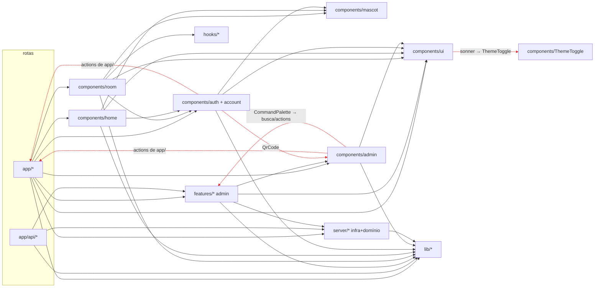
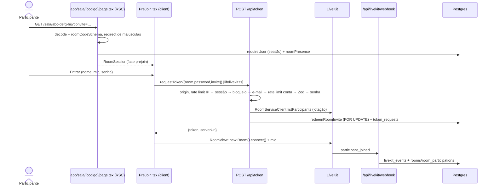

# 01 — Inventário do projeto

> Levantamento somente leitura feito em 2026-10-06 sobre o estado **atual do disco**, incluindo o trabalho em andamento não commitado no mascote (`components/home/MascotPair.*`, `components/mascot/personality.ts` e mudanças em `use-mascot.ts`, `PreJoin.tsx`, `RoomView.tsx` e `ScreenStage.tsx`).
> Comandos usados: `git ls-files`, `wc`, `grep`, `madge@8.0.0`, `jscpd@5.4.0`, `knip@6.40.0`, `oxlint` com regras de métrica numa config temporária, `pnpm outdated`, `pnpm audit`, `pnpm lint`, `tsc --noEmit` e `vitest --project unit --coverage`. Toda saída foi para fora do repositório.

## 1. Visão geral

| Item                                      | Valor                                                                                                                                                                                                                                                                                                       |
| ----------------------------------------- | ----------------------------------------------------------------------------------------------------------------------------------------------------------------------------------------------------------------------------------------------------------------------------------------------------------- |
| Stack                                     | Next 16.3.8 (App Router, `proxy.ts`, React Compiler), React 19.3, TypeScript 7.0.2, Drizzle 0.45 + Postgres 18, Better Auth 1.7.7 (duas instâncias), next-safe-action 8.7.3, nuqs 2.10, Zod 4.6, LiveKit (client 2.22, server-sdk 2.19, components-react 2.9), GSAP 3.15, Tailwind 4 + shadcn, pino, Sentry |
| Linhas de TS/TSX/CSS (sem lock, sem meta) | **26.465**                                                                                                                                                                                                                                                                                                  |
| Por pasta                                 | `components` 11.689 (das quais `ui` 2.268, `room` 3.098, `mascot` 1.453) · `server` 3.706 · `tests` 3.618 · `features` 3.013 · `app` 2.732 · `lib` 866 · `scripts` 364 · `hooks` 147                                                                                                                        |
| Arquivos com `"use client"`               | 73                                                                                                                                                                                                                                                                                                          |
| Arquivos com `import "server-only"`       | 37                                                                                                                                                                                                                                                                                                          |
| Histórico                                 | 36 commits, todos de 2026-10-06; **sem `git remote`**                                                                                                                                                                                                                                                       |

## 2. Árvore anotada (o que cada pasta faz de verdade)

```
app/                         Rotas. Em geral finas, MAS algumas páginas fazem consultas Drizzle inline
  (acesso)/                  Login, cadastro, 2FA, verificação e recuperação do PARTICIPANTE
  conta/                     "Minha conta" do participante + actions.ts (revogar sessões, excluir conta)
  admin/(auth)/              Login, convite, 2FA e recuperação do ADMIN, fora do shell + convite/[token]/actions.ts
  admin/(painel)/            Shell + páginas protegidas (salas, usuarios, compartilhamentos, auditoria, configuracoes, conta)
                             configuracoes/actions.ts e conta/sessoes/actions.ts ficam AQUI, não em features/
  api/                       Route Handlers (seção 4). token/route.ts concentra as regras de negócio da entrada na sala
  sala/[codigo]/page.tsx     RSC: valida o código, exige login, lê presença → <RoomSession> (client)
  page.tsx                   Home RSC → <HomeScene> (client, página inteira)
features/                    SÓ o painel admin: auditoria, compartilhamentos, salas, usuarios, busca
  */queries.ts               DAL de leitura (server-only), paginação keyset, iterate* para CSV
  */search-params.ts         Parsers nuqs compartilhados entre servidor e cliente
  */actions.ts               Server actions do admin (salas, usuarios, busca)
  */components/              Tabelas client (TanStack) + filtros + diálogos
components/                  Mistura de UI genérica, UI de domínio e domínio de cliente
  ui/                        shadcn (vendor customizado); popover e select sem uso
  room/                      Sala ao vivo inteira (pré-entrada, conexão, palco, dock, chat, reações, hooks)
  mascot/                    Motor do mascote: estado, molas, olhar, sono, personalidade, render imperativo
  home/                      HomeScene, SmartBar, RecentRooms, MascotPair (WIP)
  account/                   Telas do participante + ShareSupportNote (que a home e a sala também usam)
  auth/                      Formulários de auth compartilhados admin/participante via prop `scope`
  admin/                     Peças do painel: DataTable, filtros, shell, CommandPalette, ConfirmDialog, QrCode (que a auth compartilhada usa)
  Mascot.tsx, NavBar.tsx, ThemeToggle.tsx, HowItWorks.tsx   Soltos na raiz
hooks/                       3 arquivos sem relação: useShortcut (sala), use-mobile (shadcn), useRoomAnimations (sala)
lib/                         "Gaveta": genéricos (format, csv, utils, gsap, theme) misturados com
                             DOMÍNIO (livekit.ts = contrato do /api/token + fetch + gerador de código, sem
                             importar LiveKit; room-data.ts = protocolo do data channel + geometria +
                             localStorage; access-copy, auth-errors, password-rules, table-params, invite)
server/                      Infra do servidor (db, env, logger, mail, rate-limit, csp, actions/client)
                             E domínio: auth/ (2 instâncias Better Auth, lockout, convites, permissões),
                             livekit/ (projeção do webhook, log de token), rooms/, participants/, audit/,
                             settings.ts, admin-nav.ts (configuração de menu, consumida por componentes client)
  db/schema/                 Schema Drizzle por área (admin-auth, user-auth, audit, rooms, security, settings)
drizzle/                     7 migrações SQL (0000–0006) + snapshots
scripts/                     migrate.ts (advisory lock), create-owner.ts, seed.ts (via esbuild)
deploy/                      postgres (bootstrap.sql com papéis, conf) e livekit (yaml dev/prod)
tests/unit|integration       Vitest. A integração usa Postgres real (banco-modelo clonado por worker)
docs/PLANO-ADMIN.md          Plano original do painel (referenciado em comentários e no oxlint)
proxy.ts                     x-request-id, x-client-ip sempre sobrescrito, CSP com nonce
```

## 3. Mapa de dependências entre módulos

Grafo extraído com madge (726 arestas, 231 arquivos). **Nenhum import circular entre arquivos** (madge e `import/no-cycle` concordam). Há, porém, **ciclos no nível de pasta** e dependências invertidas, marcados em vermelho no diagrama abaixo.



Arestas problemáticas (todas conferidas no grafo):

| De                                               | Para                                                                       | Por quê é problema                                                |
| ------------------------------------------------ | -------------------------------------------------------------------------- | ----------------------------------------------------------------- |
| `components/account/AccountForms.tsx`            | `app/conta/actions.ts`                                                     | UI compartilhada depende da camada de rotas                       |
| `components/auth/SessionList.tsx`                | `app/conta/actions.ts` **e** `app/admin/(painel)/conta/sessoes/actions.ts` | idem, e põe referências às actions de admin no bundle de `/conta` |
| `components/admin/MascotSettingsForm.tsx`        | `app/admin/(painel)/configuracoes/actions.ts`                              | idem                                                              |
| `components/admin/auth/AcceptInvitationForm.tsx` | `app/admin/(auth)/convite/[token]/actions.ts`                              | idem                                                              |
| `components/admin/shell/CommandPalette.tsx`      | `features/busca/actions.ts`                                                | `components` ↔ `features` (ciclo de pasta)                        |
| `components/auth/TwoFactorSettings.tsx`          | `components/admin/QrCode.tsx`                                              | o compartilhado depende do específico de admin                    |
| `components/ui/sonner.tsx`                       | `components/ThemeToggle.tsx`                                               | o vendor depende da app                                           |
| `server/table/selection.ts`                      | `server/actions/client.ts`                                                 | um utilitário de tabela depende da camada de actions              |
| `server/db/schema/admin-auth.ts`                 | `server/auth/roles.ts`                                                     | o schema depende de auth (sem ciclo)                              |
| `components/admin/shell/*`, `MascotSettingsForm` | `server/admin-nav.ts`, `server/settings.ts`                                | só `import type`; acopla a UI a `server/`                         |

## 4. Rotas, actions, handlers e jobs

### 4.1 Páginas

| URL                                                                                                                   | Componente                         | Dados                                                       | Guarda                                            |
| --------------------------------------------------------------------------------------------------------------------- | ---------------------------------- | ----------------------------------------------------------- | ------------------------------------------------- |
| `/`                                                                                                                   | RSC → `HomeScene` (client inteiro) | `getUserSession`, `recentRoomsFor`                          | —                                                 |
| `/sala/[codigo]`                                                                                                      | RSC → `RoomSession`                | valida e normaliza o código, `roomPresence`, env            | `requireUser(voltar)`                             |
| `/entrar`, `/entrar/2fa`, `/cadastro`, `/verificar-email`, `/recuperar-senha`, `/redefinir-senha`                     | RSC → formulários client           | sessão, `?voltar` via `safeReturnPath`                      | redireciona se já logado                          |
| `/conta`                                                                                                              | RSC                                | sessões **via Drizzle inline** (`app/conta/page.tsx:33-47`) | `requireUser`                                     |
| `/privacidade`, 404                                                                                                   | RSC estático                       | —                                                           | —                                                 |
| `/admin/entrar`, `/admin/convite/[token]`, `/admin/recuperar-senha`, `/admin/redefinir-senha`, `/admin/verificar-2fa` | RSC → formulários                  | `findPendingInvitation`                                     | painel desligado → `AdminDisabled`                |
| `/admin` (layout + início)                                                                                            | RSC → `AdminShell`                 | cookie da sidebar                                           | `requireAdmin` (2FA obrigatório para owner/admin) |
| `/admin/salas`, `/admin/salas/[id]`                                                                                   | RSC → `RoomsTable` / detalhe       | `listRooms`, `getRoomDetail`                                | `room.read`                                       |
| `/admin/usuarios`, `/admin/usuarios/[id]`                                                                             | RSC → `ParticipantsTable`          | `listParticipants`, `getParticipantDetail`                  | `participant.read`                                |
| `/admin/compartilhamentos`                                                                                            | RSC → `SharesTable`                | `listShares`                                                | `shareSession.read`                               |
| `/admin/auditoria`                                                                                                    | RSC → `AuditTable`                 | `listAuditLogs`                                             | `audit.read`                                      |
| `/admin/configuracoes`                                                                                                | RSC → `MascotSettingsForm`         | `getSetting`                                                | `settings.read`                                   |
| `/admin/conta/seguranca`, `/admin/conta/sessoes`                                                                      | RSC                                | sessões **via Drizzle inline** (`sessoes/page.tsx:13-27`)   | `requireAdmin(allowWithoutTwoFactor)`             |

### 4.2 Route Handlers

| Método e URL                                                           | O que faz                                                                                                                 | Auth                    | Tabelas                                                    |
| ---------------------------------------------------------------------- | ------------------------------------------------------------------------------------------------------------------------- | ----------------------- | ---------------------------------------------------------- |
| `GET/POST /api/auth/[...all]`                                          | Better Auth dos participantes                                                                                             | origin guard            | users, user_*, login_failures                              |
| `GET/POST /api/admin/auth/[...all]`                                    | Better Auth do admin (503 sem segredo)                                                                                    | origin guard            | admin_*, login_failures, audit_logs                        |
| `POST /api/token`                                                      | Emite o JWT do LiveKit: rate limit (IP e conta), sessão, bloqueio, e-mail, Zod, senha de acesso, lotação, convite, grants | sessão do participante  | token_requests, room_invites, room_invite_uses             |
| `POST /api/livekit/webhook`                                            | Valida a assinatura, guarda o evento bruto e projeta (idempotente)                                                        | JWT do LiveKit          | livekit_events, rooms, room_participations, share_sessions |
| `GET /api/conta/dados`                                                 | Exportação LGPD em JSON (4 consultas inline)                                                                              | sessão (refeita à mão)  | users, sessions, participações, shares, token_requests     |
| `GET /api/admin/exportar/{salas,usuarios,compartilhamentos,auditoria}` | CSV em stream + registro na auditoria                                                                                     | `requireAdminApi(perm)` | via `features/*/queries`                                   |
| `GET /api/health` / `GET /api/ready`                                   | Processo vivo / `select 1` + versão                                                                                       | —                       | —                                                          |

### 4.3 Server Actions (todas via next-safe-action + Zod)

| Arquivo                                       | Actions                                                                        | Cliente                                |
| --------------------------------------------- | ------------------------------------------------------------------------------ | -------------------------------------- |
| `app/admin/(auth)/convite/[token]/actions.ts` | `acceptInvitation`                                                             | `publicAction` (rate limit em memória) |
| `app/admin/(painel)/configuracoes/actions.ts` | `saveMascotSettings`                                                           | `adminAction`                          |
| `app/admin/(painel)/conta/sessoes/actions.ts` | `revokeOwnSession`, `revokeOtherOwnSessions`                                   | `adminAction(allowWithoutTwoFactor)`   |
| `app/conta/actions.ts`                        | `revokeMySession`, `revokeMyOtherSessions`, `deleteMyAccount`                  | `userAction`                           |
| `features/salas/actions.ts`                   | delete/restore rooms, nota, criar/revogar convite                              | `adminAction`                          |
| `features/usuarios/actions.ts`                | block, unblock, delete, restore, revokeSessions, resendVerification, anonymize | `adminAction` (anonymize com `fresh`)  |
| `features/busca/actions.ts`                   | `searchPanelAction`                                                            | `adminAction`                          |

### 4.4 Jobs

**Nenhum.** `purgeOldFailures` (`server/auth/lockout.ts:132`) não tem chamador e `reprocessPendingEvents` (`server/livekit/webhook-projector.ts:367`) só é chamado em teste. As retenções previstas no `docs/PLANO-ADMIN.md` não existem.

## 5. Fluxos de dados das jornadas principais

### 5.1 Entrar na sala



Onde está cada responsabilidade: a validação está em `lib/livekit.ts:20` (compartilhada); as regras de negócio estão em `app/api/token/route.ts:83-247`; o acesso a dados está em `server/rooms/invites.ts` e `server/livekit/token-log.ts`; o SDK é chamado direto no handler (`AccessToken`, `RoomServiceClient`) e direto no componente (`RoomView.tsx:91-159`).

### 5.2 Compartilhar tela

`ControlDock` → `ShareMenu` (UI pura) → `use-screen-share.ts:24-39` (`setScreenShareEnabled` com presets) → LiveKit → `RoomLayout` (`RoomView.tsx:227-239` escolhe o foco) → `ScreenStage` (VideoTrack + apontador por data channel). O webhook `track_published`/`track_unpublished` grava `share_sessions` (`webhook-projector.ts:265-309`). O suporte do navegador é tratado em `lib/share-support.ts` (puro e testado).

### 5.3 Login no admin com 2FA

`AdminSignInForm` → `adminAuthClient.signIn.email` → `/api/admin/auth/sign-in/email` → hooks `before`/`after` (`server/auth/shared.ts:44-124`: lockout + auditoria) → plugin twoFactor redireciona para `/admin/verificar-2fa` → `TwoFactorCodeForm scope="admin"` → `requireAdmin` em cada página (`server/auth/admin-session.ts:73`; sem 2FA, redireciona para `/admin/conta/seguranca`).

### 5.4 Ação em massa no painel + exportação CSV

Página RSC → `loadXParams` (nuqs) → `features/X/queries.listX` (keyset + `approximateCount`) → `XTable` client (`DataTable` + `Filters` com `useQueryStates`) → action `adminAction` → `resolveSelection` (reaplica o filtro no servidor, teto de 10.000) → `server/participants/operations` ou update direto → `recordAuditMany`. Para exportar: link `exportHref` → `app/api/admin/exportar/X/route.ts` → `requireAdminApi` → `recordAudit` → `iterateX` → `csvResponse`.

### 5.5 Webhook do LiveKit → banco

`route.ts` (assinatura) → `ingestEvent` (`INSERT … ON CONFLICT DO NOTHING` em `livekit_events`) → `processStoredEvent` (transação: `projectEvent`, um `switch` de 7 casos) → `processed_at`. Em caso de falha, grava `error` e **responde 204** (`route.ts:59-66`), e nada reprocessa o evento.

## 6. Onde está cada responsabilidade

| Responsabilidade     | Onde está hoje                                                                                                                                                                                                                                                                                                               |
| -------------------- | ---------------------------------------------------------------------------------------------------------------------------------------------------------------------------------------------------------------------------------------------------------------------------------------------------------------------------- |
| Regras de negócio    | `app/api/token/route.ts` (no handler), `server/livekit/webhook-projector.ts`, `server/participants/operations.ts`, `server/rooms/invites.ts`, `server/auth/{lockout,invitations}.ts`, `features/salas/actions.ts` (recusa apagar sala ao vivo), `components/mascot/use-mascot.ts` (regras do mascote presas num `useEffect`) |
| Acesso a dados       | `features/*/queries.ts` (DAL bem feito), `server/*`, **e inline** em `app/conta/page.tsx`, `app/admin/(painel)/conta/sessoes/page.tsx`, `app/api/conta/dados/route.ts` e cerca de 12 páginas e actions que chamam `getDb()`                                                                                                  |
| Validação            | Zod em env, token, webhook, settings, cursores, seleção em massa e inputs das actions; parsers nuqs; CHECKs no banco                                                                                                                                                                                                         |
| Auth/autorização     | Duas instâncias Better Auth (`server/auth/admin.ts`, `user.ts`); DAL `requireAdmin`/`requireUser`/`requireAdminApi`; middleware `adminAction`/`userAction` (`server/actions/client.ts`); matriz `can()` (`permissions.ts`)                                                                                                   |
| Estado global        | Não há store. Contextos: `RoomContext` (SDK), `ReactionsContext`; nuqs para a URL; barramento `mascot:signal` (CustomEvent); `localStorage` (tema, microfone)                                                                                                                                                                |
| Integrações externas | LiveKit server SDK (`/api/token`, webhook), livekit-client e components-react (componentes da sala), nodemailer (`server/mail.ts`, cai para log sem SMTP), Sentry (`instrumentation*.ts`)                                                                                                                                    |

## 7. Dependências

| Situação                         | Pacotes                                                                                                                                                                                        |
| -------------------------------- | ---------------------------------------------------------------------------------------------------------------------------------------------------------------------------------------------- |
| Usadas                           | Todas as outras. Algumas sem import direto, mas usadas: tw-animate-css e shadcn (CSS), babel-plugin-react-compiler, pino-pretty (o knip acusa um falso positivo)                               |
| **Não usada**                    | `date-fns` (zero imports; `@date-fns/tz` não depende dela)                                                                                                                                     |
| Arquivos sem uso                 | `components/ui/popover.tsx`, `components/ui/select.tsx` (o Radix Popover é usado direto em 4 componentes)                                                                                      |
| Exports sem uso (knip)           | 26 exports + 10 tipos. Os relevantes: `purgeOldFailures`, `reprocessPendingEvents` (só em teste), `BOUNCE`, `RoomStatusFilter`                                                                 |
| Sobreposição                     | Nenhuma real. O pacote `cn` substitui clsx e tailwind-merge, mas há dois caminhos de import (`"cn"` em 20 arquivos e `@/lib/utils`, que só reexporta)                                          |
| Desatualizadas (`pnpm outdated`) | Só desenvolvimento: shadcn 4.21.1→4.21.2, oxfmt 0.71→0.72, oxlint 1.86→1.87, @types/node 24→26 (manter 24 = runtime)                                                                           |
| Vulnerabilidades (`pnpm audit`)  | Alta: `braces` ≤3.0.3 via `shadcn>…>micromatch` (só dev, sem correção). Moderada: `esbuild` ≤0.24.2 via `drizzle-kit>@esbuild-kit` (entra na árvore de produção via `better-auth>drizzle-kit`) |

## 8. Métricas objetivas

### 8.1 Os 20 maiores arquivos

| Linhas  | Arquivo                                      | Linhas | Arquivo                                               |
| ------- | -------------------------------------------- | ------ | ----------------------------------------------------- |
| 671     | components/ui/sidebar.tsx (vendor)           | 300    | features/usuarios/components/ParticipantsTable.tsx    |
| **666** | **components/mascot/use-mascot.ts**          | 293    | app/globals.css                                       |
| **534** | **components/room/PreJoin.tsx**              | 288    | components/account/AccountForms.tsx                   |
| 384     | server/livekit/webhook-projector.ts          | 284    | components/admin/data-table/DataTable.tsx             |
| 380     | components/room/RoomView.tsx                 | 276    | components/auth/TwoFactorSettings.tsx                 |
| 360     | features/auditoria/components/AuditTable.tsx | 263    | features/salas/components/RoomsTable.tsx              |
| 355     | tests/integration/token-route.test.ts        | 259    | server/db/schema/rooms.ts                             |
| 338     | tests/integration/livekit-webhook.test.ts    | 254    | features/salas/components/InvitesPanel.tsx            |
| 335     | components/room/ScreenStage.tsx              | 250    | scripts/seed.ts                                       |
| 331     | components/Mascot.module.css                 | 247    | components/home/SmartBar.tsx · app/api/token/route.ts |

Arquivos acima de 300 linhas úteis (oxlint `max-lines`, sem brancos e comentários, sem vendor): `use-mascot.ts` 572, `PreJoin.tsx` 483, `RoomView.tsx` 345, `AuditTable.tsx` 342, `webhook-projector.ts` 340, `ScreenStage.tsx` 301.

### 8.2 Funções e complexidade (oxlint, sem `components/ui` e testes)

- **75 funções com mais de 50 linhas.** A maioria são componentes React com JSX, o que é esperado. As que importam:

| Linhas    | Função                                                          | Complexidade      |
| --------- | --------------------------------------------------------------- | ----------------- |
| 547       | `useMascot` (`use-mascot.ts:41`; o `useEffect` sozinho tem 518) | 34 (`step`, :223) |
| 394       | `PreJoin` (`PreJoin.tsx:103`)                                   | **39**            |
| 200       | `MascotPair` (WIP)                                              | —                 |
| 186       | `TwoFactorSettings`                                             | 13                |
| 177 / 158 | páginas `salas/[id]` / `usuarios/[id]`                          | 18 / 17           |
| 161       | `DataTable`                                                     | 21                |
| 160       | `ScreenStage`                                                   | 13                |
| 145       | `POST /api/token`                                               | **31**            |
| 142 / 129 | config Better Auth user / admin                                 | —                 |
| 116       | `projectEvent` (webhook)                                        | 24                |
| 110       | `RoomLayout` (`RoomView.tsx:213`)                               | 28                |

- **23 funções com complexidade acima de 12.** Não há aninhamento acima de 4 níveis, e só 3 funções têm mais de 4 parâmetros.

### 8.3 Tipagem e higiene

| Métrica                                               | Valor                                                                                                                    |
| ----------------------------------------------------- | ------------------------------------------------------------------------------------------------------------------------ |
| `any` explícito                                       | **0** (`no-explicit-any` = error)                                                                                        |
| Casts `as X` fora de `as const` (sem vendor e testes) | 14                                                                                                                       |
| Non-null `!`                                          | 4× `db!` nas exportações, 15× em `seed.ts`                                                                               |
| `@ts-ignore` / `@ts-expect-error`                     | 0 / 1 (teste, intencional)                                                                                               |
| `oxlint-disable`                                      | 5, todos justificados                                                                                                    |
| `try/catch` vazio                                     | 0 no código (só no script inline de tema). Há `.catch(() => {})` sem log em `admin-session.ts:38` e `user-session.ts:48` |
| tsconfig                                              | `strict`, `noUncheckedIndexedAccess`, `noImplicitOverride`, `noFallthroughCasesInSwitch` ligados                         |
| `tsc --noEmit`                                        | passa                                                                                                                    |
| **`pnpm lint`**                                       | **falha: 44 erros e 10 avisos** (22 `await-thenable` em testes, 18 `no-unsafe-type-assertion`, entre outros)             |
| `pnpm format:check`                                   | passa (antes destes documentos)                                                                                          |

### 8.4 Duplicação (jscpd, mínimo de 50 tokens)

**2,24%** (51 clones, 585 linhas). É baixa, mas concentrada:

| Linhas | Clone                                                                                       |
| ------ | ------------------------------------------------------------------------------------------- |
| 43     | `RoomsTable.tsx:67-109` ↔ `ParticipantsTable.tsx:69-111` (Filters)                          |
| 23     | `RoomsTable.tsx:3-25` ↔ `ParticipantsTable.tsx:3-25`                                        |
| 20     | `AuditTable.tsx:167-186` ↔ `SharesTable.tsx:107-126`                                        |
| 17     | `SignInForm.tsx:118-134` ↔ `AdminSignInForm.tsx:85-101`                                     |
| 17     | `server/auth/permissions.ts:14-30` ↔ `:35-49`                                               |
| 16     | `db/schema/admin-auth.ts:73-88` ↔ `user-auth.ts:84-98` (espelho do Better Auth, aceitável)  |
| 10     | `auditoria/queries.ts:148-157` ↔ compartilhamentos, salas e usuarios (filtro de período ×4) |

### 8.5 Testes e cobertura

- **Unitários:** 10 arquivos e 57 testes, todos passando. Cobertura **16% das linhas** do recorte configurado (`server/**`, `features/**`, `lib/**`, `app/**/actions.ts`, `app/api/**`). `components/**` e `hooks/**` **estão fora** da cobertura (`vitest.config.ts:58`).
- **Integração:** 15 arquivos, com Postgres real e boa cobertura do servidor (token, webhook, admin, auth e keyset). **Não rodaram nesta análise** porque o Docker não estava disponível.
- **E2E: não existe.** Não há Playwright nem jsdom. **Nada do cliente da sala tem teste.**

### 8.6 Não medido (fica para a Fase 0)

Tempo de build e tamanho do bundle. `pnpm build` sobrescreveria `.next/` do ambiente de desenvolvimento, o que esta análise não podia fazer.
