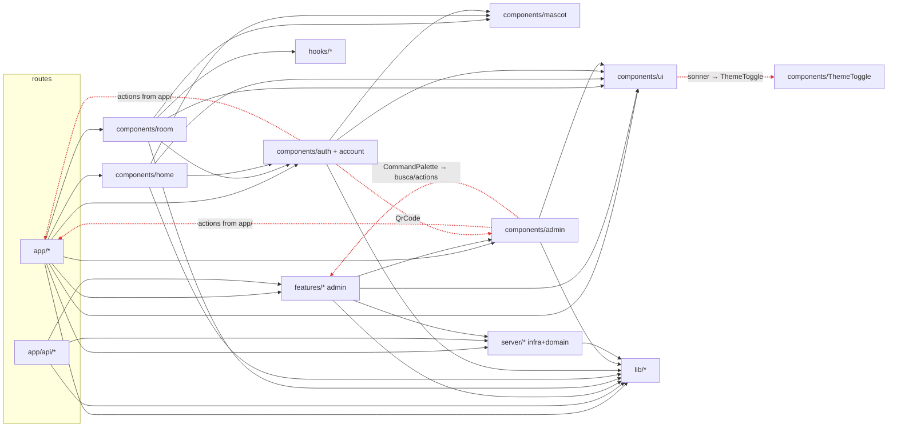
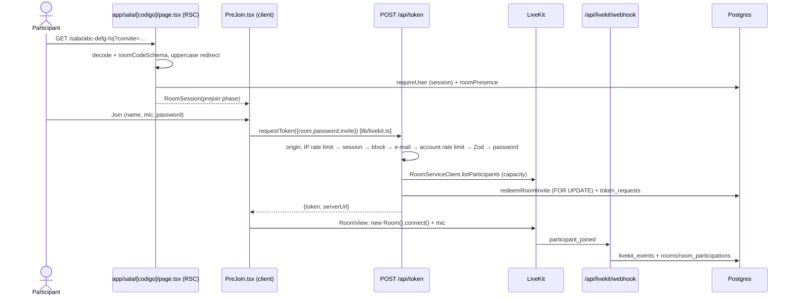

# 01 — Project inventory

> Read-only survey done on 2026-10-06 of the **current on-disk state**, including the uncommitted in-progress mascot work (`components/home/MascotPair.*`, `components/mascot/personality.ts` and changes to `use-mascot.ts`, `PreJoin.tsx`, `RoomView.tsx` and `ScreenStage.tsx`).
> Commands used: `git ls-files`, `wc`, `grep`, `madge@8.0.0`, `jscpd@5.4.0`, `knip@6.40.0`, `oxlint` with metric rules in a temporary config, `pnpm outdated`, `pnpm audit`, `pnpm lint`, `tsc --noEmit` and `vitest --project unit --coverage`. All output went outside the repository.

## 1. Overview

| Item                                       | Value                                                                                                                                                                                                                                                                                                     |
| ------------------------------------------ | --------------------------------------------------------------------------------------------------------------------------------------------------------------------------------------------------------------------------------------------------------------------------------------------------------- |
| Stack                                      | Next 16.3.8 (App Router, `proxy.ts`, React Compiler), React 19.3, TypeScript 7.0.2, Drizzle 0.45 + Postgres 18, Better Auth 1.7.7 (two instances), next-safe-action 8.7.3, nuqs 2.10, Zod 4.6, LiveKit (client 2.22, server-sdk 2.19, components-react 2.9), GSAP 3.15, Tailwind 4 + shadcn, pino, Sentry |
| Lines of TS/TSX/CSS (no lockfile, no meta) | **26,465**                                                                                                                                                                                                                                                                                                |
| By folder                                  | `components` 11,689 (of which `ui` 2,268, `room` 3,098, `mascot` 1,453) · `server` 3,706 · `tests` 3,618 · `features` 3,013 · `app` 2,732 · `lib` 866 · `scripts` 364 · `hooks` 147                                                                                                                       |
| Files with `"use client"`                  | 73                                                                                                                                                                                                                                                                                                        |
| Files with `import "server-only"`          | 37                                                                                                                                                                                                                                                                                                        |
| History                                    | 36 commits, all from 2026-10-06; **no `git remote`**                                                                                                                                                                                                                                                      |

## 2. Annotated tree (what each folder actually does)

```
app/                         Routes. Mostly thin, BUT some pages run inline Drizzle queries
  (acesso)/                  PARTICIPANT sign-in, sign-up, 2FA, verification and recovery
  conta/                     Participant "Minha conta" (My account) + actions.ts (revoke sessions, delete account)
  admin/(auth)/              ADMIN sign-in, invitation, 2FA and recovery, outside the shell + convite/[token]/actions.ts
  admin/(painel)/            Shell + protected pages (salas, usuarios, compartilhamentos, auditoria, configuracoes, conta)
                             configuracoes/actions.ts and conta/sessoes/actions.ts live HERE, not in features/
  api/                       Route Handlers (section 4). token/route.ts concentrates the room-entry business rules
  sala/[codigo]/page.tsx     RSC: validates the code, requires sign-in, reads presence → <RoomSession> (client)
  page.tsx                   Home RSC → <HomeScene> (client, whole page)
features/                    ONLY the admin panel: auditoria, compartilhamentos, salas, usuarios, busca
  */queries.ts               Read DAL (server-only), keyset pagination, iterate* for CSV
  */search-params.ts         nuqs parsers shared between server and client
  */actions.ts               Admin server actions (salas, usuarios, busca)
  */components/              Client tables (TanStack) + filters + dialogs
components/                  Mix of generic UI, domain UI and client-side domain
  ui/                        shadcn (customized vendor); popover and select unused
  room/                      The whole live room (pre-join, connection, stage, dock, chat, reactions, hooks)
  mascot/                    Mascot engine: state, springs, gaze, sleep, personality, imperative render
  home/                      HomeScene, SmartBar, RecentRooms, MascotPair (WIP)
  account/                   Participant screens + ShareSupportNote (also used by the home page and the room)
  auth/                      Auth forms shared by admin/participant via the `scope` prop
  admin/                     Panel pieces: DataTable, filters, shell, CommandPalette, ConfirmDialog, QrCode (used by the shared auth)
  Mascot.tsx, NavBar.tsx, ThemeToggle.tsx, HowItWorks.tsx   Loose at the root
hooks/                       3 unrelated files: useShortcut (room), use-mobile (shadcn), useRoomAnimations (room)
lib/                         "Junk drawer": generics (format, csv, utils, gsap, theme) mixed with
                             DOMAIN (livekit.ts = /api/token contract + fetch + code generator, without
                             importing LiveKit; room-data.ts = data channel protocol + geometry +
                             localStorage; access-copy, auth-errors, password-rules, table-params, invite)
server/                      Server infra (db, env, logger, mail, rate-limit, csp, actions/client)
                             AND domain: auth/ (2 Better Auth instances, lockout, invitations, permissions),
                             livekit/ (webhook projection, token log), rooms/, participants/, audit/,
                             settings.ts, admin-nav.ts (menu configuration, consumed by client components)
  db/schema/                 Drizzle schema by area (admin-auth, user-auth, audit, rooms, security, settings)
drizzle/                     7 SQL migrations (0000–0006) + snapshots
scripts/                     migrate.ts (advisory lock), create-owner.ts, seed.ts (via esbuild)
deploy/                      postgres (bootstrap.sql with roles, conf) and livekit (dev/prod yaml)
tests/unit|integration       Vitest. Integration uses real Postgres (template database cloned per worker)
docs/PLANO-ADMIN.md          Original panel plan (referenced in comments and in oxlint)
proxy.ts                     x-request-id, x-client-ip always overwritten, CSP with nonce
```

## 3. Module dependency map

Graph extracted with madge (726 edges, 231 files). **No circular imports between files** (madge and `import/no-cycle` agree). There are, however, **folder-level cycles** and inverted dependencies, marked in red in the diagram below.



Problematic edges (all checked in the graph):

| From                                             | To                                                                           | Why it is a problem                                               |
| ------------------------------------------------ | ---------------------------------------------------------------------------- | ----------------------------------------------------------------- |
| `components/account/AccountForms.tsx`            | `app/conta/actions.ts`                                                       | Shared UI depends on the routes layer                             |
| `components/auth/SessionList.tsx`                | `app/conta/actions.ts` **and** `app/admin/(painel)/conta/sessoes/actions.ts` | same, and puts references to admin actions in the `/conta` bundle |
| `components/admin/MascotSettingsForm.tsx`        | `app/admin/(painel)/configuracoes/actions.ts`                                | same                                                              |
| `components/admin/auth/AcceptInvitationForm.tsx` | `app/admin/(auth)/convite/[token]/actions.ts`                                | same                                                              |
| `components/admin/shell/CommandPalette.tsx`      | `features/busca/actions.ts`                                                  | `components` ↔ `features` (folder cycle)                          |
| `components/auth/TwoFactorSettings.tsx`          | `components/admin/QrCode.tsx`                                                | the shared code depends on admin-specific code                    |
| `components/ui/sonner.tsx`                       | `components/ThemeToggle.tsx`                                                 | the vendor code depends on the app                                |
| `server/table/selection.ts`                      | `server/actions/client.ts`                                                   | a table utility depends on the actions layer                      |
| `server/db/schema/admin-auth.ts`                 | `server/auth/roles.ts`                                                       | the schema depends on auth (no cycle)                             |
| `components/admin/shell/*`, `MascotSettingsForm` | `server/admin-nav.ts`, `server/settings.ts`                                  | only `import type`; couples the UI to `server/`                   |

## 4. Routes, actions, handlers and jobs

### 4.1 Pages

| URL                                                                                                                   | Component                        | Data                                                         | Guard                                          |
| --------------------------------------------------------------------------------------------------------------------- | -------------------------------- | ------------------------------------------------------------ | ---------------------------------------------- |
| `/`                                                                                                                   | RSC → `HomeScene` (fully client) | `getUserSession`, `recentRoomsFor`                           | —                                              |
| `/sala/[codigo]`                                                                                                      | RSC → `RoomSession`              | validates and normalizes the code, `roomPresence`, env       | `requireUser(voltar)`                          |
| `/entrar`, `/entrar/2fa`, `/cadastro`, `/verificar-email`, `/recuperar-senha`, `/redefinir-senha`                     | RSC → client forms               | session, `?voltar` via `safeReturnPath`                      | redirects if already signed in                 |
| `/conta`                                                                                                              | RSC                              | sessions **via inline Drizzle** (`app/conta/page.tsx:33-47`) | `requireUser`                                  |
| `/privacidade`, 404                                                                                                   | Static RSC                       | —                                                            | —                                              |
| `/admin/entrar`, `/admin/convite/[token]`, `/admin/recuperar-senha`, `/admin/redefinir-senha`, `/admin/verificar-2fa` | RSC → forms                      | `findPendingInvitation`                                      | panel disabled → `AdminDisabled`               |
| `/admin` (layout + home)                                                                                              | RSC → `AdminShell`               | sidebar cookie                                               | `requireAdmin` (2FA mandatory for owner/admin) |
| `/admin/salas`, `/admin/salas/[id]`                                                                                   | RSC → `RoomsTable` / detail      | `listRooms`, `getRoomDetail`                                 | `room.read`                                    |
| `/admin/usuarios`, `/admin/usuarios/[id]`                                                                             | RSC → `ParticipantsTable`        | `listParticipants`, `getParticipantDetail`                   | `participant.read`                             |
| `/admin/compartilhamentos`                                                                                            | RSC → `SharesTable`              | `listShares`                                                 | `shareSession.read`                            |
| `/admin/auditoria`                                                                                                    | RSC → `AuditTable`               | `listAuditLogs`                                              | `audit.read`                                   |
| `/admin/configuracoes`                                                                                                | RSC → `MascotSettingsForm`       | `getSetting`                                                 | `settings.read`                                |
| `/admin/conta/seguranca`, `/admin/conta/sessoes`                                                                      | RSC                              | sessions **via inline Drizzle** (`sessoes/page.tsx:13-27`)   | `requireAdmin(allowWithoutTwoFactor)`          |

### 4.2 Route Handlers

| Method and URL                                                         | What it does                                                                                                                    | Auth                     | Tables                                                     |
| ---------------------------------------------------------------------- | ------------------------------------------------------------------------------------------------------------------------------- | ------------------------ | ---------------------------------------------------------- |
| `GET/POST /api/auth/[...all]`                                          | Participants' Better Auth                                                                                                       | origin guard             | users, user_*, login_failures                              |
| `GET/POST /api/admin/auth/[...all]`                                    | Admin Better Auth (503 without secret)                                                                                          | origin guard             | admin_*, login_failures, audit_logs                        |
| `POST /api/token`                                                      | Issues the LiveKit JWT: rate limit (IP and account), session, block, e-mail, Zod, access password, capacity, invitation, grants | participant session      | token_requests, room_invites, room_invite_uses             |
| `POST /api/livekit/webhook`                                            | Validates the signature, stores the raw event and projects it (idempotent)                                                      | LiveKit JWT              | livekit_events, rooms, room_participations, share_sessions |
| `GET /api/conta/dados`                                                 | LGPD export as JSON (4 inline queries)                                                                                          | session (redone by hand) | users, sessions, participations, shares, token_requests    |
| `GET /api/admin/exportar/{salas,usuarios,compartilhamentos,auditoria}` | Streamed CSV + audit log entry                                                                                                  | `requireAdminApi(perm)`  | via `features/*/queries`                                   |
| `GET /api/health` / `GET /api/ready`                                   | Process alive / `select 1` + version                                                                                            | —                        | —                                                          |

### 4.3 Server Actions (all via next-safe-action + Zod)

| File                                          | Actions                                                                        | Client                                 |
| --------------------------------------------- | ------------------------------------------------------------------------------ | -------------------------------------- |
| `app/admin/(auth)/convite/[token]/actions.ts` | `acceptInvitation`                                                             | `publicAction` (in-memory rate limit)  |
| `app/admin/(painel)/configuracoes/actions.ts` | `saveMascotSettings`                                                           | `adminAction`                          |
| `app/admin/(painel)/conta/sessoes/actions.ts` | `revokeOwnSession`, `revokeOtherOwnSessions`                                   | `adminAction(allowWithoutTwoFactor)`   |
| `app/conta/actions.ts`                        | `revokeMySession`, `revokeMyOtherSessions`, `deleteMyAccount`                  | `userAction`                           |
| `features/salas/actions.ts`                   | delete/restore rooms, note, create/revoke invitation                           | `adminAction`                          |
| `features/usuarios/actions.ts`                | block, unblock, delete, restore, revokeSessions, resendVerification, anonymize | `adminAction` (anonymize with `fresh`) |
| `features/busca/actions.ts`                   | `searchPanelAction`                                                            | `adminAction`                          |

### 4.4 Jobs

**None.** `purgeOldFailures` (`server/auth/lockout.ts:132`) has no caller and `reprocessPendingEvents` (`server/livekit/webhook-projector.ts:367`) is only called in tests. The retention policies planned in `docs/PLANO-ADMIN.md` do not exist.

## 5. Data flows of the main journeys

### 5.1 Joining a room



Where each responsibility lives: validation is in `lib/livekit.ts:20` (shared); business rules are in `app/api/token/route.ts:83-247`; data access is in `server/rooms/invites.ts` and `server/livekit/token-log.ts`; the SDK is called directly in the handler (`AccessToken`, `RoomServiceClient`) and directly in the component (`RoomView.tsx:91-159`).

### 5.2 Sharing the screen

`ControlDock` → `ShareMenu` (pure UI) → `use-screen-share.ts:24-39` (`setScreenShareEnabled` with presets) → LiveKit → `RoomLayout` (`RoomView.tsx:227-239` picks the focus) → `ScreenStage` (VideoTrack + pointer via data channel). The `track_published`/`track_unpublished` webhook writes `share_sessions` (`webhook-projector.ts:265-309`). Browser support is handled in `lib/share-support.ts` (pure and tested).

### 5.3 Admin sign-in with 2FA

`AdminSignInForm` → `adminAuthClient.signIn.email` → `/api/admin/auth/sign-in/email` → `before`/`after` hooks (`server/auth/shared.ts:44-124`: lockout + audit) → the twoFactor plugin redirects to `/admin/verificar-2fa` → `TwoFactorCodeForm scope="admin"` → `requireAdmin` on each page (`server/auth/admin-session.ts:73`; without 2FA, redirects to `/admin/conta/seguranca`).

### 5.4 Bulk action in the panel + CSV export

RSC page → `loadXParams` (nuqs) → `features/X/queries.listX` (keyset + `approximateCount`) → client `XTable` (`DataTable` + `Filters` with `useQueryStates`) → `adminAction` action → `resolveSelection` (reapplies the filter on the server, cap of 10,000) → `server/participants/operations` or direct update → `recordAuditMany`. To export: `exportHref` link → `app/api/admin/exportar/X/route.ts` → `requireAdminApi` → `recordAudit` → `iterateX` → `csvResponse`.

### 5.5 LiveKit webhook → database

`route.ts` (signature) → `ingestEvent` (`INSERT … ON CONFLICT DO NOTHING` into `livekit_events`) → `processStoredEvent` (transaction: `projectEvent`, a 7-case `switch`) → `processed_at`. On failure, it writes `error` and **responds 204** (`route.ts:59-66`), and nothing reprocesses the event.

## 6. Where each responsibility lives

| Responsibility        | Where it lives today                                                                                                                                                                                                                                                                                                           |
| --------------------- | ------------------------------------------------------------------------------------------------------------------------------------------------------------------------------------------------------------------------------------------------------------------------------------------------------------------------------ |
| Business rules        | `app/api/token/route.ts` (in the handler), `server/livekit/webhook-projector.ts`, `server/participants/operations.ts`, `server/rooms/invites.ts`, `server/auth/{lockout,invitations}.ts`, `features/salas/actions.ts` (refuses to delete a live room), `components/mascot/use-mascot.ts` (mascot rules stuck in a `useEffect`) |
| Data access           | `features/*/queries.ts` (well-built DAL), `server/*`, **and inline** in `app/conta/page.tsx`, `app/admin/(painel)/conta/sessoes/page.tsx`, `app/api/conta/dados/route.ts` and about 12 pages and actions that call `getDb()`                                                                                                   |
| Validation            | Zod for env, token, webhook, settings, cursors, bulk selection and action inputs; nuqs parsers; CHECKs in the database                                                                                                                                                                                                         |
| Auth/authorization    | Two Better Auth instances (`server/auth/admin.ts`, `user.ts`); DAL `requireAdmin`/`requireUser`/`requireAdminApi`; `adminAction`/`userAction` middleware (`server/actions/client.ts`); `can()` matrix (`permissions.ts`)                                                                                                       |
| Global state          | No store. Contexts: `RoomContext` (SDK), `ReactionsContext`; nuqs for the URL; `mascot:signal` bus (CustomEvent); `localStorage` (theme, microphone)                                                                                                                                                                           |
| External integrations | LiveKit server SDK (`/api/token`, webhook), livekit-client and components-react (room components), nodemailer (`server/mail.ts`, falls back to logging without SMTP), Sentry (`instrumentation*.ts`)                                                                                                                           |

## 7. Dependencies

| Status                         | Packages                                                                                                                                                                                  |
| ------------------------------ | ----------------------------------------------------------------------------------------------------------------------------------------------------------------------------------------- |
| Used                           | All the others. Some have no direct import but are used: tw-animate-css and shadcn (CSS), babel-plugin-react-compiler, pino-pretty (knip reports a false positive)                        |
| **Unused**                     | `date-fns` (zero imports; `@date-fns/tz` does not depend on it)                                                                                                                           |
| Unused files                   | `components/ui/popover.tsx`, `components/ui/select.tsx` (Radix Popover is used directly in 4 components)                                                                                  |
| Unused exports (knip)          | 26 exports + 10 types. The relevant ones: `purgeOldFailures`, `reprocessPendingEvents` (tests only), `BOUNCE`, `RoomStatusFilter`                                                         |
| Overlap                        | None real. The `cn` package replaces clsx and tailwind-merge, but there are two import paths (`"cn"` in 20 files and `@/lib/utils`, which only re-exports)                                |
| Outdated (`pnpm outdated`)     | Dev only: shadcn 4.21.1→4.21.2, oxfmt 0.71→0.72, oxlint 1.86→1.87, @types/node 24→26 (keep 24 = runtime)                                                                                  |
| Vulnerabilities (`pnpm audit`) | High: `braces` ≤3.0.3 via `shadcn>…>micromatch` (dev only, no fix). Moderate: `esbuild` ≤0.24.2 via `drizzle-kit>@esbuild-kit` (enters the production tree via `better-auth>drizzle-kit`) |

## 8. Objective metrics

### 8.1 The 20 largest files

| Lines   | File                                         | Lines | File                                                  |
| ------- | -------------------------------------------- | ----- | ----------------------------------------------------- |
| 671     | components/ui/sidebar.tsx (vendor)           | 300   | features/usuarios/components/ParticipantsTable.tsx    |
| **666** | **components/mascot/use-mascot.ts**          | 293   | app/globals.css                                       |
| **534** | **components/room/PreJoin.tsx**              | 288   | components/account/AccountForms.tsx                   |
| 384     | server/livekit/webhook-projector.ts          | 284   | components/admin/data-table/DataTable.tsx             |
| 380     | components/room/RoomView.tsx                 | 276   | components/auth/TwoFactorSettings.tsx                 |
| 360     | features/auditoria/components/AuditTable.tsx | 263   | features/salas/components/RoomsTable.tsx              |
| 355     | tests/integration/token-route.test.ts        | 259   | server/db/schema/rooms.ts                             |
| 338     | tests/integration/livekit-webhook.test.ts    | 254   | features/salas/components/InvitesPanel.tsx            |
| 335     | components/room/ScreenStage.tsx              | 250   | scripts/seed.ts                                       |
| 331     | components/Mascot.module.css                 | 247   | components/home/SmartBar.tsx · app/api/token/route.ts |

Files above 300 effective lines (oxlint `max-lines`, excluding blank lines and comments, excluding vendor): `use-mascot.ts` 572, `PreJoin.tsx` 483, `RoomView.tsx` 345, `AuditTable.tsx` 342, `webhook-projector.ts` 340, `ScreenStage.tsx` 301.

### 8.2 Functions and complexity (oxlint, excluding `components/ui` and tests)

- **75 functions longer than 50 lines.** Most are React components with JSX, which is expected. The ones that matter:

| Lines     | Function                                                        | Complexity        |
| --------- | --------------------------------------------------------------- | ----------------- |
| 547       | `useMascot` (`use-mascot.ts:41`; the `useEffect` alone has 518) | 34 (`step`, :223) |
| 394       | `PreJoin` (`PreJoin.tsx:103`)                                   | **39**            |
| 200       | `MascotPair` (WIP)                                              | —                 |
| 186       | `TwoFactorSettings`                                             | 13                |
| 177 / 158 | `salas/[id]` / `usuarios/[id]` pages                            | 18 / 17           |
| 161       | `DataTable`                                                     | 21                |
| 160       | `ScreenStage`                                                   | 13                |
| 145       | `POST /api/token`                                               | **31**            |
| 142 / 129 | Better Auth user / admin config                                 | —                 |
| 116       | `projectEvent` (webhook)                                        | 24                |
| 110       | `RoomLayout` (`RoomView.tsx:213`)                               | 28                |

- **23 functions with complexity above 12.** There is no nesting deeper than 4 levels, and only 3 functions have more than 4 parameters.

### 8.3 Typing and hygiene

| Metric                                                      | Value                                                                                                                                          |
| ----------------------------------------------------------- | ---------------------------------------------------------------------------------------------------------------------------------------------- |
| Explicit `any`                                              | **0** (`no-explicit-any` = error)                                                                                                              |
| `as X` casts other than `as const` (excl. vendor and tests) | 14                                                                                                                                             |
| Non-null `!`                                                | 4× `db!` in the exports, 15× in `seed.ts`                                                                                                      |
| `@ts-ignore` / `@ts-expect-error`                           | 0 / 1 (test, intentional)                                                                                                                      |
| `oxlint-disable`                                            | 5, all justified                                                                                                                               |
| Empty `try/catch`                                           | 0 in the code (only in the inline theme script). There is `.catch(() => {})` without logging in `admin-session.ts:38` and `user-session.ts:48` |
| tsconfig                                                    | `strict`, `noUncheckedIndexedAccess`, `noImplicitOverride`, `noFallthroughCasesInSwitch` enabled                                               |
| `tsc --noEmit`                                              | passes                                                                                                                                         |
| **`pnpm lint`**                                             | **fails: 44 errors and 10 warnings** (22 `await-thenable` in tests, 18 `no-unsafe-type-assertion`, among others)                               |
| `pnpm format:check`                                         | passes (before these documents)                                                                                                                |

### 8.4 Duplication (jscpd, minimum of 50 tokens)

**2.24%** (51 clones, 585 lines). It is low, but concentrated:

| Lines | Clone                                                                                         |
| ----- | --------------------------------------------------------------------------------------------- |
| 43    | `RoomsTable.tsx:67-109` ↔ `ParticipantsTable.tsx:69-111` (Filters)                            |
| 23    | `RoomsTable.tsx:3-25` ↔ `ParticipantsTable.tsx:3-25`                                          |
| 20    | `AuditTable.tsx:167-186` ↔ `SharesTable.tsx:107-126`                                          |
| 17    | `SignInForm.tsx:118-134` ↔ `AdminSignInForm.tsx:85-101`                                       |
| 17    | `server/auth/permissions.ts:14-30` ↔ `:35-49`                                                 |
| 16    | `db/schema/admin-auth.ts:73-88` ↔ `user-auth.ts:84-98` (Better Auth mirror, acceptable)       |
| 10    | `auditoria/queries.ts:148-157` ↔ compartilhamentos, salas and usuarios (date-range filter ×4) |

### 8.5 Tests and coverage

- **Unit:** 10 files and 57 tests, all passing. Coverage of **16% of lines** in the configured scope (`server/**`, `features/**`, `lib/**`, `app/**/actions.ts`, `app/api/**`). `components/**` and `hooks/**` **are excluded** from coverage (`vitest.config.ts:58`).
- **Integration:** 15 files, with real Postgres and good server coverage (token, webhook, admin, auth and keyset). **They did not run in this analysis** because Docker was not available.
- **E2E: does not exist.** There is no Playwright and no jsdom. **Nothing in the room client is tested.**

### 8.6 Not measured (left for Phase 0)

Build time and bundle size. `pnpm build` would overwrite the development environment's `.next/`, which this analysis was not allowed to do.
