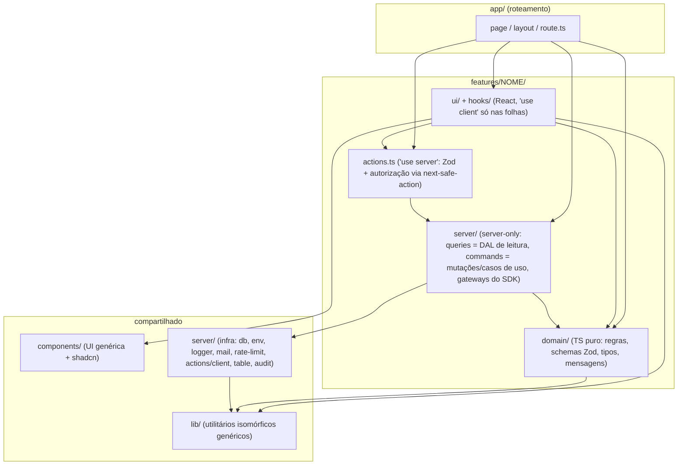

# 03 — Arquitetura-alvo

## 1. Recomendação

**Pastas por feature + Data Access Layer do Next + núcleo puro só onde existe regra.** Não é Clean Architecture completa.

O projeto já faz metade disso: `features/*/queries.ts` com `server-only` é exatamente o DAL que a documentação do Next 16 recomenda para projetos novos (`node_modules/next/dist/docs/01-app/02-guides/data-security.md:56-60`). O mesmo guia recomenda actions finas sobre um DAL também nas mutações (`:397-399`). A proposta é **estender esse padrão ao app inteiro**, em vez de inventar um novo, e acrescentar três coisas:

1. **`domain/` puro** dentro das features que têm regra de verdade: a decisão do token, o mapeamento de erros da sala, o cérebro do mascote, as fases do `MascotPair` e a projeção do webhook. Sem React, sem Next, sem Drizzle e sem SDK, testável com Vitest em milissegundos.
2. **Uma única "porta"**, em forma de objeto de funções e não de classe, entre a regra do token e o SDK do LiveKit (`countParticipants`, `signToken`). É o único lugar onde hoje é preciso subir um servidor HTTP falso para testar uma decisão.
3. **Fronteiras impostas pelo oxlint** que o projeto já usa (`no-restricted-imports` por override + `import/no-cycle`), mais knip e jscpd no CI.

### Alternativas descartadas

| Alternativa                                                                                                                              | Por que foi descartada                                                                                                                                                                                                                                                                                                                                                                                                                |
| ---------------------------------------------------------------------------------------------------------------------------------------- | ------------------------------------------------------------------------------------------------------------------------------------------------------------------------------------------------------------------------------------------------------------------------------------------------------------------------------------------------------------------------------------------------------------------------------------- |
| **Clean Architecture completa** (entities / use-cases / ports / adapters, repositório por agregado, interface para DB, e-mail e LiveKit) | Com 1 dev e cerca de 5 usuários, dobraria o número de arquivos sem benefício. O Drizzle já é a abstração de dados, e os testes de integração com **Postgres real** (`tests/integration/*`, banco-modelo clonado por worker) já são melhores que fakes de repositório: testam SQL, constraints e triggers de verdade. Uma interface `UserRepository` com uma única implementação é exatamente o over-engineering que a regra 2 proíbe. |
| **Manter a organização por tipo técnico** (`components/`, `lib/`, `hooks/`) e só quebrar os arquivos grandes                             | Resolve o tamanho, mas não resolve `components → app`, as três pastas de auth nem `lib/` como gaveta. E não permite escrever **uma** regra de lint que diga "UI não importa servidor da feature".                                                                                                                                                                                                                                     |

## 2. Camadas e regra de dependência



| Camada                                    | Pode importar                                                                       | **Não pode** importar                                                                                                                                                                               |
| ----------------------------------------- | ----------------------------------------------------------------------------------- | --------------------------------------------------------------------------------------------------------------------------------------------------------------------------------------------------- |
| `app/**`                                  | qualquer coisa                                                                      | — (deve continuar fina: lê params, chama DAL/use case, renderiza)                                                                                                                                   |
| `features/X/ui/**`, `features/X/hooks/**` | `features/X/{domain,actions}`, `components`, `lib`, `import type` de qualquer lugar | `features/*/server/**`, `@/server/**`, `drizzle-orm`, `pg`, `livekit-server-sdk`, UI de **outra** feature (exceto `features/mascot/**` e `features/room/ui/ShareSupportNote.tsx`, que são públicos) |
| `features/X/actions.ts`                   | `features/X/{server,domain}`, `@/server/actions/client`                             | `features/X/ui`                                                                                                                                                                                     |
| `features/X/server/**`                    | `features/X/domain`, `features/Y/server` (sem ciclos), `@/server/**`, drizzle, SDKs | `ui`, `react`                                                                                                                                                                                       |
| `features/X/domain/**`                    | `zod`, `lib/**`, `features/Y/domain`                                                | `react`, `next/*`, `drizzle-orm`, `pg`, `livekit-*`, `better-auth`, `@/server/**`                                                                                                                   |
| `components/**`, `lib/**`                 | `components`, `lib`                                                                 | `@/features/**`, `@/app/**`, `@/server/**` (exceto `import type`)                                                                                                                                   |
| `server/**` (infra)                       | `lib`, `server`, drizzle, pg, SDKs                                                  | `@/features/**`, `@/app/**`, `@/components/**`                                                                                                                                                      |

Por que a regra é imposta por oxlint e não por dependency-cruiser: ver a tabela de decisões (§7).

## 3. Diretrizes do pedido que foram questionadas

| Diretriz                                    | Decisão                                                                                                                                                                                  | Motivo                                                                                                                                                                                            |
| ------------------------------------------- | ---------------------------------------------------------------------------------------------------------------------------------------------------------------------------------------- | ------------------------------------------------------------------------------------------------------------------------------------------------------------------------------------------------- |
| Camada `repositories` separada              | **Não.** `server/queries.ts` (leitura) e `server/commands.ts` (escrita) usam Drizzle direto                                                                                              | O Drizzle já é o repositório. Uma camada extra só repassaria chamadas. O teste é de integração com Postgres real, como já é feito hoje.                                                           |
| Camada `services/use-cases` em toda feature | **Só onde há regra**: token, webhook, mascote, participantes (block, anonymize), convites                                                                                                | Em listagens do painel o "use case" seria `return listRooms(db, params)`. Isso é cerimônia.                                                                                                       |
| Porta para banco, e-mail e storage          | **Não.** Só para o LiveKit server SDK no token                                                                                                                                           | O banco é testado de verdade. O e-mail já cai para log sem SMTP (`server/mail.ts`). Storage não existe no projeto.                                                                                |
| `shared/` estrito e `lib/` só infra         | **Manter os nomes atuais, mudar o conteúdo**: `lib/` = genérico isomórfico (o papel de `shared/`), `server/` = infra do servidor (o papel de `lib/` infra)                               | Renomear `lib → shared` mexeria em cerca de 150 imports sem ganho. O que importa é a regra de dependência, e ela fica imposta pelo lint. O domínio sai de `lib/` e de `server/` para `features/`. |
| `Result` tipado                             | **Já existe e basta**: união discriminada `{ ok: true … } \| { ok: false; code }` no domínio, `ActionError` + next-safe-action nas actions, mapa `code → {status, message}` nos handlers | Uma biblioteca (`neverthrow@8.2.0`) espalharia `.map/.andThen` por um código que hoje lê de forma linear.                                                                                         |
| Logger estruturado                          | **Já existe** (pino com `redact`, `requestLogger` com request_id)                                                                                                                        | Só falta padronizar: ler `LOG_LEVEL` via `getEnv` e nunca engolir `catch` sem log.                                                                                                                |

## 4. Convenções

| Tema             | Regra                                                                                                                                                                                                                                                                                                                                        |
| ---------------- | -------------------------------------------------------------------------------------------------------------------------------------------------------------------------------------------------------------------------------------------------------------------------------------------------------------------------------------------- |
| Idioma           | **Código em inglês** (identificadores, pastas, arquivos, chaves de payload internas). **Português**: textos de UI, mensagens de erro ao usuário, comentários, **URLs e query params** (`/sala`, `?convite`, `?voltar`, `de`/`ate`) e **valores persistidos** (metadados de auditoria já gravados). Os dois últimos são contrato e não mudam. |
| Nomes de arquivo | Componente React: `PascalCase.tsx` (o padrão atual da maioria). Todo o resto: `kebab-case.ts`. Hooks: `use-*.ts`. Os arquivos de rota do Next seguem a convenção do framework.                                                                                                                                                               |
| Nomes de domínio | `participant` = pessoa que entra em sala (tabela `users`); `admin`/`adminUser` = conta do painel. `user` não aparece sozinho em código novo.                                                                                                                                                                                                 |
| Barrel files     | Proibidos (exceto `server/db/schema/index.ts`, que já existe e é exigido pelo drizzle-kit). Import direto do arquivo.                                                                                                                                                                                                                        |
| Alias            | `@/` (como já é). Import relativo só dentro da mesma pasta.                                                                                                                                                                                                                                                                                  |
| Limites (lint)   | Arquivo ≤ **300** linhas úteis; função de lógica (fora de JSX) ≤ **60** linhas; complexidade ≤ **15**. Começa como `error` com lista de exceções nomeadas, que diminui a cada fase (catraca).                                                                                                                                                |
| Server/Client    | RSC por padrão. `"use client"` só no componente que usa estado, efeito ou API do navegador. Todo arquivo em `features/*/server/**` e `server/**` começa com `import "server-only"`.                                                                                                                                                          |

## 5. Árvore de pastas alvo

Mostra **todos** os arquivos atuais no destino. `←` indica a origem quando ela muda; entradas sem `←` não mudam.

```
app/                                      (rotas finas; URLs NÃO mudam)
  layout.tsx, page.tsx, not-found.tsx, globals.css, privacidade/
  (acesso)/…                              páginas → features/auth/ui
  conta/page.tsx                          ← sem Drizzle inline; usa features/account/server
  sala/[codigo]/page.tsx                  → features/room
  admin/(auth)/…, admin/(painel)/…        páginas → features/admin/*
  api/
    token/route.ts                        ← cerca de 30 linhas: borda HTTP → features/room/server/issue-token
    livekit/webhook/route.ts              → features/room/server/webhook/*
    conta/dados/route.ts                  → features/account/server/data-export.ts
    admin/exportar/[recurso]/…            ← 4 rotas finas sobre server/table/csv-route.ts
    auth/, admin/auth/, health/, ready/

features/
  room/                                   SALA AO VIVO (participante)
    domain/
      room-code.ts                        ← lib/livekit.ts (roomCodeSchema, generateRoomCode, roomPath, roomLink)
      token-contract.ts                   ← lib/livekit.ts (schemas req/resp/erro, códigos)
      token-errors.ts                     ← route.ts:111-243 (código → {status, mensagem})
      issue-token.ts                      ← route.ts:83-247 (DECISÃO pura, ver §6)
      connection-errors.ts                ← RoomView.tsx:49-88, PreJoin.tsx:61-72
      data-channel.ts                     ← lib/room-data.ts:7-45
      content-box.ts                      ← lib/room-data.ts:48-59
      room-input.ts                       ← lib/room-input.ts
      share-support.ts                    ← lib/share-support.ts
      participant-label.ts                ← initials ×3 + displayName ×6 (D-026)
      focus.ts                            ← RoomView.tsx:236-239
    server/
      livekit-gateway.ts                  ← única dependência de livekit-server-sdk (count, sign, webhook receiver)
      issue-token.ts                      ← orquestra: rate limit + domínio + gateway + invites + token-log
      token-log.ts                        ← server/livekit/token-log.ts
      invites.ts                          ← server/rooms/invites.ts
      presence.ts, recent.ts              ← server/rooms/*
      webhook/ingest.ts                   ← webhook-projector.ts (ingest, process, reprocess)
      webhook/project.ts                  ← projectEvent dividido: um handler por tipo de evento
    hooks/
      use-room-connection.ts              ← RoomView.tsx:90-164
      use-mic-level.ts                    ← PreJoin.tsx:159-219
      use-mic-permission.ts, use-screen-share.ts, use-room-notices.ts, use-room-animations.ts
      request-token.ts                    ← lib/livekit.ts:78-109 (fetch do cliente)
      saved-microphone.ts                 ← lib/room-data.ts:61-79
    ui/
      RoomSession.tsx, StatusScreen.tsx, ShareSupportNote.tsx (público)
      prejoin/ PreJoin.tsx (só composição), PresenceLine.tsx, MicSetup.tsx, PasswordField.tsx, NameRow.tsx, InviteLinkButton.tsx
      call/    RoomView.tsx, RoomLayout.tsx, AloneWelcome.tsx, RoomTopBar.tsx, ParticipantTile.tsx
      stage/   ScreenStage.tsx, PointerLayer.tsx
      dock/    ControlDock.tsx, DockButton.tsx, MicMenu.tsx, ShareMenu.tsx, Chat.tsx, Reactions.tsx
  home/
    ui/ HomeScene.tsx (RSC) + SmartBar.tsx, RecentRooms.tsx, HowItWorks.tsx
  mascot/                                 (público para as outras features)
    engine/                               PURO: face.ts (com flags blocksPlay/closesEyes), reasons.ts, spring.ts,
                                          sleep.ts, eye-tracking.ts, avatar-frames.ts, body-motions.ts,
                                          personality.ts, brain.ts (← decisões do use-mascot), pair-phases.ts (← MascotPair)
    dom/                                  gaze.ts, face-renderer.ts, hand-motions.ts, global-input-hub.ts (listeners únicos)
    ui/ Mascot.tsx, Mascot.module.css, MascotPair.tsx, MascotPair.module.css, SpriteEyes.tsx, use-mascot.ts (fino)
    events.ts
  auth/                                   AS DUAS AUTHS (admin + participante)
    domain/ password-rules.ts, auth-errors.ts, return-path.ts (← safeReturnPath), access-copy.ts, access-context.ts, email-suggest.ts
    server/ participant-auth.ts (← server/auth/user.ts), admin-auth.ts (← admin.ts), auth-shared.ts, lockout.ts,
            password.ts, origin-guard.ts, participant-session.ts, admin-session.ts, admin-api.ts,
            permissions.ts, roles.ts, admin-invitations.ts
    client/ participant-auth-client.ts, admin-auth-client.ts
    hooks/  use-form-submit.ts            ← o par pending/error ×11 (D-022)
    ui/     AuthCard, SignInForm (uma, com `scope`), SignUpForm, EmailField, PasswordInput, PasswordForms,
            TwoFactorCodeForm, TwoFactorSettings, SessionList (recebe as actions por prop), VerifyEmailPanel,
            BrandPanel, AccessTabs, AcceptInvitationForm, AdminDisabled
  account/                                "Minha conta" do participante
    actions.ts                            ← app/conta/actions.ts
    server/ sessions.ts (consulta de sessões, compartilhada com admin/account), data-export.ts
    ui/     AccountForms.tsx dividido em ProfileForm, ChangeEmailForm, ChangePasswordForm, DeleteAccountForm + UserSignOutButton
  participants/
    server/operations.ts                  ← server/participants/operations.ts (usado por account e admin)
  admin/                                  PAINEL
    shell/   AdminShell.tsx, CommandPalette.tsx, nav.ts (← server/admin-nav.ts), nav-icons.ts
    dashboard/
    rooms/        queries.ts, search-params.ts, actions.ts, labels.ts, ui/{RoomsTable, RoomFilters, InvitesPanel, RoomNoteForm, RoomDetail}
    participants/ queries.ts, search-params.ts, actions.ts, labels.ts, ui/{ParticipantsTable, ParticipantFilters, ParticipantActions, ParticipantDetail}
    shares/       queries.ts, search-params.ts, ui/{SharesTable}
    audit/        queries.ts, search-params.ts, labels.ts (← lib/audit-labels.ts), ui/{AuditTable, AuditFilters, AuditDetail}
    search/       actions.ts              ← features/busca
    settings/     actions.ts (← app/admin/(painel)/configuracoes/actions.ts), ui/MascotSettingsForm.tsx
    account/      actions.ts (← app/admin/(painel)/conta/sessoes/actions.ts)

components/                               UI genérica, sem domínio
  ui/                                     shadcn (sem popover.tsx/select.tsx; sonner sem depender da app)
  NavBar.tsx, ThemeToggle.tsx, nav-item-class.ts, Section.tsx, ConfirmDialog.tsx, StatusBadge.tsx, QrCode.tsx
  data-table/ DataTable.tsx, filters.tsx (FilterSelect/Date/Search + SELECT_CLASS único), TableToolbar.tsx (Limpar + Exportar)
  undo-toast.ts

lib/                                      isomórfico e genérico (o papel de "shared")
  utils.ts, format.ts, csv.ts, gsap.ts (com o prefersReducedMotion único), theme.ts (+ useTheme), user-agent.ts,
  table-params.ts, invite-token.ts (← lib/invite.ts)
  hooks/ use-shortcut.ts (← hooks/useShortcut.ts), use-mobile.ts (← hooks/use-mobile.ts)

server/                                   infra do servidor
  env.ts, logger.ts, request-log.ts, mail.ts, sentry.ts, csp.ts, client-ip.ts (+ getClientIp), rate-limit.ts, settings.ts
  db/index.ts (getDb(): Database, não opcional), db/schema/*
  actions/client.ts                       (+ constante FRESH_SESSION_MS única)
  audit/record.ts
  table/ keyset.ts, search.ts, selection.ts (sem importar actions), csv-export.ts,
         list-page.ts (← esqueleto listX ×4), period-filter.ts (← filtro de/ate ×4), csv-route.ts (← exportar ×4)

drizzle/, scripts/, deploy/, tests/{unit,integration,e2e}/   (e2e = Playwright, novo)
```

Pastas que **desaparecem**: `hooks/`, `features/{auditoria,busca,compartilhamentos,salas,usuarios}`, `components/{room,mascot,home,account,auth,admin}`, `server/{auth,livekit,rooms,participants}`, `server/admin-nav.ts`.

## 6. Exemplo ponta a ponta: `POST /api/token` (entrar na sala)

### Antes: tudo no handler (`app/api/token/route.ts`, 247 linhas, complexidade 31)

```ts
export async function POST(request) {
  const env = getEnv();
  if (isCrossSiteMutation(request)) return forbiddenCrossSite();
  // rate limit IP → lê body à mão → getUserAuth().api.getSession()
  // → if blocked … if !emailVerified … perUserLimit … safeParse com mensagens inline
  // → senha: passwordFailures.peek/hit/reset + safeEqual
  // → try { new RoomServiceClient(...).listParticipants() → sala cheia?
  //         redeemRoomInvite(getDb()!, …)
  //         new AccessToken(...).addGrant(...) ; roomConfig ; toJwt() }
  // cada saída: await log("x"); return errorResponse("x", "mensagem pt", status)
}
```

### Depois: quatro peças, cada uma testável isoladamente

**1. Borda HTTP**: `app/api/token/route.ts` (~30 linhas). Só HTTP: origem, IP, corpo, sessão e mapeamento para resposta.

```ts
export async function POST(request: NextRequest) {
  if (isCrossSiteMutation(request)) return forbiddenCrossSite();
  const ip = clientIpFrom(request.headers);
  const body = await readJson(request); // { ok, value } — não lança
  const session = await getParticipantSessionFromHeaders(request.headers);
  const result = await issueRoomToken({ ip, body, session }); // features/room/server
  return result.ok
    ? NextResponse.json(result.data, { headers: NO_STORE })
    : tokenErrorResponse(result.code, result); // domain/token-errors: code → {status, message, retryAfter}
}
```

**2. Orquestração no servidor**: `features/room/server/issue-token.ts` (`server-only`). Liga infra e domínio e **preserva a ordem atual das checagens e dos logs**.

```ts
const limits = { perIp: createRateLimiter(...), perUser: ..., passwordFailures: ... }; // mesmos números de hoje

export async function issueRoomToken(input, deps = defaultDeps()) {
  const decision = await decideTokenRequest(input, {        // domain/issue-token.ts (puro)
    config: { accessPassword, requireVerifiedEmail, maxParticipants },
    limits,
    room: { countParticipants: deps.livekit.countParticipants,
            redeemInvite: (token, room, userId) => redeemRoomInvite(deps.db, {...}) },
  });
  await deps.log(decision.logResult);                      // token_requests, como hoje
  if (!decision.ok) return decision;
  return { ok: true, data: { token: await deps.livekit.signToken(decision.grant), serverUrl } };
}
```

**3. Domínio puro**: `features/room/domain/issue-token.ts`. Sem Next, sem SDK, sem banco. As dependências são funções recebidas por parâmetro.

```ts
export type TokenDecision =
  | { ok: true; grant: RoomGrant; logResult: "granted" }
  | { ok: false; code: TokenErrorCode; logResult: TokenLogResult | null; retryAfter?: number };

export async function decideTokenRequest(input, deps): Promise<TokenDecision> {
  if (!deps.limits.perIp.hit(input.ip).ok)
    return fail("rate_limited", null /* não loga, como hoje */);
  if (!input.session) return fail("unauthenticated");
  if (isBlocked(input.session.user)) return fail("blocked");
  // … e-mail, perUser, body ilegível, schema, senha, lotação, convite — mesma ordem de hoje
  return {
    ok: true,
    grant: buildGrant(user, room, deps.config.maxParticipants),
    logResult: "granted",
  };
}
```

**4. Gateway do SDK**: `features/room/server/livekit-gateway.ts`. É o **único** arquivo que importa `livekit-server-sdk` para o token.

```ts
export type LiveKitGateway = {
  countParticipants(room: string): Promise<number>;   // 404 → 0, como hoje
  signToken(grant: RoomGrant): Promise<string>;       // AccessToken + PUBLISH_SOURCES + roomConfig
};
export const liveKitGateway: LiveKitGateway = { … };   // implementação única; nos testes, um objeto literal
```

**Testes que essa estrutura destrava:**

- `decideTokenRequest`: um teste Vitest por ramo (cerca de 15), com fakes em objeto literal, sem rede e sem banco.
- `tests/integration/token-route.test.ts` (já existe, 15 casos) continua **sem alteração** como teste de caracterização da borda HTTP. Se ele passar antes e depois, o comportamento foi preservado.

**O que não muda:** a URL, o corpo, os códigos de erro, as mensagens em português, os status HTTP, o `Retry-After`, a ordem das checagens, as linhas gravadas em `token_requests`, os limites de rate e o TTL de 10 min.

## 7. Tabela de decisões

Versões verificadas com `npm view` em 2026-10-06.

| Padrão                  | Escolha                                                                                                    | Alternativa                                           | Motivo                                                                                                                                                                                                                                               | Risco                                                                                    |
| ----------------------- | ---------------------------------------------------------------------------------------------------------- | ----------------------------------------------------- | ---------------------------------------------------------------------------------------------------------------------------------------------------------------------------------------------------------------------------------------------------- | ---------------------------------------------------------------------------------------- |
| Organização             | Pastas por feature (`features/*`) + `components`/`lib`/`server` genéricos                                  | Por tipo técnico                                      | Coesão; permite regra de lint por pasta                                                                                                                                                                                                              | Muitos `git mv`. Mitigação: uma feature por PR, sem mudar código no mesmo commit do `mv` |
| Dados                   | DAL: `queries.ts`/`commands.ts` com Drizzle direto                                                         | Repositórios + interfaces                             | Recomendado pelo Next; testes com Postgres real já existem                                                                                                                                                                                           | Nenhum novo                                                                              |
| Regras                  | `domain/` puro **só** onde há regra (token, webhook, mascote, sala)                                        | Use case em toda feature                              | Evita cerimônia em listagens                                                                                                                                                                                                                         | Linha cinzenta sobre o que é "regra"; resolver no PR                                     |
| Inversão de dependência | Um gateway em objeto de funções para o LiveKit server SDK                                                  | Portas para DB, e-mail e storage                      | É o único ponto em que um teste precisa de servidor HTTP falso                                                                                                                                                                                       | Nenhum                                                                                   |
| Erros                   | União discriminada + `ActionError` (já existe) + mapa código→HTTP                                          | `neverthrow@8.2.0`                                    | Já funciona, sem dependência nova                                                                                                                                                                                                                    | —                                                                                        |
| Validação               | Zod 4.6.5 (já instalado), tipos com `z.infer`; tipos de enum do banco via `$inferSelect`/`enumValues`      | —                                                     | Já é o padrão; só remover as redeclarações (D-037)                                                                                                                                                                                                   | —                                                                                        |
| Fronteiras de camada    | **oxlint `no-restricted-imports` por override** + `import/no-cycle` (já configurados, só estender)         | `dependency-cruiser@18.5.0`                           | O depcruise precisa do compilador TypeScript para ler `.ts`, e o TypeScript 7.0.2 instalado **não expõe a API JS** (`require("typescript").createSourceFile` → `undefined`, verificado). Exigiria instalar SWC e manter um segundo sistema de regras | Precisão menor que o depcruise (é por padrão de caminho), suficiente aqui                |
| Fronteiras (alt.)       | —                                                                                                          | `eslint-plugin-boundaries@7.2.0`                      | Exige ESLint (10.12.0) como **segundo linter** ao lado do oxlint                                                                                                                                                                                     | —                                                                                        |
| Código morto            | `knip@6.40.0` no CI (já rodou com sucesso neste projeto)                                                   | `ts-prune` (abandonado)                               | Pega arquivos, exports e deps; funciona com a stack                                                                                                                                                                                                  | Falso positivo do `pino-pretty`: ignorar na config                                       |
| Duplicação              | `jscpd@5.4.0` no CI, com `threshold` de 2%                                                                 | —                                                     | Já roda em 1,8 s; o baseline é 2,24%                                                                                                                                                                                                                 | Duplicação de vendor e testes: ignorar                                                   |
| Tamanho                 | oxlint `eslint/max-lines` (300), `max-lines-per-function` (60, só `.ts`), `complexity` (15)                | —                                                     | Regras nativas (testadas aqui com config temporária)                                                                                                                                                                                                 | Exceções iniciais nomeadas (catraca)                                                     |
| E2E                     | `@playwright/test@1.63.0` (Node ≥ 20 ✓) com fake media do Chromium; `@axe-core/playwright@4.13.0` opcional | Cypress                                               | Multi-contexto (2 participantes) e flags de mídia falsa                                                                                                                                                                                              | Precisa do LiveKit dev (`docker-compose.livekit.yml`) no CI                              |
| Testes de componente    | **Não adicionar** jsdom/happy-dom/Testing Library                                                          | `@testing-library/react@16.3.3` + `happy-dom@20.14.5` | Extrair a lógica para `domain/` (Vitest node) + Playwright cobre o resto com menos manutenção                                                                                                                                                        | Hooks finos ficam sem teste unitário (aceito)                                            |
| Idioma                  | Código em inglês; UI, URLs e dados persistidos em português                                                | Tudo em português                                     | Bate com o SDK e as libs; URLs e dados são contrato                                                                                                                                                                                                  | Renomear `features/salas` → `admin/rooms` mexe em imports (só isso)                      |

## 8. Como impedir regressão (CI)

Proposta para o `oxlint.config.ts`, estendendo o override que já existe:

```ts
overrides: [
  {
    files: ["components/**", "lib/**"], // genérico
    rules: {
      "eslint/no-restricted-imports": [
        "error",
        {
          patterns: [
            {
              group: ["@/features/*", "@/app/*"],
              message: "Genérico não conhece features nem rotas.",
            },
            { group: ["@/server/*", "pg", "drizzle-orm*"], allowTypeImports: true, message: "…" },
          ],
        },
      ],
    },
  },
  {
    files: ["features/*/ui/**", "features/*/hooks/**", "features/admin/*/ui/**"],
    rules: {
      "eslint/no-restricted-imports": [
        "error",
        {
          patterns: [
            {
              group: [
                "@/features/*/server/*",
                "@/features/admin/*/queries",
                "@/server/*",
                "drizzle-orm*",
                "pg",
                "livekit-server-sdk",
              ],
              allowTypeImports: true,
              message: "UI não acessa servidor: use props ou action.",
            },
          ],
        },
      ],
    },
  },
  {
    files: ["features/*/domain/**"],
    rules: {
      "eslint/no-restricted-imports": [
        "error",
        {
          patterns: [
            {
              group: [
                "react",
                "next/*",
                "drizzle-orm*",
                "pg",
                "livekit-*",
                "better-auth*",
                "@/server/*",
                "@/features/*/server/*",
              ],
              message: "domain/ é TypeScript puro.",
            },
          ],
        },
      ],
    },
  },
  {
    files: ["server/**"],
    rules: {
      "eslint/no-restricted-imports": [
        "error",
        {
          patterns: [
            {
              group: ["@/features/*", "@/app/*", "@/components/*"],
              message: "Infra não conhece features.",
            },
          ],
        },
      ],
    },
  },
];
```

Passos novos no job `quality` do `ci.yml`: `pnpm knip`, `pnpm dlx jscpd@5.4.0 --threshold 2 …`, `drizzle-kit check`. No job `test`: `coverage.thresholds` e aplicar `bootstrap.sql` para rodar a integração como `nelcota_app`. Job novo `e2e`: Playwright com o LiveKit dev como service. No job `build`: `docker build`.

## 9. Onde NÃO vamos aplicar SOLID nem camadas

| Parte                                                                                              | Fica como está                                                         | Por quê                                                                                                                |
| -------------------------------------------------------------------------------------------------- | ---------------------------------------------------------------------- | ---------------------------------------------------------------------------------------------------------------------- |
| `components/ui/*` (shadcn)                                                                         | Só apagar os 2 arquivos mortos e tirar o import da app em `sonner.tsx` | É vendor. Os 18 erros de `no-unsafe-type-assertion` que vêm daí se resolvem com um override do lint, não com reescrita |
| `server/env.ts`, `logger.ts`, `rate-limit.ts` (em memória), `csp.ts`, `proxy.ts`, `mail.ts`        | Sem interfaces                                                         | Simples, corretos e testados. Redis para o rate limit seria over-engineering com uma réplica                           |
| `server/settings.ts`                                                                               | Não generalizar                                                        | Um único grupo (mascote). Zod + cache de 60 s basta                                                                    |
| As duas instâncias do Better Auth                                                                  | Continuam separadas; extrair só **constantes** comuns (limites, fresh) | A separação (tabelas, cookies, segredos) é uma decisão de segurança. Unificar seria risco                              |
| `server/table/keyset.ts`, `csv-export.ts`, `lib/csv.ts`, `audit/record.ts`                         | Mantidos                                                               | Bem desenhados e testados                                                                                              |
| `webhook-projector`: idempotência, `greatest`/`least`, evento bruto                                | Mantidos                                                               | Só dividir o `switch` em funções por evento. O desenho é bom                                                           |
| Listagens do painel                                                                                | Sem use case: page → `queries.ts`                                      | Não há regra; extrair só os helpers (`list-page`, `period-filter`, `csv-route`)                                        |
| `RoomSession` (máquina de fases com `key={attempt}`), `useRoomAnimations` (Flip), padrão `useGSAP` | Intocados                                                              | Corretos, e reescrever é risco sem ganho                                                                               |
| Prop drilling da sala                                                                              | Sem contexto novo                                                      | No máximo 5 níveis, e só para 2 valores                                                                                |
| `RoomServiceClient`/`AccessToken` no webhook                                                       | Sem porta                                                              | O receiver do webhook já é testado com assinatura real (`tests/unit/webhook-route.test.ts`)                            |
| Migrações e schema                                                                                 | Nenhuma mudança de schema no refactor                                  | Ver o plano: o refactor não toca o banco                                                                               |
