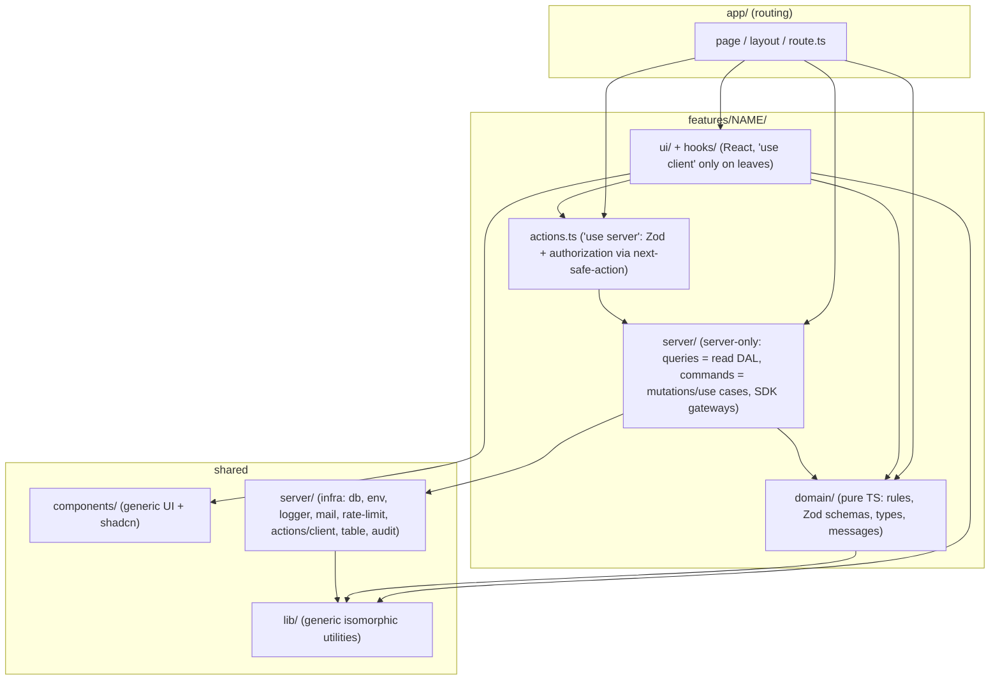

# 03 — Target architecture

## 1. Recommendation

**Feature folders + Next's Data Access Layer + a pure core only where there are real rules.** This is not full Clean Architecture.

The project already does half of this: `features/*/queries.ts` with `server-only` is exactly the DAL that the Next 16 documentation recommends for new projects (`node_modules/next/dist/docs/01-app/02-guides/data-security.md:56-60`). The same guide recommends thin actions on top of a DAL for mutations as well (`:397-399`). The proposal is to **extend this pattern to the whole app**, instead of inventing a new one, and to add three things:

1. **Pure `domain/`** inside the features that have real rules: the token decision, the room error mapping, the mascot brain, the `MascotPair` phases and the webhook projection. No React, no Next, no Drizzle and no SDK, testable with Vitest in milliseconds.
2. **A single "port"**, shaped as an object of functions rather than a class, between the token rule and the LiveKit SDK (`countParticipants`, `signToken`). It is the only place where today you have to spin up a fake HTTP server to test a decision.
3. **Boundaries enforced by the oxlint** the project already uses (`no-restricted-imports` per override + `import/no-cycle`), plus knip and jscpd in CI.

### Rejected alternatives

| Alternative                                                                                                                              | Why it was rejected                                                                                                                                                                                                                                                                                                                                                                                                                                 |
| ---------------------------------------------------------------------------------------------------------------------------------------- | --------------------------------------------------------------------------------------------------------------------------------------------------------------------------------------------------------------------------------------------------------------------------------------------------------------------------------------------------------------------------------------------------------------------------------------------------- |
| **Full Clean Architecture** (entities / use-cases / ports / adapters, a repository per aggregate, interfaces for DB, e-mail and LiveKit) | With 1 dev and about 5 users, it would double the number of files with no benefit. Drizzle is already the data abstraction, and the integration tests against **real Postgres** (`tests/integration/*`, template database cloned per worker) are already better than repository fakes: they test real SQL, constraints and triggers. A `UserRepository` interface with a single implementation is exactly the over-engineering that rule 2 forbids. |
| **Keep the organization by technical type** (`components/`, `lib/`, `hooks/`) and only split the large files                             | It fixes size, but does not fix `components → app`, the three auth folders or `lib/` as a junk drawer. And it does not allow writing **one** lint rule that says "UI does not import the feature's server code".                                                                                                                                                                                                                                    |

## 2. Layers and the dependency rule



| Layer                                     | May import                                                                         | **May not** import                                                                                                                                                                                        |
| ----------------------------------------- | ---------------------------------------------------------------------------------- | --------------------------------------------------------------------------------------------------------------------------------------------------------------------------------------------------------- |
| `app/**`                                  | anything                                                                           | — (must stay thin: reads params, calls the DAL/use case, renders)                                                                                                                                         |
| `features/X/ui/**`, `features/X/hooks/**` | `features/X/{domain,actions}`, `components`, `lib`, `import type` from anywhere    | `features/*/server/**`, `@/server/**`, `drizzle-orm`, `pg`, `livekit-server-sdk`, UI from **another** feature (except `features/mascot/**` and `features/room/ui/ShareSupportNote.tsx`, which are public) |
| `features/X/actions.ts`                   | `features/X/{server,domain}`, `@/server/actions/client`                            | `features/X/ui`                                                                                                                                                                                           |
| `features/X/server/**`                    | `features/X/domain`, `features/Y/server` (no cycles), `@/server/**`, drizzle, SDKs | `ui`, `react`                                                                                                                                                                                             |
| `features/X/domain/**`                    | `zod`, `lib/**`, `features/Y/domain`                                               | `react`, `next/*`, `drizzle-orm`, `pg`, `livekit-*`, `better-auth`, `@/server/**`                                                                                                                         |
| `components/**`, `lib/**`                 | `components`, `lib`                                                                | `@/features/**`, `@/app/**`, `@/server/**` (except `import type`)                                                                                                                                         |
| `server/**` (infra)                       | `lib`, `server`, drizzle, pg, SDKs                                                 | `@/features/**`, `@/app/**`, `@/components/**`                                                                                                                                                            |

Why the rule is enforced by oxlint and not by dependency-cruiser: see the decisions table (§7).

## 3. Guidelines from the request that were challenged

| Guideline                                   | Decision                                                                                                                                                                                               | Reason                                                                                                                                                                                         |
| ------------------------------------------- | ------------------------------------------------------------------------------------------------------------------------------------------------------------------------------------------------------ | ---------------------------------------------------------------------------------------------------------------------------------------------------------------------------------------------- |
| Separate `repositories` layer               | **No.** `server/queries.ts` (reads) and `server/commands.ts` (writes) use Drizzle directly                                                                                                             | Drizzle is already the repository. An extra layer would only forward calls. Testing is integration against real Postgres, as is done today.                                                    |
| `services/use-cases` layer in every feature | **Only where there are rules**: token, webhook, mascot, participants (block, anonymize), invitations                                                                                                   | In panel listings the "use case" would be `return listRooms(db, params)`. That is ceremony.                                                                                                    |
| Port for database, e-mail and storage       | **No.** Only for the LiveKit server SDK in the token                                                                                                                                                   | The database is tested for real. E-mail already falls back to logging without SMTP (`server/mail.ts`). Storage does not exist in the project.                                                  |
| Strict `shared/` and infra-only `lib/`      | **Keep the current names, change the contents**: `lib/` = generic isomorphic code (the role of `shared/`), `server/` = server infra (the role of infra `lib/`)                                         | Renaming `lib → shared` would touch about 150 imports with no gain. What matters is the dependency rule, and lint enforces it. Domain code moves out of `lib/` and `server/` into `features/`. |
| Typed `Result`                              | **Already exists and is enough**: discriminated union `{ ok: true … } \| { ok: false; code }` in the domain, `ActionError` + next-safe-action in actions, a `code → {status, message}` map in handlers | A library (`neverthrow@8.2.0`) would spread `.map/.andThen` through code that currently reads linearly.                                                                                        |
| Structured logger                           | **Already exists** (pino with `redact`, `requestLogger` with request_id)                                                                                                                               | It only needs standardizing: read `LOG_LEVEL` via `getEnv` and never swallow a `catch` without logging.                                                                                        |

## 4. Conventions

| Topic         | Rule                                                                                                                                                                                                                                                                                                                      |
| ------------- | ------------------------------------------------------------------------------------------------------------------------------------------------------------------------------------------------------------------------------------------------------------------------------------------------------------------------- |
| Language      | **Code in English** (identifiers, folders, files, internal payload keys). **Portuguese**: UI text, user-facing error messages, comments, **URLs and query params** (`/sala`, `?convite`, `?voltar`, `de`/`ate`) and **persisted values** (audit metadata already written). The last two are a contract and do not change. |
| File names    | React component: `PascalCase.tsx` (the current pattern for most). Everything else: `kebab-case.ts`. Hooks: `use-*.ts`. Next route files follow the framework convention.                                                                                                                                                  |
| Domain names  | `participant` = person who joins a room (`users` table); `admin`/`adminUser` = panel account. `user` does not appear on its own in new code.                                                                                                                                                                              |
| Barrel files  | Forbidden (except `server/db/schema/index.ts`, which already exists and is required by drizzle-kit). Import the file directly.                                                                                                                                                                                            |
| Alias         | `@/` (as today). Relative imports only within the same folder.                                                                                                                                                                                                                                                            |
| Limits (lint) | File ≤ **300** effective lines; logic function (outside JSX) ≤ **60** lines; complexity ≤ **15**. Starts as `error` with a list of named exceptions that shrinks with each phase (ratchet).                                                                                                                               |
| Server/Client | RSC by default. `"use client"` only on the component that uses state, effects or browser APIs. Every file in `features/*/server/**` and `server/**` starts with `import "server-only"`.                                                                                                                                   |

## 5. Target folder tree

Shows **all** current files at their destination. `←` marks the origin when it changes; entries without `←` do not change.

```
app/                                      (thin routes; URLs do NOT change)
  layout.tsx, page.tsx, not-found.tsx, globals.css, privacidade/
  (acesso)/…                              pages → features/auth/ui
  conta/page.tsx                          ← no inline Drizzle; uses features/account/server
  sala/[codigo]/page.tsx                  → features/room
  admin/(auth)/…, admin/(painel)/…        pages → features/admin/*
  api/
    token/route.ts                        ← about 30 lines: HTTP edge → features/room/server/issue-token
    livekit/webhook/route.ts              → features/room/server/webhook/*
    conta/dados/route.ts                  → features/account/server/data-export.ts
    admin/exportar/[recurso]/…            ← 4 thin routes on top of server/table/csv-route.ts
    auth/, admin/auth/, health/, ready/

features/
  room/                                   LIVE ROOM (participant)
    domain/
      room-code.ts                        ← lib/livekit.ts (roomCodeSchema, generateRoomCode, roomPath, roomLink)
      token-contract.ts                   ← lib/livekit.ts (req/resp/error schemas, codes)
      token-errors.ts                     ← route.ts:111-243 (code → {status, message})
      issue-token.ts                      ← route.ts:83-247 (pure DECISION, see §6)
      connection-errors.ts                ← RoomView.tsx:49-88, PreJoin.tsx:61-72
      data-channel.ts                     ← lib/room-data.ts:7-45
      content-box.ts                      ← lib/room-data.ts:48-59
      room-input.ts                       ← lib/room-input.ts
      share-support.ts                    ← lib/share-support.ts
      participant-label.ts                ← initials ×3 + displayName ×6 (D-026)
      focus.ts                            ← RoomView.tsx:236-239
    server/
      livekit-gateway.ts                  ← sole dependency on livekit-server-sdk (count, sign, webhook receiver)
      issue-token.ts                      ← orchestrates: rate limit + domain + gateway + invites + token-log
      token-log.ts                        ← server/livekit/token-log.ts
      invites.ts                          ← server/rooms/invites.ts
      presence.ts, recent.ts              ← server/rooms/*
      webhook/ingest.ts                   ← webhook-projector.ts (ingest, process, reprocess)
      webhook/project.ts                  ← projectEvent split up: one handler per event type
    hooks/
      use-room-connection.ts              ← RoomView.tsx:90-164
      use-mic-level.ts                    ← PreJoin.tsx:159-219
      use-mic-permission.ts, use-screen-share.ts, use-room-notices.ts, use-room-animations.ts
      request-token.ts                    ← lib/livekit.ts:78-109 (client fetch)
      saved-microphone.ts                 ← lib/room-data.ts:61-79
    ui/
      RoomSession.tsx, StatusScreen.tsx, ShareSupportNote.tsx (public)
      prejoin/ PreJoin.tsx (composition only), PresenceLine.tsx, MicSetup.tsx, PasswordField.tsx, NameRow.tsx, InviteLinkButton.tsx
      call/    RoomView.tsx, RoomLayout.tsx, AloneWelcome.tsx, RoomTopBar.tsx, ParticipantTile.tsx
      stage/   ScreenStage.tsx, PointerLayer.tsx
      dock/    ControlDock.tsx, DockButton.tsx, MicMenu.tsx, ShareMenu.tsx, Chat.tsx, Reactions.tsx
  home/
    ui/ HomeScene.tsx (RSC) + SmartBar.tsx, RecentRooms.tsx, HowItWorks.tsx
  mascot/                                 (public to the other features)
    engine/                               PURE: face.ts (with blocksPlay/closesEyes flags), reasons.ts, spring.ts,
                                          sleep.ts, eye-tracking.ts, avatar-frames.ts, body-motions.ts,
                                          personality.ts, brain.ts (← use-mascot decisions), pair-phases.ts (← MascotPair)
    dom/                                  gaze.ts, face-renderer.ts, hand-motions.ts, global-input-hub.ts (single listeners)
    ui/ Mascot.tsx, Mascot.module.css, MascotPair.tsx, MascotPair.module.css, SpriteEyes.tsx, use-mascot.ts (thin)
    events.ts
  auth/                                   BOTH AUTHS (admin + participant)
    domain/ password-rules.ts, auth-errors.ts, return-path.ts (← safeReturnPath), access-copy.ts, access-context.ts, email-suggest.ts
    server/ participant-auth.ts (← server/auth/user.ts), admin-auth.ts (← admin.ts), auth-shared.ts, lockout.ts,
            password.ts, origin-guard.ts, participant-session.ts, admin-session.ts, admin-api.ts,
            permissions.ts, roles.ts, admin-invitations.ts
    client/ participant-auth-client.ts, admin-auth-client.ts
    hooks/  use-form-submit.ts            ← the pending/error pair ×11 (D-022)
    ui/     AuthCard, SignInForm (one, with `scope`), SignUpForm, EmailField, PasswordInput, PasswordForms,
            TwoFactorCodeForm, TwoFactorSettings, SessionList (receives the actions via props), VerifyEmailPanel,
            BrandPanel, AccessTabs, AcceptInvitationForm, AdminDisabled
  account/                                Participant "Minha conta" (My account)
    actions.ts                            ← app/conta/actions.ts
    server/ sessions.ts (sessions query, shared with admin/account), data-export.ts
    ui/     AccountForms.tsx split into ProfileForm, ChangeEmailForm, ChangePasswordForm, DeleteAccountForm + UserSignOutButton
  participants/
    server/operations.ts                  ← server/participants/operations.ts (used by account and admin)
  admin/                                  PANEL
    shell/   AdminShell.tsx, CommandPalette.tsx, nav.ts (← server/admin-nav.ts), nav-icons.ts
    dashboard/
    rooms/        queries.ts, search-params.ts, actions.ts, labels.ts, ui/{RoomsTable, RoomFilters, InvitesPanel, RoomNoteForm, RoomDetail}
    participants/ queries.ts, search-params.ts, actions.ts, labels.ts, ui/{ParticipantsTable, ParticipantFilters, ParticipantActions, ParticipantDetail}
    shares/       queries.ts, search-params.ts, ui/{SharesTable}
    audit/        queries.ts, search-params.ts, labels.ts (← lib/audit-labels.ts), ui/{AuditTable, AuditFilters, AuditDetail}
    search/       actions.ts              ← features/busca
    settings/     actions.ts (← app/admin/(painel)/configuracoes/actions.ts), ui/MascotSettingsForm.tsx
    account/      actions.ts (← app/admin/(painel)/conta/sessoes/actions.ts)

components/                               Generic UI, no domain
  ui/                                     shadcn (without popover.tsx/select.tsx; sonner no longer depends on the app)
  NavBar.tsx, ThemeToggle.tsx, nav-item-class.ts, Section.tsx, ConfirmDialog.tsx, StatusBadge.tsx, QrCode.tsx
  data-table/ DataTable.tsx, filters.tsx (FilterSelect/Date/Search + single SELECT_CLASS), TableToolbar.tsx ("Limpar" + "Exportar" buttons, Clear + Export)
  undo-toast.ts

lib/                                      isomorphic and generic (the "shared" role)
  utils.ts, format.ts, csv.ts, gsap.ts (with the single prefersReducedMotion), theme.ts (+ useTheme), user-agent.ts,
  table-params.ts, invite-token.ts (← lib/invite.ts)
  hooks/ use-shortcut.ts (← hooks/useShortcut.ts), use-mobile.ts (← hooks/use-mobile.ts)

server/                                   server infra
  env.ts, logger.ts, request-log.ts, mail.ts, sentry.ts, csp.ts, client-ip.ts (+ getClientIp), rate-limit.ts, settings.ts
  db/index.ts (getDb(): Database, not optional), db/schema/*
  actions/client.ts                       (+ single FRESH_SESSION_MS constant)
  audit/record.ts
  table/ keyset.ts, search.ts, selection.ts (no longer imports actions), csv-export.ts,
         list-page.ts (← listX skeleton ×4), period-filter.ts (← de/ate filter ×4), csv-route.ts (← exportar ×4)

drizzle/, scripts/, deploy/, tests/{unit,integration,e2e}/   (e2e = Playwright, new)
```

Folders that **disappear**: `hooks/`, `features/{auditoria,busca,compartilhamentos,salas,usuarios}`, `components/{room,mascot,home,account,auth,admin}`, `server/{auth,livekit,rooms,participants}`, `server/admin-nav.ts`.

## 6. End-to-end example: `POST /api/token` (joining a room)

### Before: everything in the handler (`app/api/token/route.ts`, 247 lines, complexity 31)

```ts
export async function POST(request) {
  const env = getEnv();
  if (isCrossSiteMutation(request)) return forbiddenCrossSite();
  // IP rate limit → reads body by hand → getUserAuth().api.getSession()
  // → if blocked … if !emailVerified … perUserLimit … safeParse with inline messages
  // → password: passwordFailures.peek/hit/reset + safeEqual
  // → try { new RoomServiceClient(...).listParticipants() → room full?
  //         redeemRoomInvite(getDb()!, …)
  //         new AccessToken(...).addGrant(...) ; roomConfig ; toJwt() }
  // each exit: await log("x"); return errorResponse("x", "Portuguese message", status)
}
```

### After: four pieces, each testable in isolation

**1. HTTP edge**: `app/api/token/route.ts` (~30 lines). HTTP only: origin, IP, body, session and mapping to a response.

```ts
export async function POST(request: NextRequest) {
  if (isCrossSiteMutation(request)) return forbiddenCrossSite();
  const ip = clientIpFrom(request.headers);
  const body = await readJson(request); // { ok, value } — does not throw
  const session = await getParticipantSessionFromHeaders(request.headers);
  const result = await issueRoomToken({ ip, body, session }); // features/room/server
  return result.ok
    ? NextResponse.json(result.data, { headers: NO_STORE })
    : tokenErrorResponse(result.code, result); // domain/token-errors: code → {status, message, retryAfter}
}
```

**2. Server orchestration**: `features/room/server/issue-token.ts` (`server-only`). Wires infra and domain together and **preserves the current order of checks and logs**.

```ts
const limits = { perIp: createRateLimiter(...), perUser: ..., passwordFailures: ... }; // same numbers as today

export async function issueRoomToken(input, deps = defaultDeps()) {
  const decision = await decideTokenRequest(input, {        // domain/issue-token.ts (pure)
    config: { accessPassword, requireVerifiedEmail, maxParticipants },
    limits,
    room: { countParticipants: deps.livekit.countParticipants,
            redeemInvite: (token, room, userId) => redeemRoomInvite(deps.db, {...}) },
  });
  await deps.log(decision.logResult);                      // token_requests, as today
  if (!decision.ok) return decision;
  return { ok: true, data: { token: await deps.livekit.signToken(decision.grant), serverUrl } };
}
```

**3. Pure domain**: `features/room/domain/issue-token.ts`. No Next, no SDK, no database. Dependencies are functions passed in as parameters.

```ts
export type TokenDecision =
  | { ok: true; grant: RoomGrant; logResult: "granted" }
  | { ok: false; code: TokenErrorCode; logResult: TokenLogResult | null; retryAfter?: number };

export async function decideTokenRequest(input, deps): Promise<TokenDecision> {
  if (!deps.limits.perIp.hit(input.ip).ok)
    return fail("rate_limited", null /* does not log, as today */);
  if (!input.session) return fail("unauthenticated");
  if (isBlocked(input.session.user)) return fail("blocked");
  // … e-mail, perUser, unreadable body, schema, password, capacity, invitation — same order as today
  return {
    ok: true,
    grant: buildGrant(user, room, deps.config.maxParticipants),
    logResult: "granted",
  };
}
```

**4. SDK gateway**: `features/room/server/livekit-gateway.ts`. It is the **only** file that imports `livekit-server-sdk` for the token.

```ts
export type LiveKitGateway = {
  countParticipants(room: string): Promise<number>;   // 404 → 0, as today
  signToken(grant: RoomGrant): Promise<string>;       // AccessToken + PUBLISH_SOURCES + roomConfig
};
export const liveKitGateway: LiveKitGateway = { … };   // single implementation; in tests, an object literal
```

**Tests this structure unlocks:**

- `decideTokenRequest`: one Vitest test per branch (about 15), with object-literal fakes, no network and no database.
- `tests/integration/token-route.test.ts` (already exists, 15 cases) stays **unchanged** as a characterization test of the HTTP edge. If it passes before and after, behavior was preserved.

**What does not change:** the URL, the body, the error codes, the Portuguese messages, the HTTP statuses, `Retry-After`, the order of checks, the rows written to `token_requests`, the rate limits and the 10-min TTL.

## 7. Decisions table

Versions checked with `npm view` on 2026-10-06.

| Pattern              | Choice                                                                                                   | Alternative                                           | Reason                                                                                                                                                                                                                                                            | Risk                                                                                           |
| -------------------- | -------------------------------------------------------------------------------------------------------- | ----------------------------------------------------- | ----------------------------------------------------------------------------------------------------------------------------------------------------------------------------------------------------------------------------------------------------------------- | ---------------------------------------------------------------------------------------------- |
| Organization         | Feature folders (`features/*`) + generic `components`/`lib`/`server`                                     | By technical type                                     | Cohesion; allows a lint rule per folder                                                                                                                                                                                                                           | Many `git mv`s. Mitigation: one feature per PR, no code changes in the same commit as the `mv` |
| Data                 | DAL: `queries.ts`/`commands.ts` with Drizzle directly                                                    | Repositories + interfaces                             | Recommended by Next; tests against real Postgres already exist                                                                                                                                                                                                    | Nothing new                                                                                    |
| Rules                | Pure `domain/` **only** where there are rules (token, webhook, mascot, room)                             | A use case in every feature                           | Avoids ceremony in listings                                                                                                                                                                                                                                       | Grey area over what counts as a "rule"; settle it in the PR                                    |
| Dependency inversion | One function-object gateway for the LiveKit server SDK                                                   | Ports for DB, e-mail and storage                      | It is the only spot where a test needs a fake HTTP server                                                                                                                                                                                                         | None                                                                                           |
| Errors               | Discriminated union + `ActionError` (already exists) + code→HTTP map                                     | `neverthrow@8.2.0`                                    | Already works, no new dependency                                                                                                                                                                                                                                  | —                                                                                              |
| Validation           | Zod 4.6.5 (already installed), types via `z.infer`; database enum types via `$inferSelect`/`enumValues`  | —                                                     | Already the standard; just remove the redeclarations (D-037)                                                                                                                                                                                                      | —                                                                                              |
| Layer boundaries     | **oxlint `no-restricted-imports` per override** + `import/no-cycle` (already configured, just extend)    | `dependency-cruiser@18.5.0`                           | depcruise needs the TypeScript compiler to read `.ts`, and the installed TypeScript 7.0.2 **does not expose the JS API** (`require("typescript").createSourceFile` → `undefined`, verified). It would require installing SWC and maintaining a second rule system | Less precise than depcruise (it works by path pattern), enough here                            |
| Boundaries (alt.)    | —                                                                                                        | `eslint-plugin-boundaries@7.2.0`                      | Requires ESLint (10.12.0) as a **second linter** next to oxlint                                                                                                                                                                                                   | —                                                                                              |
| Dead code            | `knip@6.40.0` in CI (already ran successfully on this project)                                           | `ts-prune` (abandoned)                                | Catches files, exports and deps; works with the stack                                                                                                                                                                                                             | `pino-pretty` false positive: ignore it in the config                                          |
| Duplication          | `jscpd@5.4.0` in CI, with a 2% `threshold`                                                               | —                                                     | Already runs in 1.8 s; the baseline is 2.24%                                                                                                                                                                                                                      | Vendor and test duplication: ignore                                                            |
| Size                 | oxlint `eslint/max-lines` (300), `max-lines-per-function` (60, `.ts` only), `complexity` (15)            | —                                                     | Native rules (tested here with a temporary config)                                                                                                                                                                                                                | Named initial exceptions (ratchet)                                                             |
| E2E                  | `@playwright/test@1.63.0` (Node ≥ 20 ✓) with Chromium fake media; `@axe-core/playwright@4.13.0` optional | Cypress                                               | Multi-context (2 participants) and fake media flags                                                                                                                                                                                                               | Needs LiveKit dev (`docker-compose.livekit.yml`) in CI                                         |
| Component tests      | **Do not add** jsdom/happy-dom/Testing Library                                                           | `@testing-library/react@16.3.3` + `happy-dom@20.14.5` | Extracting logic into `domain/` (Vitest node) + Playwright covers the rest with less maintenance                                                                                                                                                                  | Thin hooks go without unit tests (accepted)                                                    |
| Language             | Code in English; UI, URLs and persisted data in Portuguese                                               | Everything in Portuguese                              | Matches the SDK and the libraries; URLs and data are a contract                                                                                                                                                                                                   | Renaming `features/salas` → `admin/rooms` touches imports (that's all)                         |

## 8. How to prevent regression (CI)

Proposal for `oxlint.config.ts`, extending the override that already exists:

```ts
overrides: [
  {
    files: ["components/**", "lib/**"], // generic
    rules: {
      "eslint/no-restricted-imports": [
        "error",
        {
          patterns: [
            {
              group: ["@/features/*", "@/app/*"],
              message: "Genérico não conhece features nem rotas.",
            },
            { group: ["@/server/*", "pg", "drizzle-orm*"], allowTypeImports: true, message: "…" },
          ],
        },
      ],
    },
  },
  {
    files: ["features/*/ui/**", "features/*/hooks/**", "features/admin/*/ui/**"],
    rules: {
      "eslint/no-restricted-imports": [
        "error",
        {
          patterns: [
            {
              group: [
                "@/features/*/server/*",
                "@/features/admin/*/queries",
                "@/server/*",
                "drizzle-orm*",
                "pg",
                "livekit-server-sdk",
              ],
              allowTypeImports: true,
              message: "UI não acessa servidor: use props ou action.",
            },
          ],
        },
      ],
    },
  },
  {
    files: ["features/*/domain/**"],
    rules: {
      "eslint/no-restricted-imports": [
        "error",
        {
          patterns: [
            {
              group: [
                "react",
                "next/*",
                "drizzle-orm*",
                "pg",
                "livekit-*",
                "better-auth*",
                "@/server/*",
                "@/features/*/server/*",
              ],
              message: "domain/ é TypeScript puro.",
            },
          ],
        },
      ],
    },
  },
  {
    files: ["server/**"],
    rules: {
      "eslint/no-restricted-imports": [
        "error",
        {
          patterns: [
            {
              group: ["@/features/*", "@/app/*", "@/components/*"],
              message: "Infra não conhece features.",
            },
          ],
        },
      ],
    },
  },
];
```

(The lint `message` strings in the proposal above were written in Portuguese: "generic code knows neither features nor routes", "UI does not access the server: use props or an action", "domain/ is pure TypeScript", "infra does not know features".)

New steps in the `quality` job of `ci.yml`: `pnpm knip`, `pnpm dlx jscpd@5.4.0 --threshold 2 …`, `drizzle-kit check`. In the `test` job: `coverage.thresholds` and applying `bootstrap.sql` so integration runs as `nelcota_app`. New `e2e` job: Playwright with LiveKit dev as a service. In the `build` job: `docker build`.

## 9. Where we will NOT apply SOLID or layers

| Part                                                                                                  | Stays as is                                                            | Why                                                                                                                       |
| ----------------------------------------------------------------------------------------------------- | ---------------------------------------------------------------------- | ------------------------------------------------------------------------------------------------------------------------- |
| `components/ui/*` (shadcn)                                                                            | Only delete the 2 dead files and remove the app import in `sonner.tsx` | It is vendor code. The 18 `no-unsafe-type-assertion` errors coming from it are solved with a lint override, not a rewrite |
| `server/env.ts`, `logger.ts`, `rate-limit.ts` (in memory), `csp.ts`, `proxy.ts`, `mail.ts`            | No interfaces                                                          | Simple, correct and tested. Redis for the rate limit would be over-engineering with one replica                           |
| `server/settings.ts`                                                                                  | Do not generalize                                                      | A single group (mascot). Zod + a 60 s cache is enough                                                                     |
| The two Better Auth instances                                                                         | Stay separate; extract only shared **constants** (limits, fresh)       | The separation (tables, cookies, secrets) is a security decision. Unifying them would be a risk                           |
| `server/table/keyset.ts`, `csv-export.ts`, `lib/csv.ts`, `audit/record.ts`                            | Kept                                                                   | Well designed and tested                                                                                                  |
| `webhook-projector`: idempotency, `greatest`/`least`, raw event                                       | Kept                                                                   | Only split the `switch` into per-event functions. The design is good                                                      |
| Panel listings                                                                                        | No use case: page → `queries.ts`                                       | There are no rules; extract only the helpers (`list-page`, `period-filter`, `csv-route`)                                  |
| `RoomSession` (phase machine with `key={attempt}`), `useRoomAnimations` (Flip), the `useGSAP` pattern | Untouched                                                              | Correct, and rewriting is risk with no gain                                                                               |
| Room prop drilling                                                                                    | No new context                                                         | At most 5 levels, and only for 2 values                                                                                   |
| `RoomServiceClient`/`AccessToken` in the webhook                                                      | No port                                                                | The webhook receiver is already tested with a real signature (`tests/unit/webhook-route.test.ts`)                         |
| Migrations and schema                                                                                 | No schema change in the refactor                                       | See the plan: the refactor does not touch the database                                                                    |
