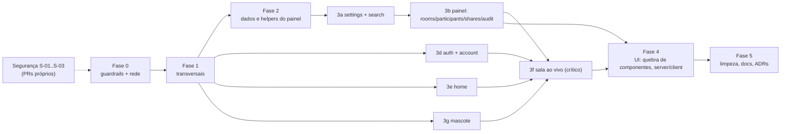

# 04 — Plano de migração

## Princípios

1. **Cada PR é pequeno, deployável e não muda comportamento.** Mover arquivo (`git mv` + ajuste de import) e mudar código ficam em **commits separados**, para o diff de revisão ficar legível.
2. **Bugs e segurança (`S-*`, `B-*` do doc 02) entram em PRs próprios**, fora das fases de refactor. A exceção são os que o próprio teste de caracterização exige documentar. As correções de segurança S-01, S-02 e S-03 podem (e devem) entrar antes de tudo, porque não dependem do refactor.
3. **Uma fase só começa quando a rede de segurança dela estiver verde no CI.**
4. **O refactor não toca o banco.** Zero migrações. Se surgir necessidade, ela vira PR próprio no padrão expand/contract.
5. **Catraca**: cada fase reduz a lista de exceções do lint (`max-lines`, regras de camada). A lista nunca cresce.

## 1. Rede de segurança (testes de caracterização)

### Já existem (manter verdes, sem editar)

| Teste                                                                                                                 | Trava                                                                                               |
| --------------------------------------------------------------------------------------------------------------------- | --------------------------------------------------------------------------------------------------- |
| `tests/integration/token-route.test.ts` (15 casos)                                                                    | Todo o contrato do `/api/token`: 401/403, senha, sala cheia, rate limit, convites, `token_requests` |
| `tests/integration/livekit-webhook.test.ts`                                                                           | Projeção, idempotência, ordem trocada, reprocessamento                                              |
| `tests/integration/admin-*.test.ts`, `user-auth`, `account-data`, `keyset`, `settings`, `recent-rooms`, `room-counts` | Painel, auth, LGPD, paginação                                                                       |
| `tests/unit/*` (57 testes)                                                                                            | Regras puras: csv, room-input, share-support, rate limiter, CSP, permissões, mascote                |

### Faltam (escrever na Fase 0, **antes** de mexer em qualquer área)

| #   | Teste                                                                                                                                                                                               | Ferramenta                                       | Trava                                  | Libera a fase |
| --- | --------------------------------------------------------------------------------------------------------------------------------------------------------------------------------------------------- | ------------------------------------------------ | -------------------------------------- | ------------- |
| T1  | `requestToken` com `fetch` stubado (rede caindo, 200 válido, 200 inválido, 4xx, 500 não-JSON); `roomPath`/`roomLink`                                                                                | Vitest                                           | o cliente do token                     | 3f            |
| T2  | `room-data`: ida e volta de encode/decode, payload inválido, `contentBox` (tarjas, 0×0), `savedMicrophone` com `localStorage` lançando                                                              | Vitest                                           | o protocolo do data channel            | 3f            |
| T3  | `actions-authz` cobrindo **também** `features/**/actions.ts` (hoje só `app/**`, D-048)                                                                                                              | Vitest integração                                | autorização das 13 actions do painel   | 3b, 3c        |
| T4  | Exportação CSV: as 4 rotas devolvem cabeçalho, BOM, `;`, auditoria gravada e 401/403                                                                                                                | Vitest integração                                | D-019                                  | 2             |
| T5  | `/api/conta/dados`: formato do JSON                                                                                                                                                                 | Vitest integração (já parcial em `account-data`) | 3d                                     | 3d            |
| T6  | `safeReturnPath`: casos atuais. O `/\t/` passa hoje; marcar com `it.fails` e referência a S-01                                                                                                      | Vitest                                           | 3d                                     | 3d            |
| E1  | Sem login: `/sala/ABC-DEFG-HIJ` → `/entrar?voltar=/sala/abc-defg-hij`; código inválido → `/?erro=codigo`                                                                                            | Playwright                                       | page da sala                           | 3f            |
| E2  | Pré-entrada: senha errada → mensagem; `?convite=` esconde a senha; permissão de mic negada → passo a passo + "Entrar só ouvindo"                                                                    | Playwright (fake media)                          | PreJoin                                | 3f, 4         |
| E3  | Entrar sozinho → "Você é a primeira pessoa aqui"; sair → "Você saiu da sala" → "Entrar de novo"                                                                                                     | Playwright                                       | RoomView/RoomSession                   | 3f, 4         |
| E4  | Dois contextos: toast "X entrou"; chat + badge de não lidas; reação; "H" levanta a mão; compartilhar tela (stub de `getDisplayMedia`) → o palco aparece no outro                                    | Playwright                                       | sala completa                          | 3f, 4         |
| E5  | **Comportamento atual de B-01 e B-02**: URL de servidor inválida → hoje mostra "Você saiu da sala"; cancelar o seletor de tela → hoje 2 toasts. Marcar como `test.fail` documentado                 | Playwright                                       | não "consertar sem querer" no refactor | 3f            |
| E6  | Login admin + 2FA (TOTP com `tests/integration/support/totp.ts`) → painel; filtro de salas → URL; exportar CSV baixa um arquivo                                                                     | Playwright                                       | shell e tabelas                        | 3b, 4         |
| E7  | Cadastro → verificar e-mail (flag desligada) → login → `/conta` → revogar outra sessão                                                                                                              | Playwright                                       | auth e conta                           | 3d            |
| E8  | Home: digitar o código → navega; código inválido → mascote "grumpy" (`data-expression`); "/" foca a barra                                                                                           | Playwright                                       | home e SmartBar                        | 3e            |
| M1  | Snapshot das decisões do mascote: sequência de eventos → `data-expression` esperado (via `page.evaluate` sobre o DOM) para 5 cenários (idle→sleepy→asleep, senha, sinal celebrate, high-five, pair) | Playwright                                       | o motor do mascote                     | 3g            |

## 2. Fases

A ordem dentro da Fase 3 vai do mais simples e com mais teste ao mais crítico e com menos teste. A sala ao vivo fica por último porque depende do E2E maduro e das peças compartilhadas (auth, mascote) já no lugar. As subfases 3d, 3e e 3g podem andar em paralelo à 3b.

### Fase 0: guardrails e rede de segurança · risco **baixo** · ~22 h

| Item               | Conteúdo                                                                                                                                                                                                                                                                                                                                                                                                                                                                                                                                                                                                                                                                                                                                                                                                                                                                                                                                                                                                                                                  |
| ------------------ | --------------------------------------------------------------------------------------------------------------------------------------------------------------------------------------------------------------------------------------------------------------------------------------------------------------------------------------------------------------------------------------------------------------------------------------------------------------------------------------------------------------------------------------------------------------------------------------------------------------------------------------------------------------------------------------------------------------------------------------------------------------------------------------------------------------------------------------------------------------------------------------------------------------------------------------------------------------------------------------------------------------------------------------------------------- |
| Objetivo           | O CI roda, fica verde e passa a impedir regressão. A rede de segurança existe                                                                                                                                                                                                                                                                                                                                                                                                                                                                                                                                                                                                                                                                                                                                                                                                                                                                                                                                                                             |
| Arquivos           | `oxlint.config.ts`, `vitest.config.ts`, `.github/workflows/ci.yml`, `package.json`, `tests/unit/mascot.test.ts`, `components/ui/{popover,select}.tsx` (apagar), novos `tests/e2e/**`, `playwright.config.ts`, `knip.json`                                                                                                                                                                                                                                                                                                                                                                                                                                                                                                                                                                                                                                                                                                                                                                                                                                 |
| Passos             | 1) Criar o remote no GitHub (decisão em aberto 05/Q1) e confirmar o primeiro CI. 2) **Deixar o lint verde**: converter `mascot.test.ts` para `describe/expect` (22 `await-thenable`); override de `no-unsafe-type-assertion` para `components/ui/**`; resolver os poucos casts restantes (`app/layout.tsx:37`, `MascotSettingsForm.tsx:85`) sem mudar comportamento. 3) Remover o código morto seguro: `date-fns`, `ui/popover`, `ui/select`, `BOUNCE`, o motivo `"tap"`, `RoomStatusFilter` e os exports sem uso apontados pelo knip, **exceto** `purgeOldFailures`/`reprocessPendingEvents`. 4) Adicionar knip, jscpd (threshold 2,5% → depois 2%), `drizzle-kit check` e `docker build` ao CI. 5) Incluir `components/**` e `hooks/**` na cobertura; `thresholds` iguais ao baseline atual (catraca). 6) Fazer o projeto de integração **avisar** quando faltar `TEST_DATABASE_URL`. 7) Instalar `@playwright/test@1.63.0` e escrever E1–E8 e M1, além de T1–T6. 8) Medir o baseline de `pnpm build` (tempo) e do bundle (`.next/` em uma pasta de CI) |
| Critério de pronto | CI verde em main com lint, typecheck, unit, integração, E2E, knip, jscpd e build; baseline de métricas registrado                                                                                                                                                                                                                                                                                                                                                                                                                                                                                                                                                                                                                                                                                                                                                                                                                                                                                                                                         |
| Como testar        | O próprio CI. Os E2E rodam 3× seguidas sem flake                                                                                                                                                                                                                                                                                                                                                                                                                                                                                                                                                                                                                                                                                                                                                                                                                                                                                                                                                                                                          |
| Como reverter      | Revert de commit; nenhuma mudança de produção                                                                                                                                                                                                                                                                                                                                                                                                                                                                                                                                                                                                                                                                                                                                                                                                                                                                                                                                                                                                             |
| Estimativa         | Lint 2 h · morto 1 h · CI 3 h · Playwright setup + LiveKit no CI 5 h · E1–E8/M1 8 h · T1–T6 3 h                                                                                                                                                                                                                                                                                                                                                                                                                                                                                                                                                                                                                                                                                                                                                                                                                                                                                                                                                           |

### Fase 1: padrões transversais · risco **baixo** · ~6 h

| Item               | Conteúdo                                                                                                                                                                                                                                                                                                                                                                                                                                                                                                                                                                                                                                                                                                                                                                                                            |
| ------------------ | ------------------------------------------------------------------------------------------------------------------------------------------------------------------------------------------------------------------------------------------------------------------------------------------------------------------------------------------------------------------------------------------------------------------------------------------------------------------------------------------------------------------------------------------------------------------------------------------------------------------------------------------------------------------------------------------------------------------------------------------------------------------------------------------------------------------- |
| Objetivo           | Tirar do caminho os ruídos que contaminam todas as fases seguintes                                                                                                                                                                                                                                                                                                                                                                                                                                                                                                                                                                                                                                                                                                                                                  |
| Arquivos           | `server/db/index.ts` e os 27 pontos com `if (!db)`, `server/logger.ts`, `server/sentry.ts`, `instrumentation.ts`, `server/actions/client.ts`, `server/auth/{admin,user}.ts`, `server/table/selection.ts`, `server/rate-limit.ts`/`client-ip.ts`, `lib/password-rules.ts` + 8 usos                                                                                                                                                                                                                                                                                                                                                                                                                                                                                                                                   |
| Passos             | 1) `getDb(): Database` não opcional (o env já garante isso, D-036). Apagar os desvios mortos e `db!`. **Atenção:** `tests/unit/webhook-route.test.ts` testa "503 com o banco fora". Transformar em teste de "erro do banco" sem mudar a resposta observável, ou registrar como decisão (05/Q4). 2) `LOG_LEVEL`/`APP_VERSION`/`SENTRY_DSN` via `getEnv`. 3) Constante única `FRESH_SESSION_MS` e `customRules` comuns aos dois Better Auth. 4) `ActionError` em módulo neutro (`server/actions/errors.ts`), para `server/table` não depender de `actions/client`. 5) `getClientIp` para `client-ip.ts`. 6) Usar `PASSWORD_LIMITS` nos 8 lugares fixos (mesmos valores: comportamento igual). 7) Logar nos `.catch(() => {})`. 8) `import "server-only"` em `permissions.ts`, `roles.ts`, `csp.ts`, `table/search.ts` |
| Critério de pronto | 0 `if (!db)`; 0 `db!`; nenhum `process.env` fora de `server/env.ts` (exceto `instrumentation-client.ts`, que é `NEXT_PUBLIC_`)                                                                                                                                                                                                                                                                                                                                                                                                                                                                                                                                                                                                                                                                                      |
| Como testar        | Suíte completa + E2E                                                                                                                                                                                                                                                                                                                                                                                                                                                                                                                                                                                                                                                                                                                                                                                                |
| Como reverter      | Revert por PR (um PR por item 1–8)                                                                                                                                                                                                                                                                                                                                                                                                                                                                                                                                                                                                                                                                                                                                                                                  |

### Fase 2: dados e helpers do painel · risco **baixo** · ~7 h

| Item               | Conteúdo                                                                                                                                                                                                                                                                                                                                                                                                                                                                                                             |
| ------------------ | -------------------------------------------------------------------------------------------------------------------------------------------------------------------------------------------------------------------------------------------------------------------------------------------------------------------------------------------------------------------------------------------------------------------------------------------------------------------------------------------------------------------- |
| Objetivo           | Acabar com a cópia ×4 no painel (D-019, D-020) e com o Drizzle inline nas páginas (D-009)                                                                                                                                                                                                                                                                                                                                                                                                                            |
| Arquivos           | `features/*/queries.ts`, `app/api/admin/exportar/*/route.ts`, `app/conta/page.tsx`, `app/admin/(painel)/conta/sessoes/page.tsx`, `app/api/conta/dados/route.ts`, novos `server/table/{list-page,period-filter,csv-route}.ts`                                                                                                                                                                                                                                                                                         |
| Passos             | 1) `periodFilter(column, {de, ate})` substitui as 4 cópias. 2) `iterateAll(listFn, params)` substitui os 4 `iterateX`. 3) `csvRoute({ permission, auditAction, loadParams, iterate, columns })` torna cada rota de exportação uma chamada de cerca de 10 linhas, **preservando** `action: "user.export"` (dado persistido; ver D-017 e 05/Q5). 4) `listActiveSessions(db, table, ownerId)` compartilhado entre `/conta` e `/admin/conta/sessoes`. 5) As 4 consultas de `/api/conta/dados` vão para uma função de DAL |
| Critério de pronto | jscpd sem clones nos `queries.ts`; páginas sem `import … from "drizzle-orm"`                                                                                                                                                                                                                                                                                                                                                                                                                                         |
| Como testar        | T4, T5, `keyset.test.ts`, `admin-*.test.ts`, E6                                                                                                                                                                                                                                                                                                                                                                                                                                                                      |
| Como reverter      | Revert por PR                                                                                                                                                                                                                                                                                                                                                                                                                                                                                                        |

### Fase 3: features, uma por PR (ou poucas)

Cada subfase segue a mesma receita: **(a)** um PR só de `git mv` + imports, para a nova pasta em inglês; **(b)** um PR de extração (domínio puro, hooks, divisão de componentes); **(c)** um PR que liga o override do lint daquela pasta e remove a feature da lista de exceções.

| Subfase                  | Escopo                                                                                                                                                                                                                                                                                                                              | Passos principais                                                                                                                                                                                                                                                                                                                                                                                                                                                                                                                                                                     | Risco                                  | Horas |
| ------------------------ | ----------------------------------------------------------------------------------------------------------------------------------------------------------------------------------------------------------------------------------------------------------------------------------------------------------------------------------- | ------------------------------------------------------------------------------------------------------------------------------------------------------------------------------------------------------------------------------------------------------------------------------------------------------------------------------------------------------------------------------------------------------------------------------------------------------------------------------------------------------------------------------------------------------------------------------------- | -------------------------------------- | ----- |
| **3a** settings + search | `app/admin/(painel)/configuracoes/actions.ts` → `features/admin/settings/`; `features/busca` → `features/admin/search`; `server/admin-nav.ts` → `features/admin/shell/nav.ts`                                                                                                                                                       | Desfaz `components → app` (MascotSettingsForm) e o ciclo de pasta do CommandPalette                                                                                                                                                                                                                                                                                                                                                                                                                                                                                                   | baixo                                  | 3     |
| **3b** painel            | `features/{salas,usuarios,compartilhamentos,auditoria}` → `features/admin/{rooms,participants,shares,audit}`; `components/admin/**` → `components/` (genéricos) e `features/admin/shell`                                                                                                                                            | `RoomFilters`/`ParticipantFilters` sobre `FilterSelect/Date/Search`; `AuditTable` dividido em `AuditFilters` + `AuditDetail` + tabela; `SELECT_CLASS` e `TableToolbar` únicos; `labels.ts` por feature; `RoomStatus` fora do módulo client                                                                                                                                                                                                                                                                                                                                            | baixo-médio                            | 10    |
| **3d** auth + conta      | `server/auth/**` → `features/auth/server`; `components/{auth,account,admin/auth}` → `features/auth/ui` e `features/account/ui`; `app/conta/actions.ts` → `features/account/actions.ts`; `app/admin/(painel)/conta/sessoes/actions.ts` → `features/admin/account/actions.ts`; `server/participants` → `features/participants/server` | `useFormSubmit` (pending/error ×11); `SignInForm` único com `scope` (cerca de 60 linhas a menos); `SessionList` recebe as actions **por prop** (sai o import das duas); `QrCode`/`Section` para `components/`; `AccountForms` dividido em 4                                                                                                                                                                                                                                                                                                                                           | **médio** (auth)                       | 10    |
| **3e** home              | `components/home/**` → `features/home/ui`; `lib/room-input.ts` → `features/room/domain`                                                                                                                                                                                                                                             | `HomeScene` vira RSC com ilhas client (`SmartBar`, `MascotPair`, `ThemeToggle`)                                                                                                                                                                                                                                                                                                                                                                                                                                                                                                       | baixo                                  | 3     |
| **3g** mascote           | `components/mascot/**`, `Mascot.tsx`, `MascotPair.*` → `features/mascot/{engine,dom,ui}`                                                                                                                                                                                                                                            | **Primeiro, commitar ou finalizar o WIP atual** (05/Q2). Depois: flags em `EXPRESSIONS` (`blocksPlay`, `closesEyes`) eliminando as 5 listas (D-029); extrair `brain.ts` (`decide(state, event) → {reasons, gaze, commands}`) do `useEffect`; extrair `pair-phases.ts` do `MascotPair`; `global-input-hub.ts` com listeners únicos compartilhados entre instâncias; `prefersReducedMotion` único; separar o tipo `Expression` de `Activity`/`Gesture`                                                                                                                                  | **médio** (comportamento visual sutil) | 14    |
| **3f** sala ao vivo      | `components/room/**`, `hooks/useRoomAnimations.ts`, `lib/{livekit,room-data,share-support,recent-room,invite}.ts`, `server/{livekit,rooms}/**`, `app/api/token/route.ts`, `app/api/livekit/webhook/route.ts` → `features/room/**`                                                                                                   | 1) Token conforme o doc 03 §6 (domínio + gateway + borda). 2) `projectEvent` dividido em um handler por evento. 3) `useRoomConnection` (de `RoomView`), `useMicLevel` (de `PreJoin`). 4) `connection-errors.ts`, `focus.ts`, `participant-label.ts` puros e testados. **Unificar `initials` muda o que aparece** (B-11): manter as duas regras com nomes explícitos e decidir à parte. 5) `JoinChoices`/`ShareChoice` em `domain/`. 6) `useScreenShare` instanciado uma vez (é o mesmo comportamento observável, porque o `busy` só fica mais correto; se gerar dúvida, ir para B-11) | **alto** (fluxo principal)             | 18    |

**Critério de pronto de cada subfase:** pasta antiga apagada; override de lint ativo para a nova pasta; a feature sai da lista de exceções de `max-lines`; E2E e integração verdes. **Como reverter:** revert do PR. Como mover e extrair ficam em PRs distintos, dá para reverter só a extração.

### Fase 4: UI e fronteira server/client · risco **médio** · ~8 h

| Item               | Conteúdo                                                                                                                                                                                                                                                                                                                                                                                                                                                         |
| ------------------ | ---------------------------------------------------------------------------------------------------------------------------------------------------------------------------------------------------------------------------------------------------------------------------------------------------------------------------------------------------------------------------------------------------------------------------------------------------------------- |
| Objetivo           | Nenhum componente acima de 300 linhas; `"use client"` só nas folhas                                                                                                                                                                                                                                                                                                                                                                                              |
| Arquivos           | `PreJoin` (→ `PresenceLine`, `MicSetup`, `PasswordField`), `RoomView` (→ `RoomLayout`, `AloneWelcome`), `ScreenStage` (→ `PointerLayer`), `DataTable`, `TwoFactorSettings`, páginas `salas/[id]` e `usuarios/[id]` (→ `RoomDetail`/`ParticipantDetail` RSC), `BrandPanel` (só o balão é client), `Section` RSC, `HowItWorks` sem `"use client"`, `undo-toast.ts`/`use-shortcut.ts` sem a diretiva, `components/ui/sonner.tsx` lendo `useTheme` de `lib/theme.ts` |
| Critério de pronto | `max-lines` (300) e `complexity` (15) sem exceções fora de `components/ui`; contagem de `"use client"` ≤ baseline                                                                                                                                                                                                                                                                                                                                                |
| Como testar        | E1–E8, M1 + comparação do bundle com o baseline da Fase 0                                                                                                                                                                                                                                                                                                                                                                                                        |
| Como reverter      | Revert por componente (um PR por componente grande)                                                                                                                                                                                                                                                                                                                                                                                                              |

### Fase 5: limpeza final · risco **baixo** · ~5 h

Atualizar o README (D-053: env do Coolify, caminhos, estrutura); `docs/adr/` com 4 ADRs curtos (feature folders + DAL, gateway único do LiveKit, oxlint em vez de depcruise, idioma); apagar as exceções restantes do lint; `jscpd` threshold 2% → 1,5%; revisar o `docs/PLANO-ADMIN.md` (marcar o que virou ADR).

### Resumo de esforço

| Fase                | Horas                                                                            | Risco        |
| ------------------- | -------------------------------------------------------------------------------- | ------------ |
| 0 guardrails + rede | 22                                                                               | baixo        |
| 1 transversais      | 6                                                                                | baixo        |
| 2 dados do painel   | 7                                                                                | baixo        |
| 3a–3g features      | 58                                                                               | baixo → alto |
| 4 UI                | 8                                                                                | médio        |
| 5 limpeza           | 5                                                                                | baixo        |
| **Total**           | **≈ 106 h** (≈ 13–15 dias úteis de 1 dev, em blocos que entregam valor sozinhos) |              |

Fora do total: as correções de segurança e bugs do doc 02 (estimativa grosseira: S-01 1 h, S-02 1 h, S-03 1 h, S-04 0,5 h, B-01/B-02 3 h, B-03 2 h, B-04 2 h, B-05/B-06/B-07 1 h).

## 3. Quick wins (< 1 h cada)

| #   | Ação                                                                                                   | Ganho                               | Muda comportamento?          |
| --- | ------------------------------------------------------------------------------------------------------ | ----------------------------------- | ---------------------------- |
| 1   | Remover `date-fns`, `ui/popover.tsx`, `ui/select.tsx`, `BOUNCE`, o motivo `"tap"`, `RoomStatusFilter`  | −1 dep, −270 linhas                 | não                          |
| 2   | Converter `tests/unit/mascot.test.ts` para `describe/expect` + override de casts em `components/ui/**` | lint quase verde                    | não                          |
| 3   | `actions-authz` incluir `features/**/actions.ts`                                                       | fecha um furo de segurança no teste | não (só teste)               |
| 4   | `PASSWORD_LIMITS` nos 8 lugares fixos                                                                  | regra única                         | não (mesmos valores)         |
| 5   | `SELECT_CLASS` único em `components/admin/data-table/filters.tsx`                                      | −2 cópias                           | não                          |
| 6   | `FRESH_SESSION_MS` único + `customRules` compartilhadas                                                | −2 cópias                           | não                          |
| 7   | `LOG_LEVEL`/`APP_VERSION`/`SENTRY_DSN` via `getEnv`                                                    | config única                        | não                          |
| 8   | `ui/sonner.tsx` importar `useTheme` de `lib/theme.ts` (mover o hook)                                   | tira a dependência vendor → app     | não                          |
| 9   | Exportar `connectErrorMessage`/`disconnectMessage`/`micErrorMessage` para `lib/` + testes              | 3 funções testáveis                 | não                          |
| 10  | `.catch(() => {})` → `.catch((err) => logger.warn(...))` em 2 lugares                                  | diagnóstico                         | não                          |
| 11  | Mover `public/mascot/*.provenance.json` para fora de `public/` (S-07)                                  | não expor caminho local             | sim, é segurança: PR próprio |
| 12  | `error.tsx` `reset` → `retry` (B-06)                                                                   | botão funciona                      | sim: PR de bug               |

"Extrair os 3 componentes gigantes" **não** é quick win aqui: PreJoin, RoomView e use-mascot dependem da rede E2E (Fase 0) e são as subfases 3f/3g.

## 4. Métricas de sucesso

| Métrica                                  | Hoje                        | Meta                                                                   |
| ---------------------------------------- | --------------------------- | ---------------------------------------------------------------------- |
| Maior arquivo não-vendor                 | 666 (`use-mascot.ts`)       | ≤ 300                                                                  |
| Arquivos > 300 linhas úteis (sem vendor) | 6                           | 0                                                                      |
| Maior função de lógica (fora de JSX)     | 518 (efeito do `useMascot`) | ≤ 60                                                                   |
| Funções com complexidade > 12            | 23 (máx. 39)                | ≤ 8 (máx. 15)                                                          |
| `pnpm lint`                              | **44 erros**                | 0                                                                      |
| `any`                                    | 0                           | 0                                                                      |
| Casts inseguros (lint)                   | 18                          | 0 fora de `components/ui`                                              |
| `if (!db)` / `db!`                       | 27 / 19                     | 0 / 0                                                                  |
| Duplicação (jscpd)                       | 2,24% (51 clones)           | ≤ 1,5%                                                                 |
| knip: arquivos / deps / exports sem uso  | 2 / 1 / 36                  | 0 / 0 / 0                                                              |
| Cobertura unit (recorte atual)           | 16% linhas                  | `domain/**` ≥ 90%; `server/**` ≥ 80% (unit + integração)               |
| E2E                                      | 0 fluxos                    | 8 fluxos (E1–E8) + M1                                                  |
| Imports `components → app`               | 5                           | 0 (imposto pelo lint)                                                  |
| Tempo de build / bundle da `/sala`       | não medido                  | baseline na Fase 0; meta: **não piorar**, e −10% no JS da home após 3e |

## 5. Riscos e mitigação

| Risco                                                                                                        | Prob. | Impacto | Mitigação                                                                                                                                                                                                                                                      |
| ------------------------------------------------------------------------------------------------------------ | ----- | ------- | -------------------------------------------------------------------------------------------------------------------------------------------------------------------------------------------------------------------------------------------------------------- |
| **Regressão silenciosa** na sala ou no mascote (visual, mídia)                                               | média | alto    | Fase 0 obrigatória (E1–E5, M1); mover e extrair em PRs separados; `test.fail` documentando B-01/B-02 para que nenhuma "correção acidental" passe despercebida; testar em produção com 2 navegadores após 3f                                                    |
| **Migração de banco**                                                                                        | baixa | alto    | O refactor tem **zero** migrações. O CI ganha `drizzle-kit check` para provar que o schema não mudou. Qualquer mudança de schema vira PR próprio (expand → deploy → contract)                                                                                  |
| **Downtime no deploy do Coolify**                                                                            | baixa | médio   | Os PRs são só código (sem migração), e o rolling update + healthcheck atual já protegem. Corrigir antes o rollback: o Coolify puxar `:sha` em vez de `:main` (D-052). Deploy fora do horário de uso                                                            |
| **Lint ou CI bloqueando trabalho**                                                                           | média | médio   | Exceções nomeadas (catraca) em vez de regra frouxa; nenhum PR adiciona exceção                                                                                                                                                                                 |
| **Conflito com o WIP do mascote**                                                                            | alta  | médio   | Fechar o WIP (commit ou branch) antes da Fase 0 (05/Q2); a subfase 3g fica por último entre as visuais                                                                                                                                                         |
| **Perda de motivação em refatoração longa**                                                                  | média | alto    | Cada fase entrega valor sozinha (Fase 0 = CI de verdade; Fase 2 = painel sem cópia); dá para **parar depois de qualquer fase** com o app melhor que antes; quick wins primeiro; limitar a ≤ 1 subfase da Fase 3 por semana intercalada com features de produto |
| **Over-engineering durante a execução**                                                                      | média | médio   | O doc 03 §9 vale como checklist de revisão: um PR que cria interface com uma implementação ou um use case de uma linha volta                                                                                                                                   |
| **Renomear pastas quebra links de documentação e comentários** (`docs/PLANO-ADMIN.md §3.3` citado no oxlint) | alta  | baixo   | Atualizar referências no PR de `git mv`; o grep faz parte do checklist                                                                                                                                                                                         |
