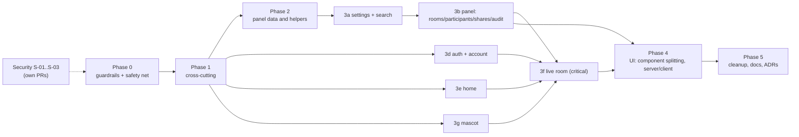

# 04 — Migration plan

## Principles

1. **Every PR is small, deployable and does not change behavior.** Moving files (`git mv` + import fixes) and changing code go in **separate commits**, so the review diff stays readable.
2. **Bugs and security (`S-*`, `B-*` from doc 02) go in their own PRs**, outside the refactor phases. The exception is whatever a characterization test itself needs to document. Security fixes S-01, S-02 and S-03 can (and should) land before everything else, because they do not depend on the refactor.
3. **A phase only starts once its safety net is green in CI.**
4. **The refactor does not touch the database.** Zero migrations. If a need arises, it becomes its own PR following the expand/contract pattern.
5. **Ratchet**: each phase shrinks the lint exception list (`max-lines`, layer rules). The list never grows.

## 1. Safety net (characterization tests)

### Already exist (keep green, do not edit)

| Test                                                                                                                  | Locks down                                                                                               |
| --------------------------------------------------------------------------------------------------------------------- | -------------------------------------------------------------------------------------------------------- |
| `tests/integration/token-route.test.ts` (15 cases)                                                                    | The whole `/api/token` contract: 401/403, password, full room, rate limit, invitations, `token_requests` |
| `tests/integration/livekit-webhook.test.ts`                                                                           | Projection, idempotency, out-of-order events, reprocessing                                               |
| `tests/integration/admin-*.test.ts`, `user-auth`, `account-data`, `keyset`, `settings`, `recent-rooms`, `room-counts` | Panel, auth, LGPD, pagination                                                                            |
| `tests/unit/*` (57 tests)                                                                                             | Pure rules: csv, room-input, share-support, rate limiter, CSP, permissions, mascot                       |

### Missing (write in Phase 0, **before** touching any area)

| #   | Test                                                                                                                                                                                                 | Tool                                                   | Locks down                                   | Unlocks phase |
| --- | ---------------------------------------------------------------------------------------------------------------------------------------------------------------------------------------------------- | ------------------------------------------------------ | -------------------------------------------- | ------------- |
| T1  | `requestToken` with a stubbed `fetch` (network down, valid 200, invalid 200, 4xx, non-JSON 500); `roomPath`/`roomLink`                                                                               | Vitest                                                 | the token client                             | 3f            |
| T2  | `room-data`: encode/decode round trip, invalid payload, `contentBox` (letterboxing, 0×0), `savedMicrophone` with `localStorage` throwing                                                             | Vitest                                                 | the data channel protocol                    | 3f            |
| T3  | `actions-authz` covering `features/**/actions.ts` **too** (today only `app/**`, D-048)                                                                                                               | Vitest integration                                     | authorization of the 13 panel actions        | 3b, 3c        |
| T4  | CSV export: the 4 routes return the header, BOM, `;`, the audit entry written, and 401/403                                                                                                           | Vitest integration                                     | D-019                                        | 2             |
| T5  | `/api/conta/dados`: JSON shape                                                                                                                                                                       | Vitest integration (already partial in `account-data`) | 3d                                           | 3d            |
| T6  | `safeReturnPath`: current cases. `/\t/` passes today; mark it with `it.fails` and a reference to S-01                                                                                                | Vitest                                                 | 3d                                           | 3d            |
| E1  | Signed out: `/sala/ABC-DEFG-HIJ` → `/entrar?voltar=/sala/abc-defg-hij`; invalid code → `/?erro=codigo`                                                                                               | Playwright                                             | room page                                    | 3f            |
| E2  | Pre-join: wrong password → message; `?convite=` hides the password; mic permission denied → step-by-step guide + "Entrar só ouvindo" ("Join listening only")                                         | Playwright (fake media)                                | PreJoin                                      | 3f, 4         |
| E3  | Join alone → "Você é a primeira pessoa aqui" ("You're the first one here"); leave → "Você saiu da sala" ("You left the room") → "Entrar de novo" ("Join again")                                      | Playwright                                             | RoomView/RoomSession                         | 3f, 4         |
| E4  | Two contexts: "X entrou" ("X joined") toast; chat + unread badge; reaction; "H" raises a hand; share screen (`getDisplayMedia` stub) → the stage appears on the other side                           | Playwright                                             | full room                                    | 3f, 4         |
| E5  | **Current behavior of B-01 and B-02**: invalid server URL → today shows "Você saiu da sala"; cancelling the screen picker → today 2 toasts. Mark as a documented `test.fail`                         | Playwright                                             | not "fixing by accident" during the refactor | 3f            |
| E6  | Admin sign-in + 2FA (TOTP with `tests/integration/support/totp.ts`) → panel; room filter → URL; CSV export downloads a file                                                                          | Playwright                                             | shell and tables                             | 3b, 4         |
| E7  | Sign-up → verify e-mail (flag off) → sign-in → `/conta` → revoke another session                                                                                                                     | Playwright                                             | auth and account                             | 3d            |
| E8  | Home: typing the code → navigates; invalid code → "grumpy" mascot (`data-expression`); "/" focuses the bar                                                                                           | Playwright                                             | home and SmartBar                            | 3e            |
| M1  | Snapshot of the mascot's decisions: event sequence → expected `data-expression` (via `page.evaluate` over the DOM) for 5 scenarios (idle→sleepy→asleep, password, celebrate signal, high-five, pair) | Playwright                                             | the mascot engine                            | 3g            |

## 2. Phases

The order inside Phase 3 goes from the simplest and best-tested to the most critical and least-tested. The live room comes last because it depends on a mature E2E suite and on the shared pieces (auth, mascot) already being in place. Sub-phases 3d, 3e and 3g can run in parallel with 3b.

### Phase 0: guardrails and safety net · **low** risk · ~22 h

| Item               | Content                                                                                                                                                                                                                                                                                                                                                                                                                                                                                                                                                                                                                                                                                                                                                                                                                                                                                                                                                                                                                                    |
| ------------------ | ------------------------------------------------------------------------------------------------------------------------------------------------------------------------------------------------------------------------------------------------------------------------------------------------------------------------------------------------------------------------------------------------------------------------------------------------------------------------------------------------------------------------------------------------------------------------------------------------------------------------------------------------------------------------------------------------------------------------------------------------------------------------------------------------------------------------------------------------------------------------------------------------------------------------------------------------------------------------------------------------------------------------------------------ |
| Goal               | CI runs, stays green and starts preventing regressions. The safety net exists                                                                                                                                                                                                                                                                                                                                                                                                                                                                                                                                                                                                                                                                                                                                                                                                                                                                                                                                                              |
| Files              | `oxlint.config.ts`, `vitest.config.ts`, `.github/workflows/ci.yml`, `package.json`, `tests/unit/mascot.test.ts`, `components/ui/{popover,select}.tsx` (delete), new `tests/e2e/**`, `playwright.config.ts`, `knip.json`                                                                                                                                                                                                                                                                                                                                                                                                                                                                                                                                                                                                                                                                                                                                                                                                                    |
| Steps              | 1) Create the GitHub remote (open decision 05/Q1) and confirm the first CI run. 2) **Make lint green**: convert `mascot.test.ts` to `describe/expect` (22 `await-thenable`); override `no-unsafe-type-assertion` for `components/ui/**`; resolve the few remaining casts (`app/layout.tsx:37`, `MascotSettingsForm.tsx:85`) without changing behavior. 3) Remove the safe dead code: `date-fns`, `ui/popover`, `ui/select`, `BOUNCE`, the `"tap"` reason, `RoomStatusFilter` and the unused exports reported by knip, **except** `purgeOldFailures`/`reprocessPendingEvents`. 4) Add knip, jscpd (threshold 2.5% → later 2%), `drizzle-kit check` and `docker build` to CI. 5) Include `components/**` and `hooks/**` in coverage; `thresholds` equal to the current baseline (ratchet). 6) Make the integration project **warn** when `TEST_DATABASE_URL` is missing. 7) Install `@playwright/test@1.63.0` and write E1–E8 and M1, plus T1–T6. 8) Measure the baseline of `pnpm build` (time) and of the bundle (`.next/` in a CI folder) |
| Definition of done | Green CI on main with lint, typecheck, unit, integration, E2E, knip, jscpd and build; metrics baseline recorded                                                                                                                                                                                                                                                                                                                                                                                                                                                                                                                                                                                                                                                                                                                                                                                                                                                                                                                            |
| How to test        | CI itself. The E2E tests run 3× in a row without flakes                                                                                                                                                                                                                                                                                                                                                                                                                                                                                                                                                                                                                                                                                                                                                                                                                                                                                                                                                                                    |
| How to roll back   | Revert the commit; no production change                                                                                                                                                                                                                                                                                                                                                                                                                                                                                                                                                                                                                                                                                                                                                                                                                                                                                                                                                                                                    |
| Estimate           | Lint 2 h · dead code 1 h · CI 3 h · Playwright setup + LiveKit in CI 5 h · E1–E8/M1 8 h · T1–T6 3 h                                                                                                                                                                                                                                                                                                                                                                                                                                                                                                                                                                                                                                                                                                                                                                                                                                                                                                                                        |

### Phase 1: cross-cutting patterns · **low** risk · ~6 h

| Item               | Content                                                                                                                                                                                                                                                                                                                                                                                                                                                                                                                                                                                                                                                                                                                                                                                                                                                            |
| ------------------ | ------------------------------------------------------------------------------------------------------------------------------------------------------------------------------------------------------------------------------------------------------------------------------------------------------------------------------------------------------------------------------------------------------------------------------------------------------------------------------------------------------------------------------------------------------------------------------------------------------------------------------------------------------------------------------------------------------------------------------------------------------------------------------------------------------------------------------------------------------------------ |
| Goal               | Clear out the noise that contaminates all subsequent phases                                                                                                                                                                                                                                                                                                                                                                                                                                                                                                                                                                                                                                                                                                                                                                                                        |
| Files              | `server/db/index.ts` and the 27 spots with `if (!db)`, `server/logger.ts`, `server/sentry.ts`, `instrumentation.ts`, `server/actions/client.ts`, `server/auth/{admin,user}.ts`, `server/table/selection.ts`, `server/rate-limit.ts`/`client-ip.ts`, `lib/password-rules.ts` + 8 usages                                                                                                                                                                                                                                                                                                                                                                                                                                                                                                                                                                             |
| Steps              | 1) Non-optional `getDb(): Database` (the env already guarantees it, D-036). Delete the dead branches and `db!`. **Caution:** `tests/unit/webhook-route.test.ts` tests "503 with the database down". Turn it into a "database error" test without changing the observable response, or record it as a decision (05/Q4). 2) `LOG_LEVEL`/`APP_VERSION`/`SENTRY_DSN` via `getEnv`. 3) A single `FRESH_SESSION_MS` constant and `customRules` shared by both Better Auth instances. 4) `ActionError` in a neutral module (`server/actions/errors.ts`), so that `server/table` does not depend on `actions/client`. 5) `getClientIp` moves to `client-ip.ts`. 6) Use `PASSWORD_LIMITS` in the 8 hardcoded places (same values: same behavior). 7) Log in the `.catch(() => {})`s. 8) `import "server-only"` in `permissions.ts`, `roles.ts`, `csp.ts`, `table/search.ts` |
| Definition of done | 0 `if (!db)`; 0 `db!`; no `process.env` outside `server/env.ts` (except `instrumentation-client.ts`, which is `NEXT_PUBLIC_`)                                                                                                                                                                                                                                                                                                                                                                                                                                                                                                                                                                                                                                                                                                                                      |
| How to test        | Full suite + E2E                                                                                                                                                                                                                                                                                                                                                                                                                                                                                                                                                                                                                                                                                                                                                                                                                                                   |
| How to roll back   | Revert per PR (one PR per item 1–8)                                                                                                                                                                                                                                                                                                                                                                                                                                                                                                                                                                                                                                                                                                                                                                                                                                |

### Phase 2: panel data and helpers · **low** risk · ~7 h

| Item               | Content                                                                                                                                                                                                                                                                                                                                                                                                                                                                                              |
| ------------------ | ---------------------------------------------------------------------------------------------------------------------------------------------------------------------------------------------------------------------------------------------------------------------------------------------------------------------------------------------------------------------------------------------------------------------------------------------------------------------------------------------------- |
| Goal               | End the ×4 copying in the panel (D-019, D-020) and the inline Drizzle in pages (D-009)                                                                                                                                                                                                                                                                                                                                                                                                               |
| Files              | `features/*/queries.ts`, `app/api/admin/exportar/*/route.ts`, `app/conta/page.tsx`, `app/admin/(painel)/conta/sessoes/page.tsx`, `app/api/conta/dados/route.ts`, new `server/table/{list-page,period-filter,csv-route}.ts`                                                                                                                                                                                                                                                                           |
| Steps              | 1) `periodFilter(column, {de, ate})` replaces the 4 copies. 2) `iterateAll(listFn, params)` replaces the 4 `iterateX`. 3) `csvRoute({ permission, auditAction, loadParams, iterate, columns })` turns each export route into a call of about 10 lines, **preserving** `action: "user.export"` (persisted data; see D-017 and 05/Q5). 4) `listActiveSessions(db, table, ownerId)` shared between `/conta` and `/admin/conta/sessoes`. 5) The 4 queries of `/api/conta/dados` move into a DAL function |
| Definition of done | jscpd with no clones in the `queries.ts` files; pages without `import … from "drizzle-orm"`                                                                                                                                                                                                                                                                                                                                                                                                          |
| How to test        | T4, T5, `keyset.test.ts`, `admin-*.test.ts`, E6                                                                                                                                                                                                                                                                                                                                                                                                                                                      |
| How to roll back   | Revert per PR                                                                                                                                                                                                                                                                                                                                                                                                                                                                                        |

### Phase 3: features, one per PR (or a few)

Each sub-phase follows the same recipe: **(a)** a PR with only `git mv` + imports, into the new English-named folder; **(b)** an extraction PR (pure domain, hooks, component splitting); **(c)** a PR that turns on that folder's lint override and removes the feature from the exception list.

| Sub-phase                | Scope                                                                                                                                                                                                                                                                                                                                 | Main steps                                                                                                                                                                                                                                                                                                                                                                                                                                                                                                                                                           | Risk                                | Hours |
| ------------------------ | ------------------------------------------------------------------------------------------------------------------------------------------------------------------------------------------------------------------------------------------------------------------------------------------------------------------------------------- | -------------------------------------------------------------------------------------------------------------------------------------------------------------------------------------------------------------------------------------------------------------------------------------------------------------------------------------------------------------------------------------------------------------------------------------------------------------------------------------------------------------------------------------------------------------------- | ----------------------------------- | ----- |
| **3a** settings + search | `app/admin/(painel)/configuracoes/actions.ts` → `features/admin/settings/`; `features/busca` → `features/admin/search`; `server/admin-nav.ts` → `features/admin/shell/nav.ts`                                                                                                                                                         | Undoes `components → app` (MascotSettingsForm) and the CommandPalette folder cycle                                                                                                                                                                                                                                                                                                                                                                                                                                                                                   | low                                 | 3     |
| **3b** panel             | `features/{salas,usuarios,compartilhamentos,auditoria}` → `features/admin/{rooms,participants,shares,audit}`; `components/admin/**` → `components/` (generic) and `features/admin/shell`                                                                                                                                              | `RoomFilters`/`ParticipantFilters` built on `FilterSelect/Date/Search`; `AuditTable` split into `AuditFilters` + `AuditDetail` + table; single `SELECT_CLASS` and `TableToolbar`; `labels.ts` per feature; `RoomStatus` out of the client module                                                                                                                                                                                                                                                                                                                     | low-medium                          | 10    |
| **3d** auth + account    | `server/auth/**` → `features/auth/server`; `components/{auth,account,admin/auth}` → `features/auth/ui` and `features/account/ui`; `app/conta/actions.ts` → `features/account/actions.ts`; `app/admin/(painel)/conta/sessoes/actions.ts` → `features/admin/account/actions.ts`; `server/participants` → `features/participants/server` | `useFormSubmit` (pending/error ×11); a single `SignInForm` with `scope` (about 60 fewer lines); `SessionList` receives the actions **via props** (the import of both goes away); `QrCode`/`Section` move to `components/`; `AccountForms` split into 4                                                                                                                                                                                                                                                                                                               | **medium** (auth)                   | 10    |
| **3e** home              | `components/home/**` → `features/home/ui`; `lib/room-input.ts` → `features/room/domain`                                                                                                                                                                                                                                               | `HomeScene` becomes an RSC with client islands (`SmartBar`, `MascotPair`, `ThemeToggle`)                                                                                                                                                                                                                                                                                                                                                                                                                                                                             | low                                 | 3     |
| **3g** mascot            | `components/mascot/**`, `Mascot.tsx`, `MascotPair.*` → `features/mascot/{engine,dom,ui}`                                                                                                                                                                                                                                              | **First, commit or finish the current WIP** (05/Q2). Then: flags on `EXPRESSIONS` (`blocksPlay`, `closesEyes`) eliminating the 5 lists (D-029); extract `brain.ts` (`decide(state, event) → {reasons, gaze, commands}`) from the `useEffect`; extract `pair-phases.ts` from `MascotPair`; `global-input-hub.ts` with single listeners shared across instances; a single `prefersReducedMotion`; separate the `Expression` type from `Activity`/`Gesture`                                                                                                             | **medium** (subtle visual behavior) | 14    |
| **3f** live room         | `components/room/**`, `hooks/useRoomAnimations.ts`, `lib/{livekit,room-data,share-support,recent-room,invite}.ts`, `server/{livekit,rooms}/**`, `app/api/token/route.ts`, `app/api/livekit/webhook/route.ts` → `features/room/**`                                                                                                     | 1) Token per doc 03 §6 (domain + gateway + edge). 2) `projectEvent` split into one handler per event. 3) `useRoomConnection` (from `RoomView`), `useMicLevel` (from `PreJoin`). 4) Pure, tested `connection-errors.ts`, `focus.ts`, `participant-label.ts`. **Unifying `initials` changes what is displayed** (B-11): keep both rules with explicit names and decide separately. 5) `JoinChoices`/`ShareChoice` in `domain/`. 6) `useScreenShare` instantiated once (same observable behavior, since `busy` only becomes more correct; if in doubt, move it to B-11) | **high** (main flow)                | 18    |

**Definition of done for each sub-phase:** old folder deleted; lint override active for the new folder; the feature leaves the `max-lines` exception list; E2E and integration green. **How to roll back:** revert the PR. Since moving and extracting are in different PRs, you can revert just the extraction.

### Phase 4: UI and the server/client boundary · **medium** risk · ~8 h

| Item               | Content                                                                                                                                                                                                                                                                                                                                                                                                                                                                                   |
| ------------------ | ----------------------------------------------------------------------------------------------------------------------------------------------------------------------------------------------------------------------------------------------------------------------------------------------------------------------------------------------------------------------------------------------------------------------------------------------------------------------------------------- |
| Goal               | No component above 300 lines; `"use client"` only on leaves                                                                                                                                                                                                                                                                                                                                                                                                                               |
| Files              | `PreJoin` (→ `PresenceLine`, `MicSetup`, `PasswordField`), `RoomView` (→ `RoomLayout`, `AloneWelcome`), `ScreenStage` (→ `PointerLayer`), `DataTable`, `TwoFactorSettings`, the `salas/[id]` and `usuarios/[id]` pages (→ `RoomDetail`/`ParticipantDetail` RSC), `BrandPanel` (only the bubble is client), `Section` RSC, `HowItWorks` without `"use client"`, `undo-toast.ts`/`use-shortcut.ts` without the directive, `components/ui/sonner.tsx` reading `useTheme` from `lib/theme.ts` |
| Definition of done | `max-lines` (300) and `complexity` (15) with no exceptions outside `components/ui`; `"use client"` count ≤ baseline                                                                                                                                                                                                                                                                                                                                                                       |
| How to test        | E1–E8, M1 + bundle comparison against the Phase 0 baseline                                                                                                                                                                                                                                                                                                                                                                                                                                |
| How to roll back   | Revert per component (one PR per large component)                                                                                                                                                                                                                                                                                                                                                                                                                                         |

### Phase 5: final cleanup · **low** risk · ~5 h

Update the README (D-053: Coolify env, paths, structure); `docs/adr/` with 4 short ADRs (feature folders + DAL, single LiveKit gateway, oxlint instead of depcruise, language); delete the remaining lint exceptions; jscpd threshold 2% → 1.5%; review `docs/PLANO-ADMIN.md` (mark what became an ADR).

### Effort summary

| Phase                     | Hours                                                                                   | Risk       |
| ------------------------- | --------------------------------------------------------------------------------------- | ---------- |
| 0 guardrails + safety net | 22                                                                                      | low        |
| 1 cross-cutting           | 6                                                                                       | low        |
| 2 panel data              | 7                                                                                       | low        |
| 3a–3g features            | 58                                                                                      | low → high |
| 4 UI                      | 8                                                                                       | medium     |
| 5 cleanup                 | 5                                                                                       | low        |
| **Total**                 | **≈ 106 h** (≈ 13–15 working days for 1 dev, in blocks that deliver value on their own) |            |

Not included in the total: the security and bug fixes from doc 02 (rough estimate: S-01 1 h, S-02 1 h, S-03 1 h, S-04 0.5 h, B-01/B-02 3 h, B-03 2 h, B-04 2 h, B-05/B-06/B-07 1 h).

## 3. Quick wins (< 1 h each)

| #   | Action                                                                                                 | Gain                                | Changes behavior?               |
| --- | ------------------------------------------------------------------------------------------------------ | ----------------------------------- | ------------------------------- |
| 1   | Remove `date-fns`, `ui/popover.tsx`, `ui/select.tsx`, `BOUNCE`, the `"tap"` reason, `RoomStatusFilter` | −1 dep, −270 lines                  | no                              |
| 2   | Convert `tests/unit/mascot.test.ts` to `describe/expect` + cast override in `components/ui/**`         | lint almost green                   | no                              |
| 3   | Make `actions-authz` include `features/**/actions.ts`                                                  | closes a security hole in the test  | no (test only)                  |
| 4   | `PASSWORD_LIMITS` in the 8 hardcoded places                                                            | single rule                         | no (same values)                |
| 5   | Single `SELECT_CLASS` in `components/admin/data-table/filters.tsx`                                     | −2 copies                           | no                              |
| 6   | Single `FRESH_SESSION_MS` + shared `customRules`                                                       | −2 copies                           | no                              |
| 7   | `LOG_LEVEL`/`APP_VERSION`/`SENTRY_DSN` via `getEnv`                                                    | single config                       | no                              |
| 8   | `ui/sonner.tsx` imports `useTheme` from `lib/theme.ts` (move the hook)                                 | removes the vendor → app dependency | no                              |
| 9   | Export `connectErrorMessage`/`disconnectMessage`/`micErrorMessage` to `lib/` + tests                   | 3 testable functions                | no                              |
| 10  | `.catch(() => {})` → `.catch((err) => logger.warn(...))` in 2 places                                   | diagnostics                         | no                              |
| 11  | Move `public/mascot/*.provenance.json` out of `public/` (S-07)                                         | do not expose a local path          | yes, it is security: its own PR |
| 12  | `error.tsx` `reset` → `retry` (B-06)                                                                   | the button works                    | yes: bug PR                     |

"Extract the 3 giant components" is **not** a quick win here: PreJoin, RoomView and use-mascot depend on the E2E net (Phase 0) and are sub-phases 3f/3g.

## 4. Success metrics

| Metric                                     | Today                        | Target                                                               |
| ------------------------------------------ | ---------------------------- | -------------------------------------------------------------------- |
| Largest non-vendor file                    | 666 (`use-mascot.ts`)        | ≤ 300                                                                |
| Files > 300 effective lines (excl. vendor) | 6                            | 0                                                                    |
| Largest logic function (outside JSX)       | 518 (the `useMascot` effect) | ≤ 60                                                                 |
| Functions with complexity > 12             | 23 (max 39)                  | ≤ 8 (max 15)                                                         |
| `pnpm lint`                                | **44 errors**                | 0                                                                    |
| `any`                                      | 0                            | 0                                                                    |
| Unsafe casts (lint)                        | 18                           | 0 outside `components/ui`                                            |
| `if (!db)` / `db!`                         | 27 / 19                      | 0 / 0                                                                |
| Duplication (jscpd)                        | 2.24% (51 clones)            | ≤ 1.5%                                                               |
| knip: unused files / deps / exports        | 2 / 1 / 36                   | 0 / 0 / 0                                                            |
| Unit coverage (current scope)              | 16% of lines                 | `domain/**` ≥ 90%; `server/**` ≥ 80% (unit + integration)            |
| E2E                                        | 0 flows                      | 8 flows (E1–E8) + M1                                                 |
| `components → app` imports                 | 5                            | 0 (enforced by lint)                                                 |
| Build time / `/sala` bundle                | not measured                 | baseline in Phase 0; target: **no worse**, and −10% home JS after 3e |

## 5. Risks and mitigation

| Risk                                                                                                      | Prob.  | Impact | Mitigation                                                                                                                                                                                                                                               |
| --------------------------------------------------------------------------------------------------------- | ------ | ------ | -------------------------------------------------------------------------------------------------------------------------------------------------------------------------------------------------------------------------------------------------------- |
| **Silent regression** in the room or the mascot (visual, media)                                           | medium | high   | Phase 0 is mandatory (E1–E5, M1); move and extract in separate PRs; `test.fail` documenting B-01/B-02 so no "accidental fix" goes unnoticed; test in production with 2 browsers after 3f                                                                 |
| **Database migration**                                                                                    | low    | high   | The refactor has **zero** migrations. CI gains `drizzle-kit check` to prove the schema did not change. Any schema change becomes its own PR (expand → deploy → contract)                                                                                 |
| **Downtime during the Coolify deploy**                                                                    | low    | medium | The PRs are code only (no migration), and the current rolling update + healthcheck already protect against it. Fix rollback first: Coolify should pull `:sha` instead of `:main` (D-052). Deploy outside usage hours                                     |
| **Lint or CI blocking work**                                                                              | medium | medium | Named exceptions (ratchet) instead of a loose rule; no PR adds an exception                                                                                                                                                                              |
| **Conflict with the mascot WIP**                                                                          | high   | medium | Close the WIP (commit or branch) before Phase 0 (05/Q2); sub-phase 3g comes last among the visual ones                                                                                                                                                   |
| **Loss of motivation during a long refactor**                                                             | medium | high   | Each phase delivers value on its own (Phase 0 = real CI; Phase 2 = panel without copies); you can **stop after any phase** with the app better than before; quick wins first; limit to ≤ 1 Phase 3 sub-phase per week, interleaved with product features |
| **Over-engineering during execution**                                                                     | medium | medium | Doc 03 §9 serves as a review checklist: a PR that creates an interface with a single implementation or a one-line use case gets sent back                                                                                                                |
| **Renaming folders breaks documentation links and comments** (`docs/PLANO-ADMIN.md §3.3` cited in oxlint) | high   | low    | Update references in the `git mv` PR; the grep is part of the checklist                                                                                                                                                                                  |
